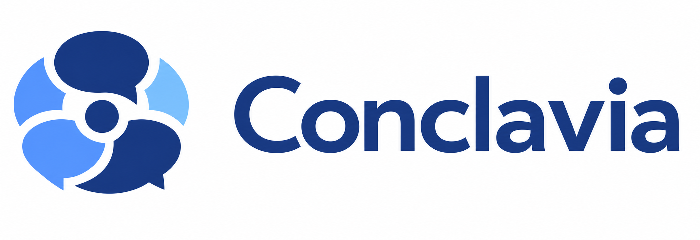

# Conclavia Meeting Avatar

<p align="center">
  
</p>

**A lifelike AI participant for real meetings.** Conclavia listens to the room,
understands the discussion, responds when invited, and uses voice, facial
expression, gaze, and authored body gestures to feel present rather than merely
connected.

It works with Microsoft Teams, Google Meet, and any meeting application that can
use an OBS virtual camera and a virtual audio device.


## What Mary can do

- Listen continuously and retain the recent meeting context.
- Answer when her name appears anywhere in a sentence, not only at the start.
- Continue a natural dialogue for two speaker-scoped follow-ups without
  requiring the wake word again.
- Raise her hand when she detects a material factual error, critical omission,
  decisive risk, or necessary addition. She waits for permission before speaking.
- Applaud only genuinely significant positive conclusions, with a positive mood.
- React while listening and speaking with 12 semantic moods and graded intensity.
- Use web search for explicit browsing requests, time-sensitive questions, and
  important factual verification.
- Summarize the discussion and help keep a timestamped agenda on schedule.
- Adapt her name, voice, model, system purpose, personality, participation style,
  and MetaHuman profile from the control room.

| Request to speak | Listening reaction |
| --- | --- |
|  |  |

## Interaction model

Conclavia is intentionally conservative in a room with five or ten people:

1. **Direct invocation:** say `Mary, what are the main risks?` or mention Mary
   naturally anywhere in the sentence.
2. **Short dialogue lease:** the same identified speaker can ask up to two
   relevant follow-ups within 45 seconds without repeating `Mary`.
3. **Autonomous participation:** Mary may raise her hand for a high-confidence,
   important correction or omission, but does not interrupt the room.
4. **Exceptional appreciation:** Mary may applaud a strong conclusion or
   completed complex result; ordinary agreement is not enough.
5. **Passive presence:** all final utterances still reach the meeting memory and
   can influence Mary's listening mood even when she remains silent.

The 12 supported moods are `neutral`, `attentive`, `curious`, `amused`,
`confident`, `skeptical`, `concerned`, `surprised`, `empathetic`, `assertive`,
`frustrated`, and `reflective`. Every spoken sentence carries its own mood and
intensity, so facial performance can change naturally within one answer.

## What is ready today

| Capability | Status |
| --- | --- |
| Unreal Engine 5.8 + MetaHuman cinematic renderer | Validated production path |
| OBS Virtual Camera video for Teams and Meet | Validated |
| BlackHole meeting capture and avatar microphone routing | Validated on macOS |
| Continuous transcription, meeting memory, direct answers | Validated |
| Request-to-speak, seated hand gesture, applause, moods | Validated and configurable |
| Showcase, Aera, Ada, Vivian, and Jelena profiles | Selectable |
| Browser test room and full control surface | Available |
| GPU-independent Web Performance Runtime | Experimental |
| Native Teams/Meet chat read and write | Planned platform integration |

The browser chat bridges are development tools, not a production integration.
The reliable meeting path today is audio in, then OBS video and BlackHole voice
out. A native Teams agent will require application registration, tenant consent,
and the appropriate Microsoft APIs.

## Architecture

```text
meeting audio
    |
    v
realtime transcription -> recent meeting memory -> meeting intelligence
                                                |  direct answer
                                                |  listening mood
                                                |  request to speak
                                                |  applause
                                                v
                                      performance plan
                                      audio + visemes + mood
                                      gaze + gesture + interrupt
                                                |
                           +--------------------+--------------------+
                           |                                         |
                    Unreal 5.8 + MetaHuman                 Web Runtime (experimental)
                           |                                         |
                           +--------------> OBS + BlackHole ----------+
                                                   |
                                             Teams / Meet
```

The renderer is deliberately separated from meeting intelligence. Both Unreal
and the Web Runtime consume the same performance semantics. This is the path
toward scaling Conclavia by transmitting a performance, not a permanent cloud
video stream.

## Quick start

### Requirements

- macOS and Node.js 22+
- `ffmpeg`
- OBS Studio with Virtual Camera
- BlackHole 16ch for meeting capture and BlackHole 2ch for Mary's voice
- an OpenAI API key
- AWS Roles Anywhere credentials for the Unreal renderer path

### Start the production renderer

```bash
npm install
cp .env.example .env
npm run studio:3d:start
```

Then open [http://127.0.0.1:4310](http://127.0.0.1:4310) in Chrome. Configure the
OpenAI key once in **Configuration**, select an avatar and voice, and start the
avatar and meeting listener from **Test room**.

`studio:3d:start` starts or reconnects to the AWS GPU, refreshes the protected
renderer connection, launches the local companion, and extends the GPU watchdog
while an active meeting session remains armed.

Stop the complete studio when finished:

```bash
npm run studio:3d:stop
```

### Run without the cloud GPU

```bash
npm run studio:web:start
```

The Web Runtime starts immediately, but it is still an experimental scaling
path and does not yet match the Unreal renderer's visual fidelity.

## Meeting setup

1. Route meeting speaker output to a macOS Multi-Output Device that includes
   **BlackHole 16ch** and your headphones or speakers.
2. In OBS, use a Browser Source pointed at
   `http://127.0.0.1:4310/output` and enable OBS Virtual Camera.
3. Select **OBS Virtual Camera** as the camera in Teams or Meet.
4. Route the renderer audio to **BlackHole 2ch** and select **BlackHole 2ch** as
   the meeting microphone.
5. In the Conclavia test room, start the avatar and select **Start listening**.

The mixed BlackHole capture cannot identify individual speakers. It still feeds
the complete recent context, but speaker-scoped follow-ups require an attributed
caption/transcript adapter with stable speaker IDs. Direct `Mary, ...`
invocations work on either path.

## Useful commands

```bash
npm run dev                         # local companion with hot reload
npm run preflight                   # verify macOS audio, OBS, and ffmpeg
npm run studio:3d:start             # production Unreal path
npm run studio:3d:stop              # stop companion and GPU studio
npm run studio:web:start            # experimental browser renderer
npm run test:e2e:meeting-audio      # exercise the real audio pipeline
npm run lint
npm run typecheck
npm test
npm run build
```

## Rebuilding and extending

The repository is the source of truth. AWS is a disposable build and render
host: Conclavia-owned Unreal source, automation, infrastructure, and manifests
are versioned here; Epic binaries, MetaHuman packages, and licensed plugins are
external prerequisites.

- [Architecture](docs/architecture.md)
- [AWS and Unreal rebuild guide](docs/aws-rebuild.md)
- [Web avatar runtime](docs/web-avatar-runtime.md)
- [Transcript adapter contract](docs/transcript-adapter-contract.md)
- [Chat adapter contract](docs/chat-adapter-contract.md)

## Privacy and security

Tell participants when the avatar is listening or recording. Never commit API
keys, AWS credentials, meeting transcripts, audio recordings, generated voice
files, certificates, or licensed Unreal assets. Local secrets and rotating
renderer endpoints belong in the ignored `.env` and `.conclavia` paths.

## License

[MIT](LICENSE)
