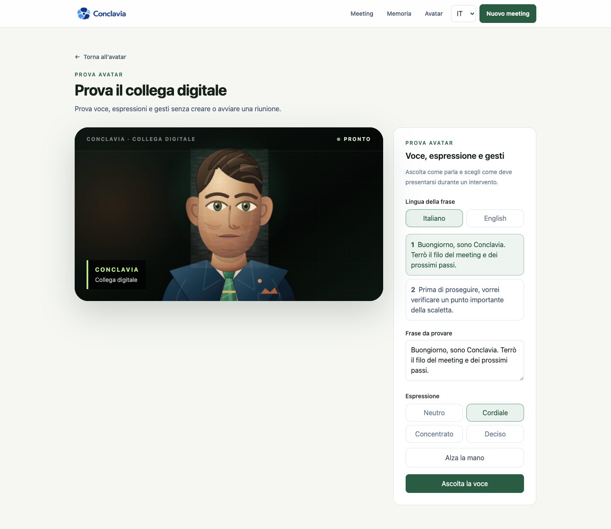

<p align="center">
  
</p>

<p align="center">
  A digital colleague for Microsoft Teams that follows the agenda, answers in the meeting, and carries memory into the next appointment.
</p>

# Conclavia Meeting Assistant

Conclavia is a focused, single-workspace meeting assistant. The product contains three areas only:

- **Meetings** for one appointment or a series of Microsoft Teams meetings.
- **Memory** for remembered facts, decisions, actions, questions, and summaries.
- **Avatar** for the digital colleague's identity, personality, voice, expressions, and hand raise.

The management interface works without a meeting provider. Automatic Teams entry is fail-closed and becomes available only after every required integration setting is present.

## Product tour

### Avatar and voice test

The avatar can be tested independently from a meeting, including Italian and English voice, facial mood, audio-driven lip sync, and hand raise.



### One meeting or a series

Every meeting has an objective, a Teams link, a date, and an agenda whose items can be mandatory or optional. A series can contain up to 24 appointments with different Teams links.


### Shared meeting memory

Completed appointments contribute their summary, remembered facts, decisions, open actions, and questions to the next appointment in the same series.


## Meeting behavior

The participant name configured in **Avatar** is also its wake phrase. If the name is changed to “Nora”, for example, the colleague responds to **“Nora…”** and future Teams participants use that name. Five commands are supported in Italian and English:

- **Remember** stores an explicit fact in the current meeting memory.
- **Summarize** creates a spoken summary and stores it as the meeting overview.
- **Agenda** identifies the next open item and can mark an item as complete.
- **Answer** responds from the current transcript and shared series memory.
- **Verify** checks a statement against known meeting facts and decisions.

When proactive contributions are enabled, the colleague checks substantive statements for material errors and for reliable stored information that would advance the current objective or agenda. It raises its hand and prepares the contribution, but does not speak yet. A participant must grant the floor using its configured name, for example **“Nora, go ahead”** or **“Nora, vai pure”**. Because the answer is prepared while the hand is raised, playback can begin without a second model request.

At the end of a meeting, the transcript is condensed into an overview, facts, decisions, actions and open questions. Those items become the continuity briefing for later appointments in the same series. The live transcript remains visible while the meeting is running; afterward it is kept out of the primary workflow and can be expanded only when someone needs to verify a specific passage.

The assistant personality has two deliberately simple controls: response length and attitude. Those choices are included in the meeting prompt.

## Runtime architecture

```text
Microsoft Teams meeting
        │
        ▼
Attendee anonymous participant + native Teams captions
        │
        ▼
Conclavia meeting output page
        ├── wake phrase and command routing
        ├── prepared request-to-speak and explicit permission
        ├── MongoDB transcript and series memory
        ├── OpenAI Responses API for meeting intelligence (optional)
        └── local Supertonic voice + lip sync + expressions
        │
        ▼
Avatar video and spoken response returned to Teams
```

Attendee loads the protected `/meeting-room/[token]` page inside an isolated meeting container and streams that page as the participant camera and audio. Bot-level webhooks deliver state changes, participants, and native Teams captions to Conclavia; the page then speaks new answers back into the meeting. No virtual microphone, virtual camera, browser extension, client-side Teams plugin, or manually operated Mac is required.

## Cost controls

- Speech is generated on the meeting device with Supertonic 3. There is no per-character voice API charge.
- Teams captions are used for live transcription, so no separate speech-to-text provider is required.
- ChatGPT-backed intelligence is opt-in through `MEETING_AI_ENABLED=true`. Remembering facts and the deterministic memory fallback work without it.
- The default model is `gpt-5.4-mini`; it can be changed with `OPENAI_MEETING_MODEL`.
- Audio is not stored. The live transcript and selected memory are stored in MongoDB.
- No external meeting participant is created while `MEETING_BOT_PROVIDER=preview`.

Latency-sensitive paths are deliberately short: presence checks, explicit memory and agenda commands run locally; meeting output polls for a prepared response every 650 ms; model requests use no reasoning phase, low verbosity and small output limits. Only the recent transcript window and a bounded set of relevant memory are sent, with stable instructions kept separate from changing meeting context to improve prompt caching.

The Supertonic model is downloaded on first voice use and cached by the browser. Review [THIRD_PARTY_NOTICES.md](THIRD_PARTY_NOTICES.md) before distribution.

## Requirements

- Node.js 22 recommended; Node.js 20.9 or newer is supported.
- MongoDB.
- Google Chrome for the Playwright browser suite.
- For automatic entry as an anonymous guest: an Attendee workspace and a public HTTPS deployment. No Teams account is required.
- The current integration targets meetings that allow anonymous guests. Signed-in Teams identities are not part of this release.
- For generated answers and semantic verification: an OpenAI API project.

## Local setup

```bash
npm ci
cp .env.example .env.local
npm run dev
```

Set `MONGODB_URI`, then open [http://localhost:3000/meetings](http://localhost:3000/meetings). Local mode stores meetings and memory, runs all manual commands, and tests the avatar without joining an external call.

## Environment variables

| Variable | Required | Purpose |
| --- | --- | --- |
| `MONGODB_URI` | Yes | MongoDB connection string. |
| `MEETING_AI_ENABLED` | No | Set to `true` to use OpenAI for summaries, answers, and verification. |
| `OPENAI_API_KEY` | With meeting AI | Server-side OpenAI API credential. |
| `OPENAI_MEETING_MODEL` | No | Responses API model; defaults to `gpt-5.4-mini`. |
| `MEETING_BOT_PROVIDER` | No | Keep `preview` locally; set `attendee` for automatic Teams entry. |
| `CONCLAVIA_PUBLIC_URL` | With Attendee | Stable public HTTPS origin serving this application. |
| `ATTENDEE_API_BASE_URL` | No | Attendee API origin; defaults to `https://app.attendee.dev/api/v1`. |
| `ATTENDEE_API_KEY` | With Attendee | Server-side Attendee API credential. |
| `ATTENDEE_WEBHOOK_SECRET` | Recommended | Base64 webhook signing secret from Attendee Settings. A private per-meeting callback token is used when it is absent. |
| `TEAMS_ACCESS_MODE` | No | Use `anonymous_guest` for the supported unattended flow. |
| `TEAMS_GUEST_ACCOUNT_EMAIL` | Legacy signed-in mode | Dedicated Microsoft identity used by older provider deployments. |
| `TEAMS_GUEST_DISPLAY_NAME` | No | Fallback participant name; the name saved under Avatar normally takes precedence. |
| `TEAMS_SIGNED_IN_CONFIRMED` | Legacy signed-in mode | Retained for older provider deployments. |

Never commit real credentials. Inject them through the deployment platform's secret store.

## Microsoft Teams setup

For the first test, use a Personal Teams meeting created from Hotmail and keep `TEAMS_ACCESS_MODE=anonymous_guest`. The participant joins with the name configured under Avatar and must be admitted if the meeting uses a lobby.

1. Create an Attendee API key and store it as `ATTENDEE_API_KEY`.
2. Deploy Conclavia at a stable public HTTPS origin and set that origin as `CONCLAVIA_PUBLIC_URL`.
3. Set `MEETING_BOT_PROVIDER=attendee` and `TEAMS_ACCESS_MODE=anonymous_guest`.
4. Recommended before production: copy the signing secret from Attendee **Settings → Webhooks** into `ATTENDEE_WEBHOOK_SECRET`. Conclavia creates the bot-level webhook automatically for each meeting; no project webhook needs to be created manually.
5. Create a meeting with **Entra ora** or schedule a future appointment. Admit the configured digital colleague from the Teams lobby when prompted.

The organizer's Teams policy must allow anonymous guests and captions. If company policy blocks either feature, the meeting detail page reports the failed entry or missing transcription instead of silently pretending the assistant is active.

## Verification

```bash
npm run verify
```

This runs ESLint, TypeScript, a production build, and eight Playwright scenarios covering:

- single-meeting creation, agenda, commands, memory, and cleanup;
- series creation and continuity across two appointments;
- avatar navigation, facial mood, and hand raise;
- dynamic Italian and English wake-phrase command parsing;
- deterministic correction detection and explicit permission to speak;
- local command response-time thresholds;
- Recall legacy transcript parsing and Attendee signed-webhook parsing;
- database health and protected meeting-output behavior.

Tests run on an isolated local port with meeting AI and the external participant disabled. They create uniquely named records and remove them even after a failed scenario, so verification never creates paid external usage.

## Production deployment

The repository includes a multi-stage, non-root Docker image using the Next.js standalone output:

```bash
docker build -t conclavia .
docker run --env-file .env.production -p 3000:3000 conclavia
```

Use `GET /api/health` for readiness checks. Terminate TLS before the application and set `CONCLAVIA_PUBLIC_URL` to the final HTTPS origin.

This release is designed as a private, single-workspace application and does not include end-user authentication. Place the entire management interface and API behind the company's SSO, identity-aware proxy, or equivalent access control before exposing it to the internet. The random meeting-output token acts as a bearer capability and must not be logged or shared.

## Main routes

| Route | Purpose |
| --- | --- |
| `/meetings` | Dashboard for meetings and series. |
| `/meetings/new` | Create one Teams meeting or a multi-appointment series. |
| `/meetings/series/[id]` | Manage appointments, shared agenda, and continuity. |
| `/meetings/[id]` | Follow the agenda, use the assistant, review the summary, and optionally expand the full transcript. |
| `/memory` | Review meeting and series memory. |
| `/avatar` | Manage identity, personality, and voice. |
| `/avatar/test` | Test voice, expressions, lip sync, and gestures without a meeting. |
| `/meeting-room/[token]` | Minimal 16:9 output consumed by the meeting participant. |

## Technology

- Next.js 16.3, React 19, and TypeScript.
- Tailwind CSS 4.
- MongoDB with Mongoose.
- Attendee meeting bots, voice-agent output, and native Teams captions.
- OpenAI Responses API for optional meeting intelligence.
- Supertonic 3 and ONNX Runtime Web for local speech.
- Playwright for end-to-end verification.
