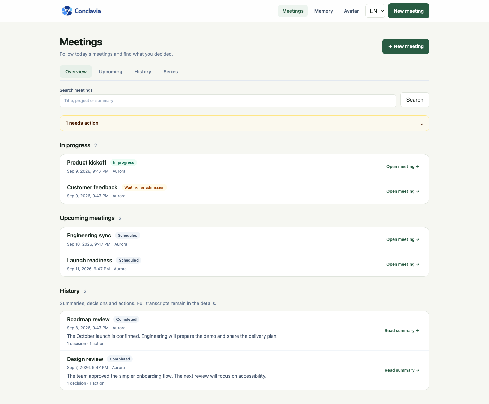
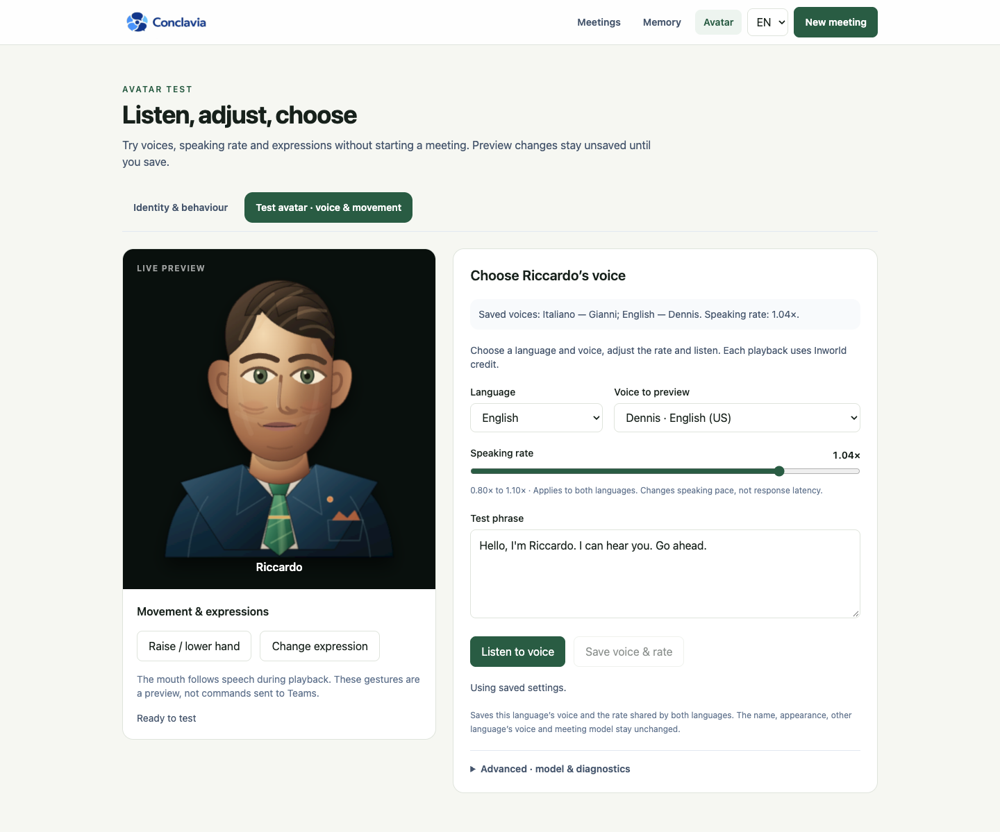
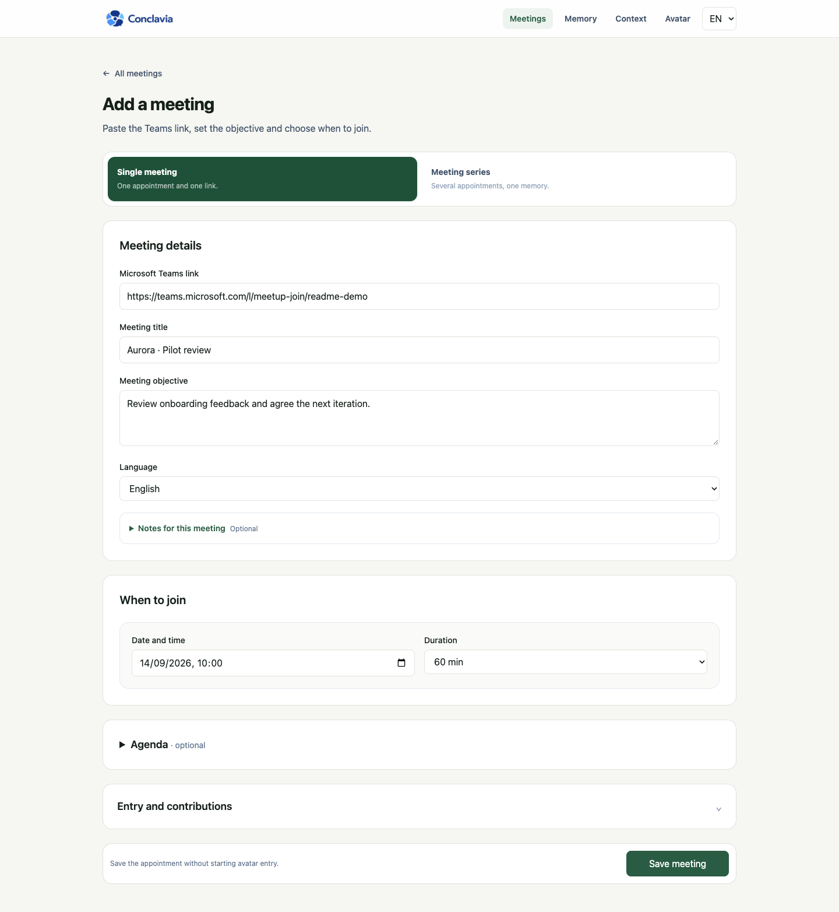
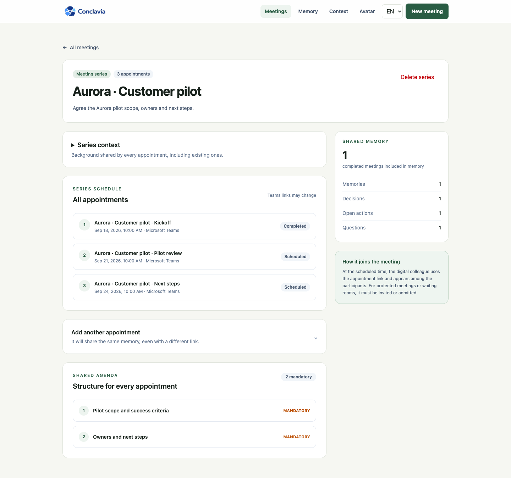
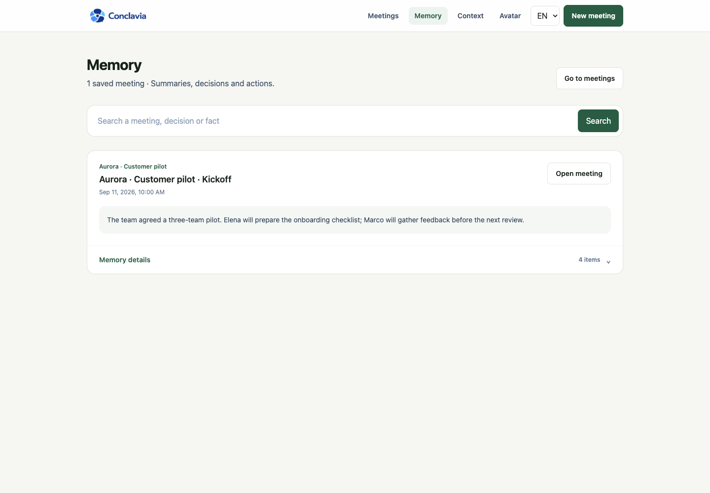
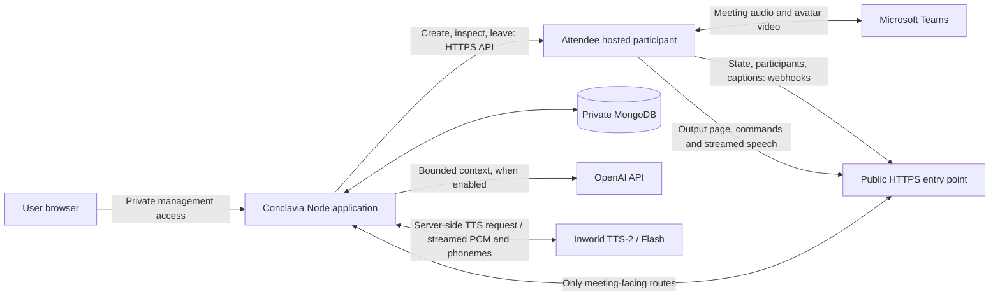

<p align="center">
  
</p>

<p align="center">
  A digital colleague for Microsoft Teams that follows the agenda, answers in the meeting, and carries memory into the next appointment.
</p>

# Conclavia Meeting Assistant

Conclavia is a focused, single-workspace meeting assistant. The product contains three areas only:

- **Meetings** for one appointment or a series of Microsoft Teams meetings.
- **Memory** for remembered facts, decisions, actions, questions, and summaries.
- **Avatar** for the digital colleague's identity, personality, voice, expressions, and hand raise.

The management interface works without a meeting provider. Automatic Teams entry becomes available only after every required integration setting is present. Configuration readiness is not an external connectivity check: the public output page and webhook endpoint must also be reachable.

## Latest update — 11 September 2026

- **Avatar workspace:** identity, appearance and behaviour are separate from voice preview. Choose an Italian/English voice, preview its speaking rate, then explicitly save or discard. Model comparisons and diagnostics are collapsed under Advanced.
- **Two appearances:** male and female business avatars share expressions, idle motion, raised-hand animation and audio-clock mouth shapes. Appearance, invocation name and voice remain independent.
- **Streaming-only speech:** Inworld TTS-2 / Flash supplies PCM and phoneme timings. The retired local/browser synthesis path is not an active option or fallback.
- **Safer meetings:** attempt-scoped entry/exit reconciliation, renderer health checks, caption language setup, conservative echo classification, optional realtime debug and summary-first paginated history.
- **Acceptance status:** application regressions and browser/provider previews are covered; receiver-side Teams latency, voice naturalness and video/lip-sync quality are **not yet signed off**. See the [objective-based audit](docs/objective-audit-2026-09-11.md) and the historical [10 September audit](docs/poc-audit-2026-09-10.md) for evidence and limits.
- **Fresh general check:** 199 automated tests passed in 2.7 minutes; TypeScript, ESLint and an isolated production build passed. No new live Teams call was performed for this check.

Start with [voice setup](#streaming-voice-setup), the [Cloudflare local test guide](#public-connection-for-a-local-teams-test), or [company deployment](#production-deployment).

## PoC objectives and acceptance

| Objective | Implemented behavior | Verification / remaining boundary |
| --- | --- | --- |
| Respond when addressed | Dynamic invocation name; greetings, presence checks and specific questions in Italian/English | Parser and caption-ingress tests; actual recognition depends on Teams captions and the configured language |
| Help run the meeting | Required/optional agenda, next item, explicit completion and contextual answers | Automated command, negation and ambiguity checks; real-AI evidence is recorded separately |
| Preserve continuity | Meeting summaries, facts, decisions, actions and open questions shared by linked appointments | Cross-meeting regression coverage; continuity draws from up to five prior completed appointments, not unrestricted global recall |
| Contribute appropriately | Prepare a correction or relevant fact, raise the avatar's hand, wait for named permission, decline or expire safely | Automated permission/queue tests; this is **not native Teams toolbar hand control** |
| Natural and responsive avatar | Two appearances, selectable native-language voices, streamed audio, phoneme-driven mouth and playback timing | Browser tests and real preview samples; received Teams quality and end-of-question-to-audible-answer latency remain open |
| Simple, scalable GUI | Overview, filtered/paginated history, summaries first, optional transcript/debug, separate identity and voice studio | Desktop/mobile tests and 250-meeting history fixture; not a production concurrency/load certification |
| Recover safely | Preflight, bounded admission waits, single attempt claims, provider reconciliation and confirmed departure | Simulated lifecycle/restart/missed-webhook tests; admission policy remains controlled by Teams |
| Company pilot readiness | Documented stable-HTTPS, private management and always-on runtime requirements | Production build verified; SSO/gateway deployment, retention agreement and company approval are not delivered infrastructure |

**Exit gate:** complete a fresh admitted Teams entry → spoken greeting/question → memory/agenda → permitted contribution → received summary → confirmed exit/re-entry run, and record the audio/video from a receiving participant. Measure caption delay, response preparation, synthesis start and received playback separately. A generated answer or browser playback acknowledgement alone does not pass this gate. No end-to-end response-time SLA is claimed.

## Product tour

### Meetings at a glance

The dashboard separates **Overview**, **Upcoming**, **History**, and **Series**. The overview shows a short list of current and upcoming meetings plus recent summaries. A collapsed action bar contains admissions and operational issues; old missed appointments and optional summary reviews do not accumulate there.

History has text, date and status filters, with 20 meetings per page. Rows show a short summary preview and decision/action counts. Missed appointments can be rescheduled from a prefilled form or archived reversibly, without deleting their history. Rescheduling creates a new appointment and does not send a participant until explicitly requested. Archiving is blocked while a participant is active or its departure is uncertain.

List queries return only the current page and lightweight fields, not full transcripts, command histories or bot access tokens. Series counts are aggregated in the database. The overview refreshes while there is active work; background tabs do not poll. The screenshot below uses fictional demonstration meetings.

See the [dashboard verification report](docs/dashboard-verification-2026-09-09.md) for pagination, archive safety and desktop/mobile checks.



### Avatar and voice test

The avatar can be tested independently from a meeting, including Italian and English voice, speaking rate, facial mood, audio-driven lip sync, and hand raise. Save voice and rate only after comparing them; advanced model comparisons affect the preview only. This local preview does not require Cloudflare or an Attendee participant.



### One meeting or a series

Every meeting has an objective, a Teams link, a date, and an agenda whose items can be mandatory or optional. A series can contain up to 24 appointments with different Teams links.



### Shared meeting memory

Completed appointments contribute their summary, remembered facts, decisions, open actions, and questions to the next appointment in the same series.



### Summary-first history

Memory is organized around concise meeting summaries. On a completed meeting's detail page, the summary, decisions and actions come before the agenda and assistant tools. Editing the summary is optional; the full transcript stays collapsed until someone needs to check a passage. The Memory area provides the broader record across meetings.



## Meeting behavior

The participant name configured in **Avatar** is also its wake phrase. If the name is changed to “Nora”, for example, the colleague responds to **“Nora…”** and future Teams participants use that name. Five commands are supported in Italian and English:

- **Remember** stores an explicit fact in the current meeting memory.
- **Summarize** creates a spoken summary and stores it as the meeting overview.
- **Agenda** identifies the next open item and can mark an item as complete.
- **Answer** responds from the current transcript and shared series memory.
- **Verify** checks a statement against known meeting facts and decisions.

When proactive contributions are enabled, the colleague checks substantive statements for material errors and for reliable stored information that would advance the current objective or agenda. It raises its hand and prepares the contribution, but does not speak yet. A participant must grant the floor using its configured name, for example **“Nora, go ahead”** or **“Nora, vai pure”**. Because the answer is prepared while the hand is raised, playback can begin without a second model request.

The raised hand is drawn by the avatar and reflected in its pending-intervention state. The current integration does not operate the native Teams hand button. Debug shows caption contributions and response text, not a general Teams chat integration.

At the end of a meeting, the transcript is condensed into an overview, facts, decisions, actions and open questions. Those items become the continuity briefing for later appointments in the same series. The full transcript remains collapsed and can be expanded afterward to verify a specific passage.

Storage/context limits are intentional but relevant to long meetings: the meeting record retains at most **4,000 transcript segments**; the expandable transcript means the retained segments, not an unlimited verbatim archive. Continuity selects up to **five** prior completed linked appointments, with bounded fact/decision/action lists. Contextual answers use at most **14 relevant memory entries / 4,000 characters** and the latest **36 participant transcript segments / 7,000 characters**. Ordinary answer and spoken-summary output caps are **120 / 180 tokens**. These are section limits, not a total prompt-token guarantee. Long-running archival/compliance requirements need a separate retention design; a large history does not mean every past statement is loaded into every response.

For testing, enable **Debug mode** on the meeting detail page, below the assistant commands. It is off by default and shows received transcript contributions and assistant response text with names and timestamps, updating roughly every second while the tab is visible. The latest acknowledged response also shows whether the avatar browser started, completed, or failed playback. A text response alone is not proof of audio, and browser playback does not establish what another Teams participant heard. This is a read-only view: it does not enable recording or change memory. Turning it off stops its requests. Only the latest 100 events are displayed; unchanged responses use conditional requests, and updates do not reload the page or pull focus away while reading older messages. Debug is not displayed in the avatar’s Teams video and does not ingest Teams text chat.

The assistant personality has two deliberately simple controls: response length and attitude. Those choices are included in the meeting prompt.

## Runtime architecture

Conclavia has two browser surfaces: the **management interface**, used by people, and the **meeting output**, loaded by the remote participant. They share the same application, but must not have the same public access rules.



The public HTTPS entry point is a **Cloudflare Quick Tunnel during local tests**, or a **stable HTTPS reverse proxy/ingress for deployment**. Cloudflare does not join Teams, transcribe speech, or generate answers. It only lets Attendee reach the app running on your computer; Attendee cannot reach your computer's `localhost` directly.

1. The user selects **Join now** or schedules an appointment. Conclavia persists an entry attempt and calls the Attendee API with the Teams link, avatar name, meeting-output URL, and callback URL.
2. Attendee joins Teams as an anonymous participant. Once admitted and listening, it opens `/meeting-room/[token]?mode=meeting` in its hosted browser. This browser renders the avatar and supplies camera/audio output to Teams. With Inworld configured, **Conclavia requests speech server-side and relays PCM audio and phoneme timings as they arrive**; the hosted browser schedules playback using Web Audio. This path does not use the organizer's Mac for playback during a remote meeting. This webpage-output mechanism requires reachable HTTPS, as described in [Attendee's voice-agent documentation](https://docs.attendee.dev/guides/voiceagents).
3. Attendee sends native Teams caption contributions and lifecycle events to `/api/webhooks/attendee`. Conclavia stores the transcript in MongoDB, routes wake-phrase commands, retrieves relevant memory, and calls OpenAI when enabled. The output page polls for prepared responses and plays them, with lip sync, mood and hand raise. Bot-level callbacks are created with the bot; see [Attendee webhooks](https://docs.attendee.dev/guides/webhooks).
4. The management browser can show the optional live debug panel. Closing that browser does not stop the server-side monitor or the hosted participant. Shutting down the **local app, tunnel, or computer** does interrupt a locally hosted test.

No manually operated Teams browser, virtual microphone/camera, or Teams plugin is required on the organizer's computer. The current local test still depends on that computer serving Conclavia; moving the app to an always-on server removes that dependency.

### Local test versus company deployment

| Component | Local test today | Company pilot / deployment target |
| --- | --- | --- |
| Conclavia UI, API and lifecycle monitor | `npm run dev` on the Mac, port 3000 | Always-on Node container with restart policy and health monitoring |
| Public meeting entry point | Temporary `*.trycloudflare.com` URL forwarded to port 3000 | Stable HTTPS hostname with restricted reverse-proxy routes; a managed tunnel is optional |
| Management access | Local browser at `http://localhost:3000` | Company SSO / authenticated gateway, separate from the bot-facing routes |
| Meeting participant and voice renderer | Hosted by Attendee | Still hosted by Attendee; deploying Conclavia does not self-host or remove the provider |
| Streaming speech synthesis | App calls Inworld; PCM is played by the preview or hosted browser | Same server-side integration; credentials injected into the container at runtime |
| Meeting history and memory | Existing configured MongoDB | Private persistent MongoDB with backups and an agreed retention policy |
| Answers | Server-side OpenAI calls when enabled | Same integration, with centrally managed configuration and credentials |

Cloudflare is **not a mandatory production dependency**. The requirement is a stable HTTPS address that Attendee can reach for output and callbacks. A private-only intranet URL is insufficient for hosted Attendee unless an approved reachable gateway is provided. Company network and Teams policies, external processing approval, access controls and an actual audio/video test must be validated before rollout. The Dockerfile is included; the company's gateway, SSO and infrastructure are not provisioned by this repository.

### Bounded entry and safe recovery

Attendee entry attempts have a persisted two-minute deadline, measured from the requested entry time (or the scheduled start). If Attendee confirms admission before an exit has been requested, the first admission event guarantees at least 60 seconds for listening startup without shortening the original deadline. Repeated polls and callbacks cannot renew that grace period. An admission report alone does not mark the colleague operational. A Node server monitor checks attempts every ten seconds, independently of the management browser. Provider polling reconciles missed callbacks; host and lobby waits are also limited to two minutes in the bot configuration. Network delays can extend the time needed to request and confirm an exit.

Only `joined_recording` confirms that the provider has started the listening pipeline. Being listed as a participant, `joined_not_recording`, or a successful webhook delivery does not establish readiness. The output badge also requires a fresh renderer heartbeat and voice readiness. Configuration readiness alone does not prove provider authentication or audible output. Run the voice preview first.

On timeout, Conclavia requests exit and displays the failure. It does not mark the bot as gone just because the exit request was accepted. A retry remains blocked until that attempt has actually ended, including provider post-processing. Concurrent immediate-entry requests for the same room are protected by a unique database claim. A lost creation response is reconciled by attempt metadata, never by blindly creating another bot; late callbacks cannot revive an interrupted attempt. Failed entries are not presented as completed conversations with an empty summary.

The monitor runs in the long-lived Node process started by `npm run dev`, `npm start`, or the standalone container. Keep that process and MongoDB available; a request-only/serverless deployment that freezes background work needs a separate scheduled worker. Persisted deadlines survive an application restart, but the application cannot force Teams admission or guarantee immediate exit while the external service is unreachable. The [10 September live report](docs/live-meeting-verification-2026-09-10.md) records a successful fourth admission and organizer-confirmed received audio, as well as the remaining microphone-trigger and quality acceptance checks. Earlier exit/re-entry evidence remains in the [9 September report](docs/verification-2026-09-09.md).

Development hot reload must not reuse an older Mongoose model that silently drops lifecycle fields. Conclavia replaces an incompatible cached model definition without touching stored meetings, rejects stale model references before external actions, and verifies the persisted entry claim before sending a bot. Restart long-running development servers after lifecycle updates so background monitors also use the current code. The meeting page shows confirmed exit only after a terminal provider state, not merely an accepted leave request.

### Caption language after admission

For new tracked Attendee entries, Conclavia persists the selected Italian/English language, omits the startup language setting and sends `PATCH /bots/{id}/transcription_settings` after a fresh `joined_recording` confirmation. This avoids a provider-side same-value no-op: Attendee's published adapter skips a language update when its internal setting already matches, even if startup did not successfully apply it. See the [adapter implementation](https://github.com/attendee-labs/attendee/blob/main/bots/teams_bot_adapter/teams_bot_adapter.py) and [request schema](https://github.com/attendee-labs/attendee/blob/main/bots/serializers.py).

The monitor persists at most three attempts per entry, does not reapply after HTTP acknowledgement, and does not configure a stopped or replaced attempt. A failed request leaves an explicit warning in the meeting controls; it does not trigger departure or a replacement bot. `captionLanguageRequestedAt` means the API accepted the request, **not** that pronunciation or recognition has been verified. Caption language can affect other participants in Teams. `auto` and pre-existing active sessions are left unchanged; there is no automatic temporary switch to another language. The deferred-startup strategy has regression coverage but still needs a fresh real-admission test. The current live call was recovered separately without creating a replacement participant.

## Cost controls

- Inworld speech is billed by the provider for generated text; it is not included in Attendee's meeting charge. Flash is the initial streaming model.
- Teams captions are used for live transcription, so no separate speech-to-text provider is required.
- Native Teams captions do **not** automatically detect the spoken language. With Attendee, the new-meeting GUI selects Italian or English explicitly, initially matching the interface language. New tracked entries send `teams_language` after listening starts, as described above. An older meeting saved as `auto` keeps the Teams setting; it is not evidence of automatic bilingual recognition. Incorrect language can turn “Ciao Riccardo” into unrelated words. Changing the language in Conclavia's new-meeting form does not reconfigure an already running bot. See [Attendee transcription](https://docs.attendee.dev/guides/transcription).
- ChatGPT-backed intelligence is opt-in through `MEETING_AI_ENABLED=true`. Remembering facts and the deterministic memory fallback work without it.
- The default model is `gpt-5.4-mini`; it can be changed with `OPENAI_MEETING_MODEL`.
- Audio is not stored. The live transcript and selected memory are stored in MongoDB.
- No external meeting participant is created while `MEETING_BOT_PROVIDER=preview`.

## Voice and response latency

### Choose the avatar appearance

In **Avatar → Avatar appearance**, choose **Male · Business** or **Female · Business**, then **Save avatar**. The female variant uses the same animated vector style, blue blazer, expressions, hand raise and audio-driven mouth shapes, with chestnut hair and a green blouse. The preview changes immediately; the choice is persisted only when saved.

Appearance, name and Italian/English voice preferences are independent: selecting the female avatar does not rename Riccardo or change the saved voices. Existing profiles keep the male appearance. The voice studio uses the saved appearance, and an already open meeting renderer picks up saved appearance changes through its existing state polling, without creating another participant.

The [female avatar verification report](docs/female-avatar-verification-2026-09-11.md) covers 64 pose combinations, movement, hand raise, controlled browser lip sync, Italian/English real voice previews and the full 197-test regression run. Receiver-side Teams sync remains a separate live acceptance check.

### Let the client choose the voice

The avatar workspace has two sections: **Identity & behaviour** for name, appearance and personality, and **Test avatar · voice & movement** for listening and animation checks. Speaking rate belongs in the test studio so changes can be heard before saving.

[Identity settings screenshot](docs/images/avatar-settings-en.png) · [Voice and movement studio screenshot](docs/images/avatar-studio-en.png)

Open **Test avatar · voice & movement**. The streaming studio offers two native Italian voices, **Gianni** and **Orietta**, and six English voices: **Dennis**, **Edward**, **Alex** (US), **Alistair**, **Olivia**, **Eleanor** (UK). This curated set was checked against the [Inworld system voice catalog](https://docs.inworld.ai/api-reference/voiceAPI/voiceservice/list-voices) on 11 September 2026. The catalog describes voice availability, not a guarantee that a client will prefer its timbre.

1. Select the language and a voice, then adjust **Speaking rate** (0.80×–1.10×). This changes speech pace, not response latency. Compare the same phrase or enter a custom one.
2. Click **Listen to voice**. Previewing does not change the saved meeting voice; each synthesis uses Inworld credit. Stop playback before switching voices.
3. Click **Save voice & rate** to save that language's voice and the rate shared by both languages. **Discard changes** restores the selected language's saved voice and saved rate. Italian and English voice preferences remain independent, persisted in MongoDB, and survive profile edits and server restarts. Unsaved preview changes do not alter meeting speech.

Hand and expression controls sit below the live avatar preview and affect only the preview. **Advanced · model & diagnostics** is collapsed by default; expand it for temporary model comparisons and technical playback metrics. Save identity/appearance changes before switching sections. Identity-only saves do not overwrite a newer rate selected in the voice studio.

Workspace verification on 11 September 2026: **199 automated tests passed in 2.6 minutes**, plus TypeScript and ESLint. Coverage includes unsaved rate previews, discard, failed-save recovery, shared rate across languages, independent voices, stale identity-form preservation, mobile layouts and existing avatar/meeting regressions. Tests used isolated data and deterministic audio, not paid synthesis or a live Teams call.

Subsequent meeting speech requests use the saved preference, falling back to `INWORLD_VOICE_ID_IT` / `INWORLD_VOICE_ID` only when none is saved. No `.env.local` change or meeting restart is required. Speech already being played is not replaced. The model comparison control affects the preview only, not the meeting model.

The management-only `/api/avatar/voices` endpoint validates the curated voice against its language, rejects cross-site writes and remains blocked on the public tunnel. No API key reaches the browser. Eight short real synthesis probes completed successfully with PCM audio and phoneme timings; first audio data reached the local test client in 283–574 ms. These are not receiver-side Teams playback measurements or a subjective naturalness rating.

Verification: 30 targeted tests passed, including save/reload, independent language preferences, profile-edit preservation, failed saves, streaming playback and authorization. Two additional real GUI previews (Orietta and Eleanor) completed with no buffer underruns or browser errors; browser audio started in approximately 1.09 s and 0.63 s respectively. The actual public tunnel returned 404 for voice settings and the avatar test page, while health remained reachable. The existing Riccardo bot was confirmed `ended` before these tests; no replacement participant was created and the user's saved voices remained unchanged.

### Transcript attribution and echo protection

Teams captions can attribute the avatar's audio to a person (for example, through microphone echo or speaker attribution errors). Conclavia preserves the original caption and speaker; it does not claim to identify the acoustic cause. Debug and expanded history distinguish **Avatar transcript**, **Possible avatar echo**, and participant contributions.

A complete matching fragment of at least four words and 18 normalized characters is marked as a suspected echo only inside an acknowledged playback window, with a five-second tail. Generated but unplayed text is not sufficient. Per-command playback timestamps support delayed captions; epoch timestamps are used when available, otherwise receipt time is used. Unfinished playback evidence expires after 90 seconds. Short replies, additional human content and repetitions outside the window remain eligible for processing.

Avatar captions and suspected echoes are excluded before voice commands, model context and final memory extraction. Raw evidence remains available for inspection; suspected echoes are not relabelled as certainly spoken by the avatar. An identical human repetition during playback is inherently ambiguous and can be quarantined; this is not acoustic echo cancellation. Async transcript processing uses the original segment's unique ID, not the latest saved speaker. No extra model request or waiting period is introduced by this protection.

Latency-sensitive paths are deliberately short: presence checks, explicit memory and agenda commands run locally; meeting output polls for prepared responses every 650 ms; model requests use no reasoning phase, low verbosity and small output limits. Only the recent transcript window and a bounded set of memory ranked for the question, objective or latest statement are sent, with stable instructions kept separate from changing meeting context to improve prompt caching.

The output retrieves every command after its last cursor and speaks them in order. Inworld audio starts before the entire utterance has been synthesized. Long replies are divided below the provider's 4,000-character streaming limit. The server accepts a command ID and active attempt, not arbitrary text from a meeting capability; it retrieves the authorized response from the database. No paid speech is pre-generated while an intervention awaits permission. Provider failures are reported, without automatically replaying a partially heard answer or silently switching voice engines. Stop/dispose aborts the stream and stops scheduled audio.

### Streaming voice setup

Edit only these entries in the existing `.env.local`; never replace the file or commit credentials:

```dotenv
MEETING_TTS_PROVIDER=inworld
INWORLD_API_KEY=YOUR_BASE64_CREDENTIALS
INWORLD_TTS_MODEL=inworld-tts-2-flash
INWORLD_VOICE_ID=Dennis
INWORLD_VOICE_ID_IT=Gianni
```

Create a **Standard** key in [Inworld Settings > API Keys](https://platform.inworld.ai/), with **Read** permissions for Voices and Router. TTS does not require their Write permissions; a Realtime-only key is for a different API. Copy the **Base64 credentials**, without encoding them again. Italian uses `Gianni` by default, configurable through `INWORLD_VOICE_ID_IT`; English uses `INWORLD_VOICE_ID` (default `Dennis`). Audition the voice before the company pilot. The key stays server-side and is never passed to the avatar page or client bundle. No account, subscription or paid deployment is created by installing this integration.

Restart the server after configuration changes, then open **Avatar > Test avatar** (`/avatar/test`). Compare Flash and TTS-2 using the same Italian text. The selector changes that preview request only; change `INWORLD_TTS_MODEL` to `inworld-tts-2` to use TTS-2 in meetings. Preview timing measures click-to-audio in that browser, **not end-of-question-to-audio in Teams**. An existing active bot needs its output page reloaded using Restore avatar to pick up a provider change; do not create a second participant.

Inworld streaming is the only supported speech path. Missing credentials, an invalid model or an obsolete provider setting fail closed with an unavailable-voice error. There is no browser synthesis fallback or comparison option. Existing voice preferences and meeting history are preserved. Preflight checks configuration presence, not authentication or audible Teams output; audition through the preview before sending a participant.

The implementation uses [HTTP streaming](https://docs.inworld.ai/tts/synthesize-speech-streaming), raw PCM at 24 kHz, and `WORD` timestamps with `SYNC` delivery. [Phoneme/viseme timings](https://docs.inworld.ai/tts/capabilities/timestamps) drive the existing mouth shapes on the playback clock; PCM silence gates close the mouth. There is no full-response audio Blob or browser model warm-up in this path. The application does not store generated audio, but Inworld processes submitted response text; verify the provider's retention and contractual terms for company use. Current transcription still uses Teams captions; direct streaming STT is a separate, unimplemented change.

Requests are bounded per process (four simultaneous streams; one per meeting; twelve requests per meeting per minute), cancelled on disconnect, and timeout-limited. The preview route remains private behind the existing management access rules. A multi-instance deployment still requires shared tenant quotas and authenticated ingress. No production latency or naturalness target is claimed without a real provider and receiver-side Teams test.

### Measured voice results

On 10 September, the real Inworld integration generated and played the same short Italian greeting in four browser-preview trials:

| Model | Trial | Browser audio start |
| --- | --- | --- |
| TTS-2 Flash | First successful request | 0.95 s |
| TTS-2 Flash | New preview page | 0.71 s |
| TTS-2 Flash | Repeated request on the same page | 0.30 s |
| TTS-2 | Comparison on the same page | 0.60 s |

Every request returned audio and 40 phonemes; all scheduled audio buffers completed, non-silent PCM was measured, and the avatar's mouth shapes changed during playback. These are **click-to-first-non-silent-audio observations in the local browser**, not end-of-question-to-response times in Teams, a statistical model comparison, or a naturalness guarantee. Teams captions, answer generation and remote audio/video delivery still need end-to-end measurement.

See the [streaming voice verification report](docs/streaming-voice-verification-2026-09-10.md) for the test method, first-PCM timings, automated coverage, the legacy CPU timeout and successful rerun, and the remaining live acceptance checklist. Use the [opt-in real voice test](#real-streaming-voice-smoke-test) to reproduce the preview measurements; it incurs provider usage.

## Requirements

- Node.js 22 recommended; Node.js 20.9 or newer is supported.
- MongoDB.
- Google Chrome for the Playwright browser suite.
- For automatic entry as an anonymous guest: an Attendee workspace and a public HTTPS deployment. No Teams account is required.
- The current integration targets meetings that allow anonymous guests. Signed-in Teams identities are not part of this release.
- For generated answers and semantic verification: an OpenAI API project.
- For streaming speech: an Inworld workspace with a valid Standard API key and available usage allowance; see [voice setup](#streaming-voice-setup).

## Local setup

`conclavia-meeting-avatar` is the single working directory for the application. Open this repository in your editor and run all development, test, and build commands here. The former `conclavia-frontend` directory is a historical backup and is no longer synchronized.

For a new installation:

```bash
git clone https://github.com/vgflutter/conclavia-meeting-avatar.git
cd conclavia-meeting-avatar
npm ci
[ -f .env.local ] || cp .env.example .env.local
npm run dev
```

Set `MONGODB_URI`, then open [http://localhost:3000/meetings](http://localhost:3000/meetings). Preview mode stores meetings and memory and runs manual commands without joining an external call. For a fresh copy using the template's Inworld setting, complete [streaming voice setup](#streaming-voice-setup) before testing speech.

For an existing installation, open `conclavia-meeting-avatar` and run `npm run dev`. Keep the existing `.env.local`: it contains the connection to your saved meetings, memory, and avatar profile, together with the configured integrations. Git updates do not include or replace this file.

## Cloudflare for local Teams tests

Cloudflare is the temporary public doorway to the app on your computer. Attendee's hosted browser must fetch the avatar page, poll commands, receive streamed speech and deliver callbacks; it cannot use your computer's `localhost`. Cloudflare does not run the app or generate speech. **Inworld changes the voice engine, not this reachability requirement.**

For **Avatar > Test avatar** at `http://localhost:3000`, no tunnel is needed: your browser already reaches the app, which calls Inworld directly. For a **real Teams test with the app hosted locally**, keep both the app and its public tunnel running. For **company deployment**, use an always-on container and stable HTTPS entry point; Cloudflare is optional, as described under [production deployment](#production-deployment).

### Public connection for a local Teams test

Use this only for development. [Cloudflare Quick Tunnels](https://developers.cloudflare.com/cloudflare-one/networks/connectors/cloudflare-tunnel/do-more-with-tunnels/trycloudflare/) allocate a temporary random hostname, have no uptime guarantee, and are not a production deployment. Do not save a particular test hostname in this README or reuse it after its tunnel stops working.

Install the connector once. On macOS with Homebrew:

```bash
brew install cloudflared
```

For other platforms, use the [official cloudflared downloads](https://developers.cloudflare.com/cloudflare-one/networks/connectors/cloudflare-tunnel/downloads/). `npm run dev` does not start the tunnel automatically.

1. Start the app from this repository with `npm run dev`. If it is already running on port 3000, use that instance instead of starting a second server. Confirm `http://localhost:3000/api/health` returns `{"status":"ok"}`.
2. With `cloudflared` installed, run this in a second terminal and keep it running:

   ```bash
   cloudflared tunnel --url http://127.0.0.1:3000 --no-autoupdate
   ```

3. Copy the **new HTTPS origin printed by that process** into the existing `.env.local` as `CONCLAVIA_PUBLIC_URL`. Edit only that value; do not replace the file or its other configuration. Restart the app in its terminal so the API and background monitor use the same current origin. Keep both processes running and the computer awake throughout the test.
4. Before sending a participant, check the public URL:

   ```bash
   curl --fail --show-error https://YOUR-NEW-HOST.trycloudflare.com/api/health
   curl --silent --output /dev/null --write-out '%{http_code}\n' https://YOUR-NEW-HOST.trycloudflare.com/meetings
   curl --silent --output /dev/null --write-out '%{http_code}\n' --request POST https://YOUR-NEW-HOST.trycloudflare.com/api/avatar/speech
   ```

   Expect healthy JSON for the first request and **404** for both management checks. The Quick Tunnel route guard intentionally blocks management pages and the standalone speech-preview API. Meeting speech uses the separate attempt-scoped `/api/meeting-room/[token]/speech` route. Use `http://localhost:3000/meetings` to operate the app, not the public tunnel homepage. Do not override the forwarded public hostname with `localhost`, since the guard relies on it.
5. After any previous participant has **confirmed its exit**, use the local GUI to start a fresh attempt. New attempts receive the current output and webhook URLs. Changing `.env.local` does **not** update URLs already sent to an existing Attendee bot; do not create a duplicate to work around a disconnected participant.

Before Attendee creation or scheduling, the app checks the actual public avatar HTML, its state endpoint, and JavaScript assets (with the public origin header). DNS failures, redirects, error pages, missing scripts, and timeouts block participant creation. This is a point-in-time check: it cannot guarantee that a temporary tunnel will stay available until a scheduled meeting.

Once loaded, the meeting renderer sends an attempt-scoped heartbeat every five seconds, including its voice-readiness state. Streaming readiness is not a paid authentication probe. The meeting detail distinguishes missing renderer confirmation, voice preparation, and a loaded avatar with a ready voice. Confirmation expires after 20 seconds without a heartbeat; previews do not count. These checks verify the renderer, not remote playback, Teams captions, or microphone reception. The server continues polling joined participants too, so missing webhooks cannot indefinitely leave a terminated bot shown as live while the server is running.

For a still-active Attendee participant, **Restore avatar** checks the new origin and requests a page reload on the same bot using the provider's [voice-agent API](https://docs.attendee.dev/guides/voiceagents). A successful API acknowledgement is not renderer confirmation. This restores the video-page URL only: existing webhooks are not rewritten by that operation. After a hostname change, a fresh attempt after confirmed exit is needed for the complete callback configuration. A terminated bot cannot be restored.

Keep the laptop powered and awake during local tests. Sleep, lid closure, or low-battery hibernation interrupts the application even if the terminal later still shows its process. For an uninterrupted macOS test run, `caffeinate -i npm run test:e2e` prevents idle sleep only for that command; it does not prevent low-battery shutdown or make a laptop a hosted service.

`/api/health` verifies app/database reachability, not the complete avatar, captions, speech or Teams path. Complete the live test after admission and use **Debug mode** to check transcript reception separately from audible responses.

Cloudflare documents a 200-concurrent-request limit and no Server-Sent Events support for [Quick Tunnels](https://developers.cloudflare.com/cloudflare-one/networks/connectors/cloudflare-tunnel/do-more-with-tunnels/trycloudflare/#limitations). The speech route uses streamed NDJSON, not SSE, and debug uses polling. Nevertheless, the local voice-preview timings above do not certify delivery through the tunnel; test actual receiver-side audio and buffering before relying on it.

### Recover after a restart or disconnection

1. Restore the local app and verify its health. Check whether the existing tunnel is still usable before starting a replacement.
2. If the public hostname changed, update only `CONCLAVIA_PUBLIC_URL` and restart the app; confirm healthy public output and blocked management routes again.
3. Check the existing participant's state. **Restore avatar** can reload a still-active bot's page; it does not rewrite that bot's webhooks. For the complete new-origin configuration, request exit, wait for confirmed departure, then start one new attempt.
4. Admit the participant if Teams requires it. Neither Cloudflare nor restarting Conclavia bypasses the lobby. Confirm the avatar, received captions and audible response separately.

If only the voice provider changed and the public hostname stayed the same, reload the existing bot's output using **Restore avatar**; a new meeting is not required solely for that configuration change.

### Managed networks and HTTPS certificates

If Node reports `SELF_SIGNED_CERT_IN_CHAIN` while the system browser can reach Attendee, a company HTTPS-inspection CA may already be trusted by the operating system but absent from Node's active CA list. On such a managed machine, this opt-in launcher adds the **existing system trust store** to Node's normal authorities:

```bash
npm run dev:system-ca
```

The preload requires Node.js 22.19+ or 24.5+, runs before network calls, and propagates to child Node processes. It follows the [Node.js TLS CA API](https://nodejs.org/api/tls.html#tlssetdefaultcacertificatescerts). It does not install certificates, disable verification, change `.env.local`, or trust a certificate downloaded from a remote server. Do not use `NODE_TLS_REJECT_UNAUTHORIZED=0`. In a company container, IT must provision its approved CA trust separately; the Mac's keychain is not part of the image.

Use this command for every restart on the affected managed Mac; plain `npm run dev` does not opt into system authorities. A certificate-verification failure now reports that no bot was sent and releases the entry claim, so a retry is possible after restoring trust. Ambiguous timeouts and connection resets still block duplicate creation until reconciled with the provider.

See the [new Teams attempt report](docs/live-meeting-verification-2026-09-10.md) for TLS recovery, earlier confirmed departures, the subsequently admitted bot with organizer-confirmed audio, and remaining live acceptance checks.

| Symptom | Meaning and next check |
| --- | --- |
| `DNS_PROBE_FINISHED_NXDOMAIN` on the avatar video | The bot's saved hostname no longer resolves. Check the current tunnel hostname; a bot using an old URL needs a fresh attempt after confirmed exit. |
| Cloudflare `502 Bad gateway` | Cloudflare cannot obtain a valid response from the local app. Check that the app is running and healthy on the port forwarded by `cloudflared`. |
| Public `/meetings` returns 404 | Expected isolation of the management interface; use the local GUI. |
| Health works but avatar or speech does not | Inspect the output page, provider readiness and voice preparation separately; HTTP health is not meeting readiness. |
| Local voice preview works, but the Teams avatar does not | The preview does not use the public tunnel. Verify the bot's output URL, the tunnel, renderer confirmation and meeting speech separately. |
| HTTP 403 from local `/api/avatar/speech` | Update to the origin-check fix and reload the preview. Legitimate local browser origins are supported; cross-site or mismatched origins remain blocked. |

The app's outgoing **leave** request goes directly to Attendee's API and does not pass through the tunnel. If the tunnel is unavailable, provider polling can still reconcile exit while the app has outbound access. A broken public URL can therefore explain missing avatar/callbacks, but is not by itself an explanation for a leave command that was never sent.

## Environment variables

| Variable | Required | Purpose |
| --- | --- | --- |
| `MONGODB_URI` | Yes | MongoDB connection string. |
| `MEETING_AI_ENABLED` | No | Set to `true` to use OpenAI for summaries, answers, and verification. |
| `OPENAI_API_KEY` | With meeting AI | Server-side OpenAI API credential. |
| `OPENAI_MEETING_MODEL` | No | Responses API model; defaults to `gpt-5.4-mini`. |
| `MEETING_BOT_PROVIDER` | No | Keep `preview` locally; set `attendee` for automatic Teams entry. |
| `CONCLAVIA_PUBLIC_URL` | With Attendee | Current public HTTPS origin: temporary Quick Tunnel for local tests, stable hostname for deployment. No route or query string. |
| `ATTENDEE_API_BASE_URL` | No | Attendee API origin; defaults to `https://app.attendee.dev/api/v1`. |
| `ATTENDEE_API_KEY` | With Attendee | Server-side Attendee API credential. |
| `ATTENDEE_WEBHOOK_SECRET` | Recommended | Base64 webhook signing secret from Attendee Settings. A private per-meeting callback token is used when it is absent. |
| `TEAMS_ACCESS_MODE` | No | Use `anonymous_guest` for the supported unattended flow. |
| `TEAMS_GUEST_ACCOUNT_EMAIL` | Legacy signed-in mode | Dedicated Microsoft identity used by older provider deployments. |
| `TEAMS_GUEST_DISPLAY_NAME` | No | Fallback participant name; the name saved under Avatar normally takes precedence. |
| `TEAMS_SIGNED_IN_CONFIRMED` | Legacy signed-in mode | Retained for older provider deployments. |
| `MEETING_TTS_PROVIDER` | No | Only `inworld` is supported (also the default). Missing credentials or another provider value disable speech; no fallback. |
| `INWORLD_API_KEY` | With Inworld speech | Server-side Standard API credential, copied in Basic/Base64 form. Never prefix it with `NEXT_PUBLIC_`. |
| `INWORLD_TTS_MODEL` | No | Defaults to `inworld-tts-2-flash`; `inworld-tts-2` enables the comparison model for meetings. |
| `INWORLD_VOICE_ID` | No | English voice, defaults to `Dennis`. Does not override the Italian voice. |
| `INWORLD_VOICE_ID_IT` | No | Italian voice, defaults to native Italian male `Gianni`. Select a different Italian/localized voice here after auditioning it. |

Never commit real credentials. Inject them through the deployment platform's secret store.

## Microsoft Teams setup

For the first test, use a Personal Teams meeting created from Hotmail and keep `TEAMS_ACCESS_MODE=anonymous_guest`. The participant joins with the name configured under Avatar and must be admitted if the meeting uses a lobby.

1. Create an Attendee API key and store it as `ATTENDEE_API_KEY`.
2. Set `CONCLAVIA_PUBLIC_URL` to a reachable HTTPS origin: use the [local test tunnel](#public-connection-for-a-local-teams-test) for development or a stable deployed hostname for the company pilot.
3. Set `MEETING_BOT_PROVIDER=attendee` and `TEAMS_ACCESS_MODE=anonymous_guest`.
4. Recommended before production: copy the signing secret from Attendee **Settings → Webhooks** into `ATTENDEE_WEBHOOK_SECRET`. Conclavia creates the bot-level webhook automatically for each meeting; no project webhook needs to be created manually.
5. Create a meeting with **Entra ora** or schedule a future appointment. Admit the configured digital colleague from the Teams lobby when prompted.

The organizer's Teams policy must allow anonymous guests and captions. If company policy blocks either feature, the meeting detail page reports the failed entry or missing transcription instead of silently pretending the assistant is active.

## Verification

```bash
npm run verify
```

This runs ESLint, TypeScript, a production build, and the Playwright regression suite covering:

- single-meeting creation, agenda, commands, memory, and cleanup;
- series creation and continuity across two appointments;
- dashboard filtering, search, and large activity queues;
- overdue meeting classification and recovery guidance;
- mobile navigation and horizontal-overflow checks on primary routes;
- avatar navigation, facial mood, and hand raise;
- dynamic Italian and English wake-phrase command parsing;
- deterministic correction detection and explicit permission to speak;
- local command response-time thresholds;
- Recall legacy transcript parsing and Attendee signed-webhook parsing;
- database health and protected meeting-output behavior.
- command delivery between polls and ordered, real browser speech;
- speech preparation while waiting for permission and warm playback latency;
- refusal to grant the floor, consecutive arithmetic checks, and finalization after an intermediate summary;
- language selection and retrieval of relevant facts beyond the first memory entries.
- management-route isolation on the public test tunnel, including spoofed forwarded-host headers.
- persisted entry deadlines, missing listening readiness, duplicate requests, lost creation responses, exit retries, late callbacks, and final exit confirmation;
- inactive output indicators and protection against deleting or completing an unfinished attempt.
- optional live debug, bounded conversation reads, automatic reconnect, disabled/hidden-tab cleanup, and mobile scrolling.
- outdated cached model recovery, fail-closed lifecycle writes, and confirmed-exit feedback.
- clean retry state, including a lost creation response that must not reuse the previous bot's output URL.
- public avatar/script preflight, same-bot page recovery, attempt-scoped renderer confirmation, stale-heartbeat warnings, and joined-bot reconciliation after webhook loss.
- streaming delivery before synthesis completes, PCM/phoneme parsing, audio-clock mouth animation, stop/replay, model selection and truncated responses;
- speech-request authorization, provider-error handling, request limits, local-origin validation and rejection of cross-site or forged-origin requests.
- wrong addressees and quoted wake words, accented/multiword names, recall without memory mutation, safe arithmetic scope, negative/ambiguous agenda completion, human names resembling the bot and disabled voice features.

Tests run on an isolated local port and a per-run `conclavia_e2e_…` database with meeting AI and the external participant disabled. `MONGODB_DB_NAME` selects this test database without modifying `.env.local`; normal runtime continues using the database in `MONGODB_URI`. Tests create uniquely named records and remove them after their scenarios, without creating paid external usage or modifying user meeting history.

The regression runner selects streaming with an empty provider credential. Deterministic PCM fixtures test playback, queue ordering, permission gating, errors, stop, and lip sync without paid synthesis. On 11 September 2026, the streaming-only regression run passed **187 tests in 2.0 minutes**, plus ESLint and TypeScript. The running application's old preview URL also opened only the streaming studio, the retired model endpoint returned 404, and no browser errors were observed. No Teams participant or paid synthesis was started for this run. Real provider probes are separate from these regressions; older audit reports describe the implementation at their recorded date.

### Real streaming voice smoke test

With Inworld configured and the application already running, explicitly run one short paid Italian voice test, or the three-request comparison:

```bash
node scripts/verify-streaming-voice.mjs
node scripts/verify-streaming-voice.mjs --compare
node scripts/verify-streaming-voice.mjs --female
```

The comparison makes two Flash requests and one TTS-2 request. These checks use Chrome and the actual preview API, measure first PCM and browser audio start, check non-silent completed playback and mouth-shape changes, and print diagnostic metrics without credentials. They create no meetings or participants but **do incur Inworld usage**. Use `CONCLAVIA_TEST_ORIGIN` to select another running local origin. Cloudflare is not required for this test.

`--female` tests Orietta in Italian and Eleanor in English with the configured model. It temporarily saves the female appearance and restores the previous appearance on completion or handled error; it does not save the preview voice choices. Avoid concurrent profile edits or running this during an important live meeting. Forced termination can interrupt restoration.

The preview displays the configured voice, buffer underruns, inserted gap duration and maximum animation callback interval. The player now uses a 180 ms initial jitter cushion (up to 500 ms on rebuffering), keeps on-time PCM blocks contiguous, and drives the mouth from the browser output-device timestamp rather than the audio render thread's leading clock. This does not compensate for separate video encoding or Teams transport delay. See [Web Audio output timestamps](https://developer.mozilla.org/en-US/docs/Web/API/AudioContext/getOutputTimestamp).

Italian synthesis uses `Gianni` by default, independently of the English `Dennis` voice. Inworld's live voice catalog identifies their native languages as Italian and English respectively. Passing `it-IT` alone does not guarantee accent-free output from an English voice; see [Inworld language/localization guidance](https://docs.inworld.ai/tts/capabilities/multilingual). Existing `.env.local` credentials are unchanged. Audition the configured voice under **Avatar > Test avatar** before the next receiving-participant Teams check. The [audio recovery report](docs/audio-recovery-2026-09-10.md) separates reproduced defects, measured browser results and remaining live checks.

### Real answer and memory checks

To explicitly verify answers with the configured AI against an already running local application:

```bash
npm run test:live
```

This creates two temporary linked meetings, validates shared memory and summaries, and removes those records afterward. It never joins Teams; AI calls use the application's configured API and may incur its normal usage charges.

To separately test **real AI proactive proposals**, permission to speak and release of the prepared response:

```bash
node scripts/verify-live-interventions.mjs
```

This creates two temporary `autoJoin: false` records and sends synthetic Attendee callbacks to the local app. It verifies a material correction against stored memory and a relevant contribution, then ends and removes its own fixtures. It does not create or admit Teams participants. It requires the configured AI and the local per-meeting-token webhook verification mode; an installation requiring signed callbacks will reject the unsigned fixtures. It incurs AI usage, including final summaries, and does not measure audible meeting latency.


The [9 September verification report](docs/verification-2026-09-09.md) records two real Teams entry attempts, 190 successful application scenario executions including repetitions, repeated real-AI summary checks, and measured browser audio. It distinguishes confirmed lifecycle behavior from the admitted Teams conversation checks still pending. The [8 September report](docs/verification-2026-09-08.md) retains the earlier findings.

## Production deployment

The repository includes a multi-stage, non-root Docker image using the Next.js standalone output:

```bash
docker build -t conclavia .
docker run --env-file .env.production -p 3000:3000 conclavia
```

Use `GET /api/health` for readiness checks. Terminate TLS before the application and set `CONCLAVIA_PUBLIC_URL` to the final HTTPS origin.

This release is designed as a private, single-workspace application and does not include end-user authentication. Place the entire management interface and API behind the company's SSO, identity-aware proxy, or equivalent access control before exposing it to the internet. The random meeting-output token acts as a bearer capability and must not be logged or shared.

Do not put the meeting-output page and callbacks behind an interactive SSO login: Attendee cannot complete it. Configure explicit route policies on the public gateway:

- Bot-facing access: `/meeting-room/*`, `/api/meeting-room/*`, the required `/_next/*` assets, `/api/webhooks/attendee`, and the minimal `/api/health` probe. Output/state routes validate the meeting capability; callbacks validate the configured signature or per-meeting callback token.
- User access: management pages and **all** management APIs, including `/api/meetings/*` and debug transcripts, require company authentication. MongoDB is not exposed through this gateway.
- The built-in development guard applies to `*.trycloudflare.com` only. A custom hostname or named tunnel **does not inherit that protection**; enforce these restrictions in the company's gateway before connecting it. Redact capability paths and callback query tokens in access logs.

Keep the Node process running continuously for scheduled entry and exit reconciliation. Initially run one application instance; validate multi-instance job coordination before scaling replicas. Monitor the public output/callback paths as well as `/api/health`, and test restarts, missed callbacks, confirmed exit and end-to-end response timing before company distribution.

For streaming voice, inject the Inworld settings at container runtime and provide outbound HTTPS access to Inworld, alongside the existing provider/AI connections. Keep `/api/avatar/speech` behind user authentication; only the attempt-scoped meeting speech route belongs on the bot-facing entry point. Configure that gateway to forward chunks without full-response buffering, and test the resulting audio from Teams. Replacing Quick Tunnel with stable HTTPS removes the temporary-hostname dependency, not the need to validate audio, transcription, access policy and provider availability.

## Main routes

| Route | Purpose |
| --- | --- |
| `/meetings` | Dashboard for meetings and series. |
| `/meetings/new` | Create one Teams meeting or a multi-appointment series. |
| `/meetings/series/[id]` | Manage appointments, shared agenda, and continuity. |
| `/meetings/[id]` | Follow the agenda, use the assistant, review the summary, and optionally expand the full transcript. |
| `/memory` | Review meeting and series memory. |
| `/avatar` | Manage identity, personality, and voice. |
| `/avatar/test` | Test voice, expressions, lip sync, and gestures without a meeting. |
| `/meeting-room/[token]` | Minimal 16:9 output consumed by the meeting participant. |

## Technology

- Next.js 16.3, React 19, and TypeScript.
- Tailwind CSS 4.
- MongoDB with Mongoose.
- Attendee meeting bots, voice-agent output, and native Teams captions.
- OpenAI Responses API for optional meeting intelligence.
- Inworld TTS-2 Flash / TTS-2 for streaming speech, with PCM playback and phoneme-timed lip sync.
- Playwright for end-to-end verification.
