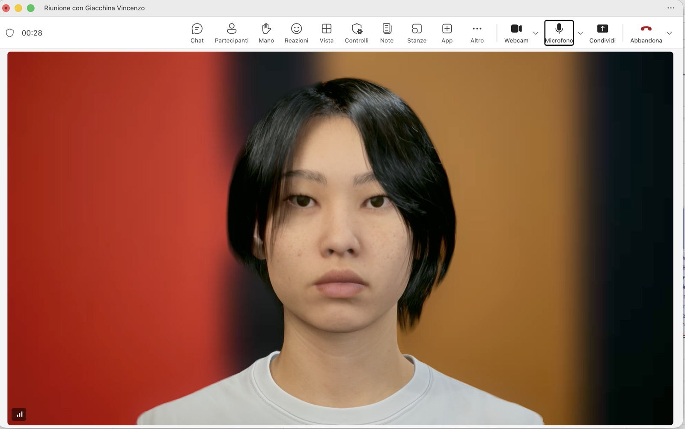
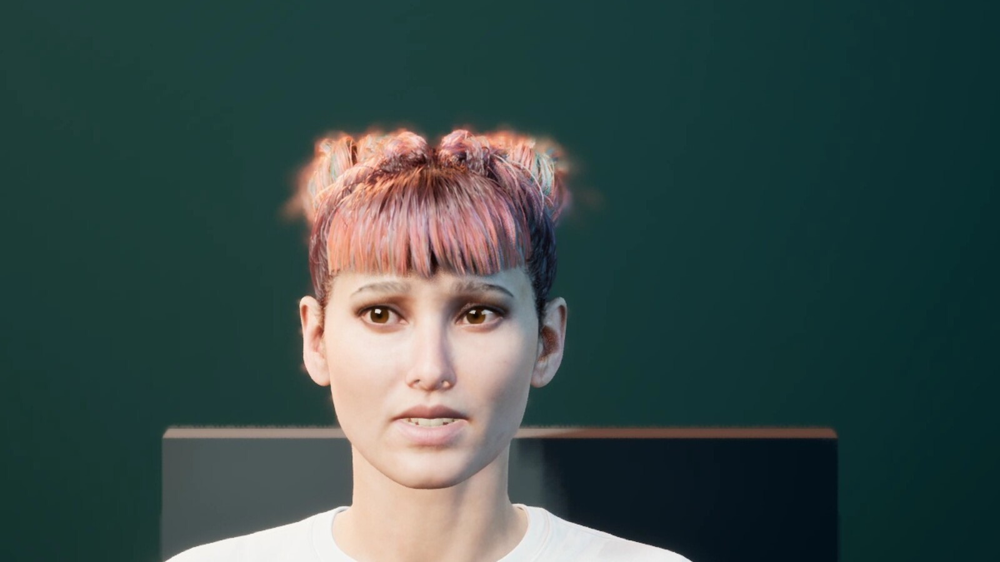

# Conclavia Meeting Avatar

An open-source local companion that brings a configurable Conclavia MetaHuman into Microsoft Teams, Google Meet, or another conferencing application as an interactive participant.

This first implementation does not create a separate bot identity. The host joins with their normal account and the meeting application receives:

- MetaHuman video through OBS Virtual Camera;
- the avatar voice through a dedicated virtual audio device;
- meeting audio through a separate capture device, preventing the avatar from hearing itself.



_Mary in the first end-to-end Microsoft Teams test: Conclavia MetaHuman, Pixel Streaming, OBS Virtual Camera, and virtual audio routing._

## In action

| Requesting the floor | Reacting while listening |
| --- | --- |
|  |  |
| The validated seated markerless performance raises, holds, and lowers the hand without constructing an arm pose at runtime. | The listening pipeline applies the same twelve semantic moods even when Mary decides not to interrupt. This frame shows `amused` mapped to the calibrated `playfulness` face primitive. |

_Both frames were captured from the live UE 5.8 Pixel Streaming renderer at 1920x1080, using production control cues rather than mock poses._

## Current capabilities

- Continuous meeting audio capture from BlackHole 16ch using ffmpeg and OpenAI Realtime transcription.
- Canonical speaker-attributed caption ingestion for safe natural dialogue in multi-participant Teams, Meet, and generic meetings.
- Persistent meeting memory: every final utterance is retained and evaluated by the LLM, including turns that do not address the avatar.
- Low-latency participation lanes: direct questions use a compact response contract, ordinary listening turns use a minimal mood-only contract, and only genuine autonomous-intervention candidates pay for the full decision schema.
- Platform-neutral chat ingestion for Teams, Google Meet browser bridges, and generic adapters, merged chronologically with voice memory.
- Configurable chat commands for semantic gesture requests, voice interventions, chat replies, and meeting summaries.
- Chat message idempotency and avatar self-message filtering to prevent duplicate actions and response loops.
- Configurable avatar name, which is also the direct voice trigger.
- Speaker-scoped dialogue leases: invoke the avatar once, then continue naturally for up to two relevant follow-ups without repeating its name.
- Automatic Realtime transcription reconnection after provider session expiry or a transient socket failure, with bounded exponential backoff.
- Conservative participation control that keeps the avatar silent for fillers, incomplete remarks, and conversations between human participants.
- `request-to-speak` autonomy: the avatar may prepare a useful contribution and visibly request the floor, but it cannot speak until a participant grants permission.
- Positive applause performance: every manual, chat-triggered, or autonomous applause is hard-bound to an `amused` semantic mood, the conservative expression calibration validated in the UE 5.6 prototype, and the captured two-hand performance.
- Floor approval from the web console or by saying phrases such as `Mary, go ahead` or `Go ahead, Mary`.
- Optional live web search for direct questions that require current or external information.
- Configurable OpenAI response model, API key, purpose, free-form personality, structured temperament, and system prompt.
- Timestamped meeting agendas loaded from chat, with reliable one-minute warnings, scheduled topic transitions, and end-of-meeting reminders for both Teams and Google Meet.
- Structured LLM output with one mood and one intensity level for every sentence.
- Separate semantic listening reactions: the LLM selects how the avatar socially reacts to what it hears, even when its action is `silence`.
- Sentence-level language selection with separate native Italian and US English voices.
- Low-latency neural Polly synthesis for supported voices, with automatic generative fallback for identities that do not expose a neural engine.
- Selectable Showcase, Aera, Ada, Vivian, or Jelena MetaHuman identity, Italian voice, English voice, and delivery style.
- In-meeting MetaHuman switcher that shows the profile actually loaded by Unreal and can replace it without manually stopping the renderer.
- Conclavia speech synthesis, lip-sync, and sentence-level Unreal performance cues.
- Embedded Pixel Streaming preview and a clean, overlay-free OBS output page. Participation state remains visible only in the management console.
- Automatic Pixel Streaming remount after an Unreal process restart, preventing a browser tab from remaining attached to an obsolete podcast session that used the same public URL.
- macOS preflight checks for ffmpeg, OBS Studio, and virtual audio devices.
- Full browser meeting room for testing spoken turns, microphone transcription, continuous meeting audio, chat, command aliases, participants, hand raising, floor approval, latency, and MetaHuman output without opening Teams or Meet.
- Live latency breakdown for the LLM, parallel TTS synthesis, Unreal cue/audio handoff, and total response time.

## Participation model

The avatar has three possible actions for each evaluated turn:

1. `silence`: retain the utterance as context and do not interrupt.
2. `speak`: answer immediately when addressed directly or during an active follow-up dialogue.
3. `request-to-speak`: prepare a concise answer, show a matching output indicator, request the configured authored body gesture when available, and wait for approval.

Autonomous requests are limited to three material cases: a factual correction that changes the conclusion, a critical omission such as an unaddressed risk or constraint, or an addition required to make an important decision complete. The structured LLM decision includes an intervention type, importance, and confidence. Runtime code requires both scores to be at least 4/5 and applies a 60-second cooldown; prompt compliance alone cannot make the avatar raise its hand.

A pending request expires after 45 seconds. Granting the floor uses the already prepared response, reducing perceived latency. Dismissing it produces no speech and clears the request. Body gestures are semantic requests for an authored Unreal animation state; the runtime does not construct arm poses bone by bone. The old procedural hand-raise prototype is explicitly disabled in the production `meeting` profile. The production request-to-speak gesture is a seated markerless performance captured from video, baked onto the MetaHuman skeleton and validated from the 1920x1080 Pixel Streaming output.

### Dialogue and floor control

An explicit voice invocation such as `Mary, what are the main risks?` opens a short dialogue lease for that platform participant ID. The same person can ask up to two relevant follow-up questions during the 45-second window without repeating `Mary`. Remarks from other participants are still retained and evaluated, but they cannot consume or inherit that lease, even if their display names happen to match. A different participant starts their own lease by addressing Mary explicitly.

`Mary, stop`, `Thank you, Mary`, and equivalent dismissal phrases immediately close the lease and send an interrupt cue to the renderer. Human-only discussion never grants Mary the floor. If she has an autonomous contribution, she must use `request-to-speak` and wait for a verbal or dashboard approval.

## Mood system and sentence-level performance

Mary uses the same twelve semantic moods while listening and while speaking.
Listening moods are generated for every finalized participant turn, including
turns for which Mary correctly remains silent. Speaking moods are generated
sentence by sentence, so a single answer can change expression naturally as its
meaning changes.

| Mood | Performance intent |
| --- | --- |
| `neutral` | Calm rest state without a strong social signal. |
| `attentive` | Focused listening and clear engagement with the speaker. |
| `curious` | Interest, exploration, or a genuine question. |
| `amused` | Warm amusement and restrained playfulness. |
| `confident` | Assured delivery of a well-supported point. |
| `skeptical` | Visible doubt or a need to verify a claim. |
| `concerned` | Caution about a risk, problem, or consequence. |
| `surprised` | A measured reaction to unexpected information. |
| `empathetic` | Supportive understanding of another participant. |
| `assertive` | A firm, important contribution delivered without aggression. |
| `frustrated` | Bounded disagreement or difficulty, without theatrical exaggeration. |
| `reflective` | Thoughtful consideration or synthesis of a complex point. |

Every mood carries an intensity level from `1` (barely perceptible) to `5`
(strong). Levels 2 and 3 are the normal conversational range; levels 4 and 5
are reserved for content that genuinely warrants a stronger performance.

The LLM returns structured output for each spoken sentence:

```json
{
  "action": "speak",
  "reason": "Direct answer",
  "interventionType": "none",
  "importance": 1,
  "confidence": 1,
  "listeningMood": "attentive",
  "listeningLevel": 2,
  "sentences": [
    {
      "text": "The connection is working correctly.",
      "mood": "confident",
      "level": 3,
      "language": "en-US"
    },
    {
      "text": "I would still verify the audio feedback path.",
      "mood": "concerned",
      "level": 2,
      "language": "en-US"
    }
  ]
}
```

`listeningMood` is Mary's socially appropriate reaction to the latest participant, rather than a mechanical copy of the participant's emotion. It is evaluated even when the participation decision is `silence`, so Mary remains socially present without interrupting. `listeningLevel` is deliberately conservative and is stabilized for approximately 5–9 seconds so the face does not flicker between sentences. `language` is `it-IT` or `en-US`. The renderer preserves the original semantic mood through the control plane, synthesizes up to two sentences in parallel with the selected native-language voices, concatenates their PCM streams, and maps every spoken mood and level to an accurately timed Unreal performance beat.

The bridge assigns each semantic mood its own commercial full-face primitive,
intensity curve, gaze target, and performance direction. No two moods collapse
to the same facial preset in either listening or speaking mode.

## Architecture

```text
Teams agent ─────────┐
Meet browser bridge ─┼──► canonical chat events ──┐
Generic adapter ─────┘                             │
attributed captions ─────► canonical speech events ┤
                                                  ▼
meeting audio ──► live STT ──► chronological memory ──► command router / participation LLM
      ▲                                                            │
      │                                  chat reply / voice / gesture ▼
BlackHole 16ch                                             optional web search
                                                                   │
                platform adapter ◄── outbound chat                  │
                                                                   ▼
                                                      sentence mood + level
                                                                   │
                                                                   ▼
BlackHole 2ch ◄── Conclavia TTS ◄── Unreal / MetaHuman ◄────────── cues
      │                                      │
      └──► meeting microphone                └──► OBS Virtual Camera ──► meeting
```

The companion and Unreal renderer are separate processes. The renderer can therefore run locally or on a cloud GPU without changing the conferencing integration. The companion owns its `/api/unreal/*` gateway, Polly synthesis and AWS lifecycle directly; the separate Conclavia frontend is not required. Direct answers, silent listening reactions, and autonomous participation decisions intentionally use separate structured-output contracts. Every finalized human turn still reaches the LLM and remains in chronological meeting memory. See the [standalone architecture](docs/architecture.md).

### Showcase identity and visual fidelity

The **Showcase** profile is a separate, reproducible UE 5.8 Cine assembly inspired by the visual family used on Epic's MetaHuman homepage. Epic does not publish that homepage character as a named Core Data preset, so the project does not present it as an exact downloadable identity. It starts from the closest installed Jelena family, keeps its own `MHC_Showcase` asset, requests 8K face and 4K body source textures, and uses the Cinematic assembly pipeline. The original 2K/Optimized Jelena profile remains available for comparison and is never overwritten.

The profile is generated once by `Build-ShowcaseAvatar.ps1` during a clean AWS source deployment and persisted with the Unreal project. Runtime selection is then a warm actor swap. The dedicated meeting portrait camera, LOD 0 rendering, strand hair, full texture mips, full-resolution high-sample skin subsurface scattering, a soft warm side key, and the high-bitrate 1080p Pixel Streaming path remain independent from the legacy Conclavia podcast project. The portrait lighting deliberately preserves pore, roughness, and specular variation instead of flattening the face with a white frontal wash. The face rests at true neutral; mood intensity is applied only by sentence-level speech beats or bounded listening reactions, so choosing a high-fidelity identity does not leave it in a permanently tense expression.

## Cross-platform chat and commands

All chat integrations use one canonical endpoint:

```text
POST http://127.0.0.1:4310/api/chat/messages
```

The management application enables chat ingestion and edits comma-separated aliases for six deterministic commands: raise hand, lower hand, applaud, summarize in chat, reply in chat, and speak. A command is recognized only when a message starts with the configured avatar name or mention. Any text after the matched alias remains a free-form LLM directive, for example:

```text
Mary, intervieni riportando la discussione sul rispetto della consegna
Mary, applaudi
```

Messages that do not contain a command still enter meeting memory. Chat is silent by default: `@Mary, what do you think?` receives a written reply. Voice starts only for the configured `speak` command, such as `Mary, intervieni ...`, or when chat explicitly grants a pending request to speak. Unaddressed chat can inform memory or cause a conservative `request-to-speak`, but cannot make the avatar speak immediately.

For immediate local testing, the project includes isolated Chrome bridges for both Teams Web and Google Meet. Run `npm run teams:bridge:open` or `npm run meet:bridge:open`, load the corresponding unpacked extension, reload the meeting tab, and keep its chat panel open. Each bridge reads only newly rendered messages, sends them through the same canonical endpoint, posts Mary’s written replies back into the meeting chat, and reports `ON`, `OPEN`, `OFF`, or `ERR` in its badge. Private Teams or Meet markup never enters the companion core.

The production Teams desktop path is the included Microsoft Teams SDK agent runtime (`npm run teams:agent:dev`). Its manifest supports ordinary meeting group chats and channel meetings with conversation-scoped `ChatMessage.Read.Chat` and `ChannelMessage.Read.Group` consent. Once the owner installs the app and grants that scope, Mary receives all new chat messages without requiring `@Mary`; the wake name is required only when a participant wants to command or question her. See the [chat adapter contract](docs/chat-adapter-contract.md), [transcript adapter contract](docs/transcript-adapter-contract.md), [Teams adapter guide](adapters/teams/README.md), and [Google Meet adapter guide](adapters/google-meet/README.md).

## Facial animation architecture

The current realtime speaking-face path uses the commercial Realistic MetaHuman LipSync plugin. It accepts the same streamed PCM used for playback and exposes realtime mood and intensity on the lip-sync clock. This remains the production default because it is already synchronized and validated in the live path.

Listening is a different state: no fake speech audio is sent to a lip-sync solver. The LLM emits one of the same twelve semantic reactions even when Mary remains silent, the face layer renders its calibrated low-intensity signature, and authored MetaHuman animation owns the body. Mood changes have a minimum hold and automatically settle to neutral. Speaking carries the semantic mood on every sentence, so the Unreal health contract can audit the intended mood separately from the commercial solver's facial primitive.

Applause is a bounded non-speaking exception. Its positive expression is a project-owned, curve-only MetaHuman animation derived from Epic's official happy pose: six restrained mouth-corner, dimple, and cheek controls ease in and out while jaw-open, brow-down, eye-look, and all 875 identity-specific facial-bone tracks are excluded. This keeps the smile warm and closed-mouth across identities instead of feeding silence into the commercial happiness preset, which produced a tense grin on Showcase. The runtime exposes independent `applauseExpressionReady` and `applauseExpressionActive` health gates.

The body path uses Epic-authored or markerless-captured MetaHuman `AnimSequence` assets and is being moved to an Animation Blueprint state machine with linked upper-body layers. The runtime bridge publishes semantic states such as listening, speaking, request-to-speak, and applause; it must not synthesize random per-frame head, breathing, or arm rotations. Meeting rest uses four baked seated clips extracted from different passages of Epic's authored source. Each returns to the same seated anchor; the runtime plays them once, chooses the next clip without immediate repetition, varies only playback timing, and inserts a short irregular rest. Hand raise uses captured motion at 82% strength over the seated base, with an 800 ms boundary ease and a separate 600 ms release from the captured hold into the recorded lowering. Applause keeps the markerless solver's upper-body rotations and captured arm-chain translations at 94% strength so hand contact remains visible and survives differences in body proportions, while the seated lower body remains authored. A 750 ms smoothstep is baked at both applause boundaries to remove the apparent framing jump without moving the camera. Runtime health reports the two independent gates as `physicalGestureReady` and `applauseGestureReady`. Epic's native [Audio Driven Animation](https://dev.epicgames.com/documentation/en-us/metahuman/audio-driven-animation) remains an evaluated backend, but its realtime audio algorithm does not produce head motion. Native [Animation Blueprints](https://dev.epicgames.com/documentation/en-us/unreal-engine/animation-blueprints-in-unreal-engine), [State Machines](https://dev.epicgames.com/documentation/en-us/unreal-engine/state-machines-in-unreal-engine), and [Linked Anim Layers](https://dev.epicgames.com/documentation/en-us/unreal-engine/animation-blueprint-linking-in-unreal-engine) are therefore the correct body/listening architecture regardless of which facial speech solver is selected.

The meeting scene owns one immutable 142 mm webcam camera for idle, listening, speech, hand raise, and applause. The gesture-safe portrait leaves enough lateral and vertical room for the complete captured wrist, fingers, and two-hand applause while retaining a close head-and-shoulders composition. Gesture cues never change the view target, focal length, or aim. Applause plays only the elevated continuous section of the markerless take, omitting its low preparation and lowering frames without synthesizing arm rotations. The applause acceptance run also verifies the camera name and camera count before, during, and after the gesture, so a body-pose transition cannot be misdiagnosed as an actual camera cut.

## Requirements

- macOS
- Node.js 22 or later
- ffmpeg
- OBS Studio with Virtual Camera enabled
- two separate virtual audio paths, recommended:
  - BlackHole 16ch for capturing meeting audio;
  - BlackHole 2ch for routing the avatar voice into the meeting microphone;
  - Loopback can be used instead for a more convenient routing UI.
- AWS IAM Roles Anywhere credentials for the cloud renderer, or a compatible local Unreal supervisor

Keeping capture and avatar output on separate paths prevents feedback loops.

## Start locally

```bash
npm install
cp .env.example .env
npm run dev
```

Open [http://127.0.0.1:4310](http://127.0.0.1:4310).

The web application can configure the meeting platform, avatar profile, name/trigger, model, native Italian and English voices, delivery style, API key, purpose, personality, system prompt, web search, autonomous requests to speak, and exceptional-conclusion applause. It also exposes six operational temperament traits: **calmness**, **assertiveness**, **impulsiveness**, **empathy**, **concision**, and **expressiveness**. These values are not cosmetic metadata: they shape response length, tone, listening and speaking mood intensity, and the minimum interval between autonomous requests to speak, while the materiality and confidence safety gates remain mandatory. Saving applies the new configuration without restarting the companion; if the meeting listener was active, it is restarted automatically. Changing the MetaHuman profile switches the warm Unreal performer immediately and does not require a second **Start avatar** action.

The default **Test room** is an end-to-end meeting simulator rather than a mocked UI. Text entered as speech uses the normal activation and meeting-memory pipeline; chat messages use the canonical Teams/Meet adapter endpoint; quick actions use the currently configured command aliases; and browser microphone input uses the production transcription path. The transcript, chat, participant list, pending floor request, physical-gesture readiness, per-sentence moods, renderer delivery, and latency are visible in one place. **New session** clears the in-memory meeting history and resets pending participation state without changing avatar configuration.

### Agenda timekeeper

Mary can turn a chat message into a live meeting agenda. Address the configured avatar, use the `scaletta` (or `meeting agenda`) command, and put one relative timestamp on every following line:

```text
Mary, scaletta
00:00 Opening and objectives
05:00 Project status
15:00 Decisions
25:00 Actions and owners
30:00 Close
```

Two-part timestamps are `MM:SS`; three-part timestamps are `HH:MM:SS`. The first item must start at `00:00`, timestamps must be strictly increasing, and the last timestamp is the planned meeting duration. The chat message's `capturedAt` value anchors the clock. Mary confirms the agenda immediately, posts a timestamped warning one minute before each transition, announces the next item at its scheduled time, and flags the planned close. A newer agenda replaces the current one for that meeting. `Mary, annulla scaletta` cancels it.

Timed messages do not wait for another participant to write. The local companion keeps a per-meeting outbound queue with short delivery leases, while the Chrome Teams and Google Meet bridges poll it every 1.5 seconds and acknowledge messages only after posting them. This prevents a temporarily hidden or unavailable chat composer from silently losing a reminder. Reload the unpacked extension after updating its source.

You can alternatively provide the API key through the environment:

```dotenv
OPENAI_API_KEY=your-key
```

When entered in the web application, the key is stored only in the local file configured by `CONCLAVIA_CONFIG_PATH`. Its directory and file are created with macOS permissions `0700` and `0600`, the key is never returned by the API, and `.conclavia/` is ignored by Git. The local console binds to `127.0.0.1` by default; do not expose it to an untrusted network.

Default settings:

```dotenv
PORT=4310
HOST=127.0.0.1
CONCLAVIA_WAKE_WORD=Mary
CONCLAVIA_DIALOGUE_TIMEOUT_MS=45000
CONCLAVIA_DIALOGUE_MAX_FOLLOW_UPS=2
CONCLAVIA_CONFIG_PATH=.conclavia/avatar-config.json
CONCLAVIA_RENDERER_URL=http://127.0.0.1:4310
CONCLAVIA_MEETING_AUDIO_DEVICE=BlackHole 16ch
CONCLAVIA_MEETING_SPEAKER_NAME=Meeting participant
OPENAI_RESPONSE_MODEL=gpt-5.4-mini
OPENAI_TRANSCRIPTION_MODEL=gpt-4o-mini-transcribe
OPENAI_REALTIME_TRANSCRIPTION_MODEL=gpt-4o-mini-transcribe
```

The chat enable switch and command aliases are stored in the local avatar configuration and edited from the web application.

Start the complete local companion and AWS Unreal studio:

```bash
npm run studio:3d:start
```

This is the single normal startup command. It is idempotent when the instance
is already running: it refreshes the IP allow-list, supervisor token and
automatic shutdown deadline, saves only rotating local values to the ignored
`.env`, rebuilds and restarts the local companion, starts the selected
MetaHuman, waits for the video to become live and starts meeting listening when
OpenAI is configured. The command does not report the studio as ready until the
avatar is actually live. Stop both the companion and GPU billing with
`npm run studio:3d:stop`.

The OpenAI API key is the only required one-time local configuration. Enter it
under **Configuration** and save it; subsequent `studio:3d:start` runs reuse the
private ignored configuration automatically.

The Unreal source, infrastructure and recovery process are versioned in this
repository. Deploy source only from a clean commit with
`npm run studio:source:deploy`, and verify AWS against Git with
`npm run studio:source:audit`. The complete disaster-recovery procedure is in
[Rebuilding the AWS Unreal studio](docs/aws-rebuild.md).

## Teams, Google Meet, and OBS setup

1. Route the Teams or Google Meet speaker output to a multi-output device that includes BlackHole 16ch.
2. In the companion console, select **Start meeting listening** and verify that the BlackHole device is resolved.
3. Open the clean MetaHuman output page from the renderer section and add it to OBS as a browser source.
4. Start OBS Virtual Camera and select it as the camera in Teams or Google Meet.
5. Route the MetaHuman/Pixel Streaming audio to BlackHole 2ch and select BlackHole 2ch as the meeting microphone.
6. Verify that the MetaHuman is live; the complete studio startup command
   normally starts it automatically.

The BlackHole realtime transcript uses the configured generic speaker name because a mixed audio device cannot reveal who spoke. It still feeds complete meeting memory, but natural follow-ups are intentionally disabled on this unattributed path. A Teams or Meet caption adapter posts stable `speakerId` values to `/api/transcript/segments`; that attributed path enables the two-turn dialogue lease safely in a room of 5–10 people. Direct `Mary, ...` invocations continue to work on either path.

## Suggested end-to-end test

1. Say a normal sentence without the avatar name. It must appear in memory without an immediate answer.
2. Ask `Mary, what was said before?`. Mary should answer with the retained context.
3. Continue with `And what do you suggest?` and then `And for tomorrow?` without repeating the name. Both clearly directed follow-ups belong to the original speaker.
4. Ask for a current fact. With web search enabled, the turn result should report web usage and expose its sources in the console.
5. Continue a human-only discussion with a substantial point. If Mary has a genuinely useful contribution, she requests the floor without audio. A physical hand raise is shown only when Unreal reports a validated authored gesture asset.
6. Approve it in the console or say `Mary, go ahead`; only then should speech and animation start.
7. Say `Thank you, Mary` or `Mary, stop` to close the dialogue early; otherwise it closes after two follow-ups or its timeout.
8. Inspect the turn JSON: every spoken sentence must include its own `mood`, `level`, and `language`.

The **Microphone** control performs the same flow through the browser microphone. The **Spoken** composer is the fastest option for deterministic protocol tests. Switch the composer to **Chat**, use the chat sidebar, or select one of the five quick commands to call the production chat endpoint before a platform adapter is connected. The equivalent CLI command is:

```bash
npm run chat:simulate -- teams Vincenzo "Mary, riassumi in chat"
```

To simulate two attributed speakers without a platform adapter:

```bash
npm run transcript:simulate -- teams user-vincenzo Vincenzo "Mary, what are the main risks?"
npm run transcript:simulate -- teams user-laura Laura "And for tomorrow?"
npm run transcript:simulate -- teams user-vincenzo Vincenzo "And what should we do first?"
```

## Commands

Run the environment preflight:

```bash
npm run preflight
```

Test only the deterministic trigger gate:

```bash
npm run simulate -- "Mary, what do you think?"
```

Run all quality checks:

```bash
npm run lint
npm run typecheck
npm test
npm run build
```

## Privacy and security

Inform every participant before capturing or processing meeting audio. Transcript content and audio may contain confidential data. Never commit provider credentials, local configuration, recordings, or meeting transcripts.

## Roadmap

- Stream TTS generation and playback to reduce time to first audio further.
- Move the validated request-to-speak and seated-idle repertoire into a blended Animation Blueprint state machine; keep every body pose asset-driven.
- Calibrate and package the Teams attributed-caption bridge; keep the isolated Teams Web chat bridge aligned with Teams DOM changes.
- Keep the isolated Google Meet browser bridge calibrated as Meet's private DOM evolves, and add attributed-caption extraction.
- Provision the included Teams SDK agent and RSC manifest in a managed tenant, then move its local relay to an authenticated outbound production channel.
- Add persistent latency histograms and percentile dashboards for transcription, web search, TTS, and renderer handoff.
- Add optional diarization for conferencing clients that cannot expose attributed captions.

## License

MIT
