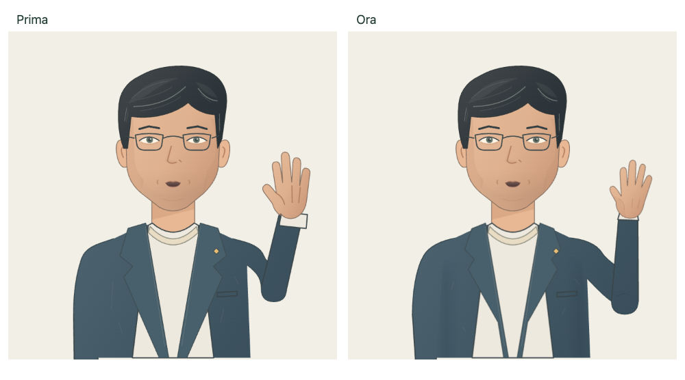

# Editorial avatar 2D

## Shared-kit review, 21 September 2026

True eyelid occlusion, expressive lip corners, F/V contact, progressive fingers and longer attentive holds. Repeated identical SVG writes are skipped; this is not a measured frame-rate claim. [Ten-cycle diary](https://github.com/vgflutter/conclavia-avatar-kit/blob/main/docs/reviews/2026-09-21-editorial.md) · [Integrated results and production assessment](avatar-kit-review-2026-09-21.md).

Latest visual revision: [arm, wrist and tailoring](#arm-wrist-and-tailoring-refinement-20-september-2026). Engineering check: [20 September pre-commit verification](verification-2026-09-20.md). Visual evidence and renderer limits are documented below.

The existing male and female SVG portraits now use one articulated animation rig. Their saved appearance IDs, voice pairing and lightweight fallback role are unchanged. The palette uses muted blue and terracotta tailoring, a restrained hierarchy of contour weights, coherent cloth and hair shading, and a subtle skin gradient; no external raster assets or WebGL are required.

## Motion and speech

- A single mouth contour interpolates width, rounding and audio-proportional opening with a 22 ms time constant. The upper lip moves by less than one SVG unit, coordinated with opening; most movement stays in the lower lip and jaw. Rounded O/U vowels reshape the upper border and withdraw the teeth instead of displaying a narrower smiling A. Teeth remain clipped to the cavity. The jaw deforms both the face outline and its clip by up to 2.8 SVG units, while eyes and nose keep their positions. Silence, stop and closed consonants close the cavity in the same layout update, without waiting for a CSS fade.
- The resting arm hangs vertically beside the body. Its wrist sits below the bottom of the portrait, so the hand cannot rest on the chest or abdomen. The same forearm rises along the outside of the body; a projected elbow/wrist trajectory keeps the intermediate sleeve readable. Its fill overlaps the upper sleeve without a transverse elbow outline. Fingers relax at rest and open continuously during the raise; there is no opacity swap between arm drawings.
- The torso stays fixed: there is no whole-body rotation, breathing translation or speech-driven head sinusoid. Independent finite actions provide presence: eyes acquire a point before the head follows, then return to sustained camera contact; a rare small nod and a separate forearm adjustment occur between long quiet intervals. Breathing affects only a sub-pixel collar expansion. Speech and hand raising attenuate these idle actions. Reduced motion suppresses idle movement and snaps explicit gestures while preserving speech articulation. Hidden tabs pause the local animation clock; unmount cancels the animation frame.

Implementation: `BusinessAvatar.tsx`, `BusinessAvatar.module.css`, `useEditorialMotion.ts` and `editorial-motion.ts` in the shared [`conclavia-avatar-kit`](https://github.com/vgflutter/conclavia-avatar-kit/blob/main/README.md). The Meeting files are compatibility re-exports. The public component API is unchanged; 2.5D and 3D still use the editorial renderer as their fallback.

## Review and verification

Open `/avatar/test`, select the editorial 2D style and either appearance. **Play animation / Avvia animazione** runs the shared nine-second silent rehearsal without voice credits or saving preferences. For idle movement, leave the preview at rest for several seconds. Real voice playback is a separate action.

Focused regression command, using only the temporary test database:

```sh
env MONGODB_URI=mongodb://127.0.0.1:27018 npm run test:e2e -- tests/e2e/editorial-animation.spec.ts tests/e2e/avatar-illustrated.spec.ts tests/e2e/female-avatar-motion.spec.ts
```

Coverage includes frame-rate independence, gesture reversals, invalid/silent energy, immediate mouth closure, bounded upper-lip movement, real UI pose controls, clipped mouth geometry, both appearances, responsive fitting and live reduced-motion changes. Forty-second browser observations measure the actual rendered torso bounds and hand position relative to the waist, and verify sustained held poses between independent head/gaze actions. Synthetic PCM checks measure browser playback and visual articulation only; they do not validate a Teams conversation.

The renderer remains an editorial SVG illustration: hand contour changes are stylized and the phoneme rig approximates speech, rather than simulating facial anatomy.

Earlier production-browser recordings (before the arm revision below): [male](images/editorial-motion/male.webm), [female](images/editorial-motion/female.webm). These include the real SVG and product controls, without voice requests or saves. [Combined three-style validation and mobile captures](avatar-styles.md).

Sampled recording frames: [male](images/editorial-motion/male-contact-sheet.png), [female](images/editorial-motion/female-contact-sheet.png).

## Arm, wrist and tailoring refinement, 20 September 2026

Removing the sleeve lines did not correct the raised arm's tube-like shape or the awkward wrist. The latest revision changes the articulated drawing in the shared kit for both appearances:

- A lower raised elbow gives the upper arm a downward diagonal. The sleeve tapers from elbow to wrist, with a small local fold instead of a transverse joint line.
- The elbow moves outward before the wrist rises. This retains visible forearm length through the middle of the gesture. Palm orientation follows the actual forearm axis with modest wrist flex; an independently interpolated hand angle had pointed backwards during the turn.
- The cuff follows the sleeve independently of palm flex. The hand has tapered fingertips, a defined thumb and progressive finger extension. At rest it remains below the waist.
- Revised lapels, shorter cloth folds and softly faded shading add volume to the jacket without bringing back the lengthwise lines through the sleeves. The face and fixed torso retain their existing animation.



Current captures from the actual `/avatar/test` nine-second sequence, with all non-GET requests blocked:

| Appearance | Rest | Raised | Sampled sequence | Complete motion |
| --- | --- | --- | --- | --- |
| Male | [Rest](images/editorial-anatomy/business_clay-rest.png) | [Raised](images/editorial-anatomy/business_clay-raised.png) | [Frames](images/editorial-anatomy/business_clay-sequence.png) | [Video](images/editorial-anatomy/business_clay-motion.webm) |
| Female | [Rest](images/editorial-anatomy/business_clay_female-rest.png) | [Raised](images/editorial-anatomy/business_clay_female-raised.png) | [Frames](images/editorial-anatomy/business_clay_female-sequence.png) | [Video](images/editorial-anatomy/business_clay_female-motion.webm) |

The before frame comes from the committed sleeve-line correction (`conclavia-avatar-kit` revision `58f6c32`). These captures supersede the shoulder/tailoring recordings retained below as history. Both sequences returned to idle with zero browser errors or write attempts. [Capture report](images/editorial-anatomy/review.json).

The final **19 focused tests passed**. New coverage checks palm/cuff overlap and framing at 30 steps in each direction for both appearances, plus bounded wrist flex and minimum projected forearm length. The existing shoulder silhouette, idle, mouth closure, audio, reversal, reduced-motion and mobile checks also passed. Both consumer production builds, the sharing check, shared source lint/typecheck and Meeting lint/typecheck passed. These checks and sampled visual review do not validate live Teams audio or photorealistic anatomy.

## Long visual observations

The revised rest pose and motion timing are recorded from the actual local browser, without saving preferences or requesting speech:

- [Male, identity view, 40 seconds](images/editorial-motion-v2/business_clay-40s.webm)
- [Female, voice and movements view, 40 seconds](images/editorial-motion-v2/business_clay_female-40s.webm)

The JSON observations alongside the clips record the rendered body transform and hand/waist positions. These recordings complement the initial, intermediate and raised gesture screenshots; static screenshots alone cannot establish that idle movement has meaningful pauses.

## Illustration and articulation refinement

Two completed visual review cycles, followed by a final correction, are preserved under `docs/images/editorial-refinement/`:

1. `cycle-1/`: thinner and differentiated contours, hair strands, revised glasses, iris/pupil detail, cloth shading and initial face planes. The review rejected the oval cheek highlights and a geometric beard mask, and found excessive teeth visibility on rounded vowels.
2. `cycle-2/`: removed those cheek patches and the beard mask; replaced the latter with a faint continuous jaw tint. Added filled upper/lower lip volumes and distinct rounding for O/U, with progressively hidden teeth.
3. `final/`: removed rectangular cloth shadow patches and reduced the lighting contrast between sleeve and jacket. The upper lip now has bounded movement coordinated with the jaw, rather than being rigidly pinned. The actual face outline and clip follow the lower jaw. The raised wrist has a small inward inclination and the sleeve cap follows the gesture locally; the torso remains fixed.

Both identities have actual browser screenshots for rest, A/E/O/U, close-ups, raised hand and gesture reversals. Final `*-presence-gesture.webm` clips contain 32 seconds of undisturbed waiting followed by raising, lowering, reversal and return. The matching JSON files record actual torso bounds and hand position. These are synthetic browser rendering checks, not provider voice or Teams acceptance.

The final browser regression additionally checks all four vowel contours, lip containment within the face, tooth withdrawal during rounded vowels, coordinated face/clip deformation and exact closure on stop. Existing tests retain arm-at-side and stable-torso regressions.

## Shoulder proportions correction, 20 September 2026

The previous visual review missed an oversized viewer-left shoulder and sleeve. Its separately drawn contour flared beyond the relaxed articulated arm on the opposite side. This was particularly conspicuous with the hand raised; the earlier recordings above retain that defect.

The first correction gave both relaxed sleeves the same proportions. The user correctly rejected the result: both shoulders were still excessively rounded. Symmetry and passing regressions did not establish acceptable proportions.

That revision defined the shoulder cap earlier and let the upper sleeve descend almost vertically, instead of continuing the shoulder curve to the elbow. Resting elbows/wrists sit closer to the torso; sleeve width at the elbow changes from 70 to 58 SVG units. The jacket body is narrower, its seams and pocket follow the new cut, and the attachment overlaps without thin background slits. The raised arm retains elbow/wrist articulation with a slimmer sleeve and visible space below the upper arm. Male and female illustrations share this geometry, including the editorial fallback.

The browser regression samples the filled jacket silhouette at six heights, accounting for nested SVG transforms. At rest, the two sides must differ by no more than four SVG units and there must be no gaps. Crucially, below the shoulder cap each silhouette edge may widen by at most 18 SVG units between y=540 and y=620; this rejects the previous symmetric but inflated shape. The viewer-left contour must stay fixed during the hand raise. The attachment probe checks the shoulder joint while allowing intentional space beneath the raised upper arm. These checks complement mouth, reverse-gesture, reduced-motion and mobile coverage; visual judgement remains separate.

Historical browser evidence for the shoulder correction, with non-GET requests blocked:

| Appearance | Previous rest pose | Current rest | Current raised pose | Complete silent sequence |
| --- | --- | --- | --- | --- |
| Male | [Before, at rest](images/editorial-tailoring/business_clay-before.png) | [Rest](images/editorial-tailoring/business_clay-rest.png) | [Raised](images/editorial-tailoring/business_clay-raised.png) | [Motion](images/editorial-tailoring/business_clay-motion.webm) |
| Female | [Before, at rest](images/editorial-tailoring/business_clay_female-before.png) | [Rest](images/editorial-tailoring/business_clay_female-rest.png) | [Raised](images/editorial-tailoring/business_clay_female-raised.png) | [Motion](images/editorial-tailoring/business_clay_female-motion.webm) |

The [side-by-side comparison](images/editorial-tailoring/comparison.png) contains actual browser frames. These captures supersede `editorial-shoulder/`, which retains the rejected first correction. They involve no voice-provider requests or saved preferences. Verification results are recorded in the [20 September report](verification-2026-09-20.md#second-shoulder-revision).

The subsequent sleeve-detail review caught two artificial lengthwise lines: the stroked torso overlap and a parallel decorative seam. The torso now covers both sleeves with fill only, the long decorative seam is removed, and both forearms sit behind that fill while hands stay in front. This preserves the external arm contour and gesture without drawing a line through the resting sleeve. The rest/raised frames and clips in that table include the sleeve-line correction; [enlarged before/after detail](images/editorial-tailoring/sleeve-detail.png). The mobile regression continues to check the forearm separately despite the changed layer order.
