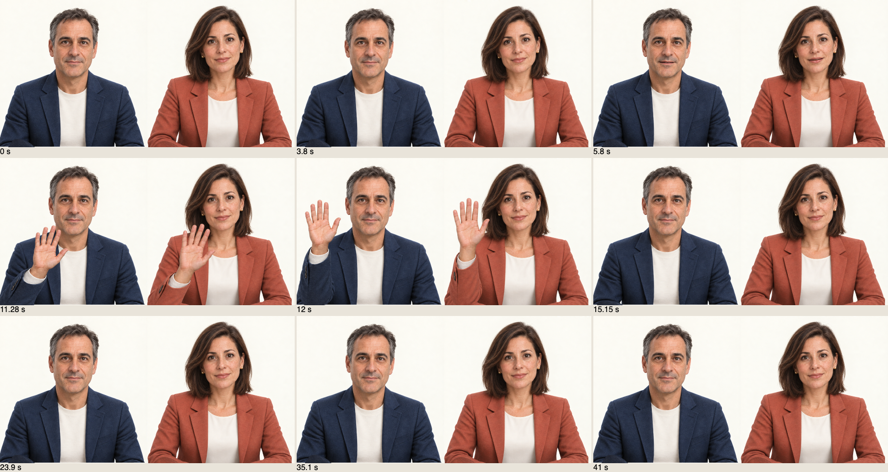

# Avatar kit: review e distanza dalla produzione — 21 settembre 2026

## Valutazione

**Il kit è candidato a un pilot controllato, non ancora a un rilascio generale con una promessa di realismo umano.** Il 2D è la direzione più coerente e leggera. I nuovi ritratti Studio migliorano nettamente l’aspetto fotografico; le labbra e il braccio rivelano ancora la superficie deformata. Il 3D ha una gestualità più articolata, ma dentatura, gengiva e capelli restano legati alla qualità dei modelli originali.

Questa valutazione riguarda sia la qualità delle animazioni sia l’affidabilità dell’integrazione. Non attribuisce una percentuale di completamento al prodotto: un test verde e una foto convincente misurano aspetti diversi. [Review del kit e decisioni tecniche](https://github.com/vgflutter/conclavia-avatar-kit/blob/main/docs/reviews/2026-09-21-production.md).

| Famiglia | Cosa è migliorato | Cosa impedisce di definirla finita |
| --- | --- | --- |
| Editoriale 2D | Palpebre con occlusione, F/V, espressioni labiali, apertura progressiva delle dita, sguardo prima della testa, lunghe soste | È volutamente illustrato; serve l’approvazione della direzione artistica sul parlato continuo |
| Personaggio 3D | Camera, inviluppi distinti per fonema, dita rilassate, assestamento locale spalla/gomito/polso, recupero errori | Denti/gengiva, capelli e faccia poco credibili nei primi piani; occorre intervenire sul modello |
| Ritratto 2.5D | Due identità fotografiche nuove, labbra e mento coordinati, F/V, palpebre e braccia proprie | Protrusione e rotazioni del viso limitate, cavità orale da texture, braccio planare |

## Dieci cicli per famiglia

Tre agenti hanno lavorato su aree di sorgente separate, ciascuno con dieci passaggi di modifica, rendering e critica. **Trenta cicli non significa trenta candidate approvate:** il naso 2D più scolpito, la dentatura 3D corretta direttamente in geometria e altre varianti sono stati scartati quando peggioravano l’immagine. Il materiale 3D ceramico è stato escluso dal catalogo dopo la review indipendente finale; rimane solo una candidata programmatica per confronti futuri.

- [Diario editoriale, 10 cicli](https://github.com/vgflutter/conclavia-avatar-kit/blob/main/docs/reviews/2026-09-21-editorial.md)
- [Diario 3D, 10 cicli](https://github.com/vgflutter/conclavia-avatar-kit/blob/main/docs/reviews/2026-09-21-3d.md)
- [Diario 2.5D, 10 cicli e provenienza dei nuovi asset](https://github.com/vgflutter/conclavia-avatar-kit/blob/main/docs/reviews/2026-09-21-portrait.md)

Il codice canonico rimane in `conclavia-avatar-kit`. Meeting e Onboarding ricevono gli stessi cambiamenti tramite il pacchetto condiviso; le impostazioni salvate dei due prodotti restano separate.

## Catalogo disponibile

Tre stili, quattro identità, **otto combinazioni supportate**:

| Aspetto | Editoriale 2D | Ritratto 2.5D | Personaggio 3D |
| --- | --- | --- | --- |
| Originale maschile | sì | sì | sì |
| Originale femminile | sì | sì | sì |
| Studio maschile, fotografico | — | sì | — |
| Studio femminile, fotografico | — | sì | — |

Aprire [Voce e movimenti](http://localhost:3000/avatar/test), scegliere **Ritratto 2.5D** e uno degli aspetti **Studio**. **Avvia animazione** mostra la sequenza silenziosa di nove secondi, senza chiamate vocali o salvataggi. Il gesto manuale e l’attesa permettono di osservare le transizioni più a lungo. **Ascolta la voce** è un’azione distinta che può consumare credito Inworld. Il profilo dei meeting cambia solo con **Salva avatar**.

Il cambio di stile preserva le voci compatibili e ricorda la scelta del ritratto per genere. I fallback usano la corretta identità maschile/femminile. Le API rifiutano combinazioni prive di asset; i profili precedenti all’introduzione di `visualStyle` restano modificabili.



[Studio maschile, 42 s](images/avatar-kit-review-2026-09-21/portrait/natural-male-final.webm) · [Studio femminile, 42 s](images/avatar-kit-review-2026-09-21/portrait/natural-female-final.webm) · [2D maschile](images/avatar-kit-review-2026-09-21/editorial/final-animation/business_clay.webm) · [2D femminile](images/avatar-kit-review-2026-09-21/editorial/final-animation/business_clay_female.webm) · [3D, 60 s con la candidata scartata inclusa nel confronto](images/avatar-kit-review-2026-09-21/3d/final/four-profiles-60s.webm).

Le registrazioni dei cicli sono harness di review che importano il renderer reale. Non sono filmati Teams né misure di sincronizzazione con un interlocutore remoto.

## Correzioni per il rilascio

- Next aggiornato da 16.3.0 a 16.3.5 nei tre progetti, ESLint allineato nei consumer; aggiornato il transitorio js-yaml segnalato dall’audit.
- GLB rivalidati con ETag/304 e cache server limitata all’allowlist. Il primo download resta circa 7,7 MiB per il maschile e 9,4 MiB per il femminile: non è una riduzione delle dimensioni.
- Nuovi test autonomi del catalogo e della distribuzione asset; recupero dei renderer da A fallito a B e di nuovo A senza loop di retry.
- Test Meeting bloccati prima dell’avvio se ricevono un URI diverso dal Mongo temporaneo 27018 o un DB fuori da `conclavia_e2e_*`.
- Manifesto di rilascio nel kit per registrare tutti e tre i commit, lockfile e hash degli asset. `file:../conclavia-avatar-kit` da solo non fissa la revisione distribuita.

## Verifiche integrate

| Verifica | Esito |
| --- | --- |
| Regressioni Meeting su avatar, catalogo, draft, voci e player | **131 casi distinti verificati**: prima esecuzione 128/131; corrette tre fixture 3D, intero file 5/5 al rerun |
| Chrome, Firefox e WebKit | **6/6**, otto combinazioni a 390 px e stop del PCM sintetico per motore |
| Onboarding browser | **5/5** al rerun completo, incluse nuove identità e risposta GLB 304 |
| Test autonomi kit / unitari Onboarding / script Meeting | **4/4 + 12/12 + 36/36** |
| Lint e TypeScript | Passati per tutti e tre i progetti; kit lintato con la configurazione del consumer |
| Build Meeting e Onboarding | Passate con **Next 16.3.5**, output separati, Mongo temporaneo |
| Audit npm | **0 vulnerabilità note** segnalate nei tre progetti al momento della verifica |
| Packaging | `npm pack --dry-run` include entrambi i GLB e tutti e tre i nuovi atlanti |

I tre fallimenti 3D iniziali non richiedevano modifiche al renderer: `angleTo` presume quaternioni normalizzati, mentre i GLB hanno arrotondamenti Float32; ora il test confronta esattamente la base e normalizza copie per le distanze, mantenendo la soglia. Il 503 simulato veniva consumato da una richiesta abortita di StrictMode; resta ora attivo fino al fallback osservato. Onboarding aveva un selettore nuovo troppo esatto per il nome accessibile della select: corretto e ripetuti tutti e cinque i flussi.

Firefox segnala l’assenza dell’estensione di compilazione parallela e un output shader non letto; il percorso compatibile rende gli otto avatar e passa i controlli. Non sono stati nascosti i warning né considerati una misura delle prestazioni su hardware mobile. [Catture dei tre motori](images/avatar-kit-review-2026-09-21/cross-browser/).

La build standalone Meeting è stata avviata sulla porta 3102 con DB temporaneo. **Otto registrazioni della sequenza reale del prodotto**, tutte rientrate in idle, con apertura della bocca finale zero, nessun `pageerror` e nessuna richiesta di modifica. Il contenitore è ingrandito a 720 px solo per la review; i prop e il codice di animazione sono quelli del prodotto. [Rapporto macchina](images/avatar-kit-review-2026-09-21/production/review.json).

| Famiglia | Registrazioni dalla build standalone |
| --- | --- |
| Editoriale | [Maschile](images/avatar-kit-review-2026-09-21/production/editorial-business_clay/motion.webm) · [Femminile](images/avatar-kit-review-2026-09-21/production/editorial-business_clay_female/motion.webm) |
| 3D | [Maschile](images/avatar-kit-review-2026-09-21/production/stylized_3d-business_clay/motion.webm) · [Femminile](images/avatar-kit-review-2026-09-21/production/stylized_3d-business_clay_female/motion.webm) |
| 2.5D originale | [Maschile](images/avatar-kit-review-2026-09-21/production/portrait_2_5d-business_clay/motion.webm) · [Femminile](images/avatar-kit-review-2026-09-21/production/portrait_2_5d-business_clay_female/motion.webm) |
| 2.5D Studio | [Maschile](images/avatar-kit-review-2026-09-21/production/portrait_2_5d-portrait_natural_male/motion.webm) · [Femminile](images/avatar-kit-review-2026-09-21/production/portrait_2_5d-portrait_natural_female/motion.webm) |

Comandi riproducibili, da Meeting con Mongo temporaneo già attivo:

```sh
env MONGODB_URI=mongodb://127.0.0.1:27018 npm run test:e2e -- \
  avatar-catalog avatar-stability editorial-production rigged-production portrait-production \
  avatar-appearance avatar-workspace avatar-draft-workflow avatar-styles avatar-portrait \
  avatar-rigged avatar-illustrated avatar-animation-preview avatar-voice-pairing avatar-voices \
  avatar-rate-settings female-avatar-motion editorial-animation portrait-expression \
  portrait-idle portrait-lips portrait-motion portrait-posture portrait-visual \
  rigged-avatar-motion voice-sync voice-playback-metrics
env MONGODB_URI=mongodb://127.0.0.1:27018 npm run test:e2e -- --config playwright.avatar-browsers.config.ts
# Dopo aver avviato la build isolata su 3102, senza regressioni in parallelo:
node scripts/review-avatar-articulation.mjs --url http://127.0.0.1:3102 --output /tmp/avatar-review
```

L’app locale su **3000** è stata riavviata con Next 16.3.5 e risponde su `/avatar/test`; le due identità Studio vengono caricate senza errori né richieste di modifica. Il profilo salvato è stato confrontato prima/dopo il riavvio e prima/dopo l’ispezione: invariato. Le quattro route di gestione testate con un host pubblico simulato rispondono 404.

**Connessione esterna non approvata:** il precedente dominio Quick Tunnel restituisce `ENOTFOUND`. Il launcher autorizzato ha provato a creare un tunnel nuovo, ma il controllo pubblico è scaduto; ha quindi ripristinato la configurazione precedente. L’app locale è stata riavviata ed è rimasta disponibile. Non è stata modificata la configurazione DNS del Mac, né sono stati creati bot. Questo esito non è una verifica di raggiungibilità dell’avatar pubblico; prima di una conversazione reale occorre recuperare e verificare il collegamento HTTPS.

I test usano Mongo temporaneo `127.0.0.1:27018`, provider disabilitati o PCM sintetico. Le immagini nuove sono state generate offline, non a ogni rendering. Nessun test ha salvato nel Mongo reale o creato partecipanti Teams. `.env.local` e preferenze salvate sono preservati.

## Passi necessari per il rilascio

1. **Pilot interno:** scegliere una direzione visiva, approvare due minuti di parlato italiano/inglese su entrambi i volti, verificare un incontro reale, rete lenta e un dispositivo mobile fisico. Servono anche avvio/ripristino e osservabilità sul servizio effettivamente distribuito.
2. **Meeting pubblico:** autenticazione e proprietà del workspace, autorizzazione delle query, HTTPS stabile, policy di conservazione e procedure operative. Il PoC locale e il tunnel temporaneo non costituiscono questa architettura. Onboarding ha già confini applicativi propri, che vanno verificati nella distribuzione cliente.
3. **Persona quasi reale:** scegliere un rig facciale più completo o una pipeline dedicata di animazione fotografica, valutare licenze/asset, latenza e costo con un prototipo separato. Aggiungere altre palette al 3D attuale non risolve il volto.

Come ordine di grandezza, dopo l’approvazione artistica un pilot del kit può richiedere ancora alcuni giorni di prove e correzioni sui dispositivi target. La produzione generale e un avatar vicino a un video umano sono lavori distinti, da stimare dopo un prototipo e requisiti di deployment; non sono una rifinitura finale da poche ore.

Il problema storico «Ciao Riccardo» → «Charlie cardo» rimane aperto. Lavori sul renderer, test sintetici, tunnel raggiungibile e build riuscite non validano riconoscimento vocale, audio ricevuto o latenza Teams. [Indagine sulla trascrizione](caption-recognition-2026-09-13.md).
