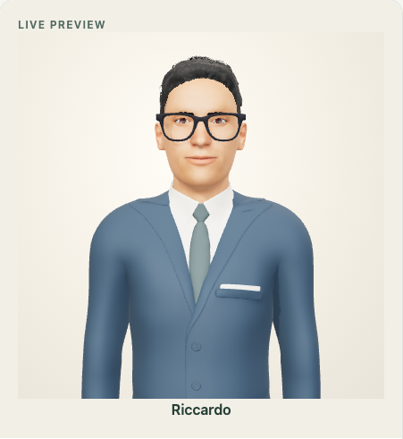
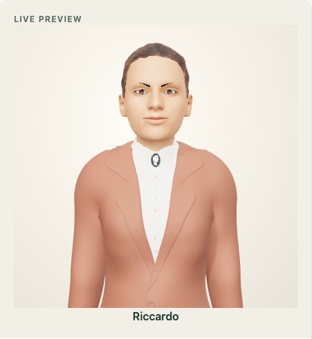
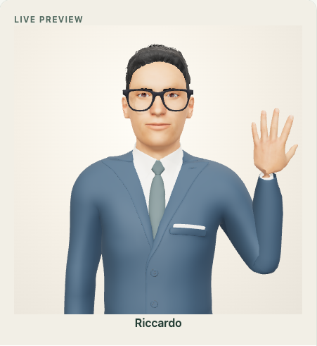
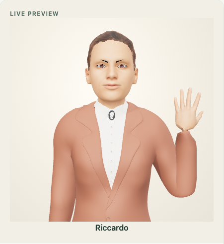

# Animated 3D characters

Latest engineering check: [20 September pre-commit verification](verification-2026-09-20.md). Visual evidence and renderer limits are documented below.

Latest visual revision: [materials, articulation and integrated review](avatar-refinement-2026-09-19.md). The earlier [stable torso and separate waiting actions](avatar-presence-review-2026-09-19.md) remain in place.

At **Avatar → Voice & movement**, select **3D character** (Italian: **Personaggio 3D**), then Male or Female. Use the hand, expression and voice controls. Save only when you want the choice applied to meetings. Existing profile, voices, history and meeting permissions are preserved.

These are real skinned 3D characters, replacing the old capsule-based figures. They are **not identical 3D reconstructions of the approved portrait images**. The animated portrait remains available as the separate 2.5D style. Visual acceptance still belongs to the user/client; successful animation tests do not establish that the design is approved.

## Browser previews

Actual browser renders, not generated promotional images:

| Male | Female |
| --- | --- |
|  |  |
|  |  |

## What actually moves

- One weighted body per character, with the same arm in every pose. A Blender-exported bone animation is sampled continuously for shoulder, elbow, wrist and fingers. It does not fade between photographs or replace the arm with another drawing.
- A subdivided face with separate vowel/consonant shapes, blink, gaze, brow and smile shapes. The existing PCM output clock and audio envelope drive the lips; no additional synthesis or image-generation call is made.
- Waiting uses distinct actions over a 43-second sequence: a brief side glance, a downcast glance, a local right-shoulder adjustment and a glance to the other side. Eyes lead the head by 160–180 ms. More than 80% of the sequence consists of actual holds, apart from blinks and tiny local chest expansion. There is no idle head roll, torso rotation or speech-driven nod. Speech and the intentional hand gesture suppress the decorative actions.
- A critically damped gesture starts and stops smoothly, retaining velocity on reversals. The shoulder leads the upper body; the torso settles later and the wrist accompanies the authored elbow/finger clip. The middle of the arm path moves forward and inward so fingers stay inside the portrait frame. Head compensation keeps the face oriented toward the camera.
- The 22 ms facial transition blends the actual mesh morphs; quiet syllables have smaller amplitude, with no fixed minimum opening. Silence, stop and closed-lip consonants clear opening targets immediately. Smile and brows transition together over 140 ms.
- All decorative rotations are reapplied relative to their bases. The sampled wrist and upper-arm poses are restored before the animation mixer, preventing cumulative twist even when an intermediate gesture is held. Hidden tabs pause the local animation clock, so returning does not jump to a different waiting pose.
- Reduced motion disables decorative movement/blinking and makes intentional hand changes immediate; expression and speech controls remain functional.

The hand is an avatar gesture, **not** the Teams toolbar raised-hand status. Speech still requires the existing named permission rules. The renderer does not change transcription, prompts, proactive checks, meeting lifecycle or the voice provider.

## Loading, performance and failure

The GLBs and their embedded WebP textures live in `conclavia-avatar-kit/assets/rigged-v1` and are served by each application through its `/avatars/rigged-v1/[asset]` route. Three.js and the model load only for this style. Shader compilation precedes the ready state; a loading message is shown meanwhile. Lighting uses a local environment, one shadow map and capped pixel density. No new avatar subscription or per-frame cloud rendering is involved.

This adds an initial model download/GPU setup (8.1 MB male, 9.8 MB female, including textures) and a continuous GPU rendering workload, **not another request in the answer-generation pipeline**. It is not a promise of zero impact on slow devices. The illustrated option is lighter. Voice samples still consume Inworld credit unless a synthetic test fixture intercepts them.

Only `/avatars/rigged-v1/male.glb` and `/avatars/rigged-v1/female.glb` are allowed through the temporary tunnel. Management routes and source/build files remain blocked. On fetch failure or unavailable/lost WebGL, an explicit notice accompanies the 2D fallback, without modifying the selected/saved style.

## Asset provenance

Built locally with **Blender 4.5.9 LTS** and **MPFB 2.0.17**. The application does not depend on Blender or MPFB at runtime. MPFB's program is GPL; its bundled character assets and the selected packs are CC0. [MakeHuman license explanation](https://static.makehumancommunity.org/about/license.html) · [MPFB license](https://github.com/makehumancommunity/mpfb2/blob/v2.0.17/LICENSE.md).

Inputs:

- [MPFB 2.0.17 source](https://github.com/makehumancommunity/mpfb2/releases/tag/v2.0.17): base mesh, macro targets and Mixamo-compatible skeleton/weights.
- [System assets, CC0](https://static.makehumancommunity.org/assets/assetpacks/makehuman_system_assets.html): middle-age male/female skin, high-poly eyes, teeth, tongue, eyebrows, eyelashes, `short01` male hair and `ponytail01` female hair.
- [Visemes 02](https://static.makehumancommunity.org/assets/assetpacks/visemes02.html) and [Face units 01](https://static.makehumancommunity.org/assets/assetpacks/faceunits01.html): speech and expression targets.
- [Suits 01, CC0](https://static.makehumancommunity.org/assets/assetpacks/suits01.html): MargaretToigo's `toigo_male_suit_3` and `toigo_female_suit`, with new fabric material assignments and subdivided surfaces.
- [Glasses 01, CC0](https://static.makehumancommunity.org/assets/assetpacks/glasses01.html): `spamrakuen_tbm_glasses_frames_01`, credited to spamrakuen / The Base Mesh in the pack metadata.

Character proportions, material treatment, gesture clip and runtime animation were adjusted for Conclavia. No noncommercial-only sample avatar is shipped. The TalkingHead CC0 MPFB sample was inspected as a technical reference, not included in the application.

### Rebuild

The shared kit already includes ready-to-use GLBs; these steps are only for changing the models.

1. Install/run Blender 4.5.9 and extract MPFB tag `v2.0.17` into a build workspace.
2. Extract the five asset ZIPs (system, visemes02, faceunits01, suits01, glasses01) into `<workspace>/data`, preserving their `skins`, `hair`, `clothes`, `custom`, etc. directories.
3. Run from the repository, choosing a temporary output directory rather than the public directory:

```bash
blender --background --factory-startup --python scripts/build-rigged-avatars.py -- \
  --workspace /path/to/avatar-build \
  --mpfb-source /path/to/mpfb2-2.0.17 \
  --output /path/to/avatar-build/export
```

4. Inspect both `.blend` files and rest/mid-gesture/raised/speaking browser renders. Copy only the resulting `.glb` files to `../conclavia-avatar-kit/assets/rigged-v1/`, then run the checks below for both consumers. Do not recreate app-local GLB copies. Bump the asset version when changing already-deployed files.

The build uses a temporary MPFB configuration path; it does not save Blender user preferences. Its downloads and intermediate `.blend` files are not runtime dependencies or committed assets.

Source SHA-256 checksums for the build on 16 September 2026:

```text
mpfb v2.0.17 tar.gz  92409ef66fa1108fa13a9b842048e0568a5a7dec5983cc5ccb728e0696195bbe
system-assets.zip   b542127a8e25547c7c29c19f2d1d2adb9a664c80396ecd694095dbc8028a0107
visemes02.zip       a69ab6fb95ddd5f56f70acc7e859f5f9c6ae613c527d577ea1571eff2183d29e
faceunits01.zip     d113107bd7eb59f3af4df6fc0ec29bfcc593f496d0b336aec14f086a80ce7146
suits01.zip         2b1d8676f3863b188e9eea98c1d8f234543d54c440e791d92b819f8ee1861f19
glasses01.zip       f215c58e09e31b7ee568c814067cb47704cee6da1f6fc01cffb8e9fca37bafdd
```

## Verification

16 September 2026: **31 targeted tests passed**, along with TypeScript, lint and a separate production build. The final assets have 52 skeleton joints each and 21 retained face shapes on the body. The male model has about 85k exported vertices and the female about 114k, including clothing/accessories.

In local Chrome with synthetic PCM, the measured output-clock viseme drift across runs was **25–45 ms**, with **zero audio underruns**. The 95th percentile frame interval during playback was **16.7–16.8 ms**. A separate animation-gap metric did record a 116.6 ms peak during the female screenshot/gesture run (33.5 ms for both characters in the final focused rerun): these are measurements from this machine, not a claim that every frame or client GPU is guaranteed 60 FPS. The tests attach the detailed measurements.

```bash
npm run typecheck -- --incremental false
npm run lint
env MONGODB_URI=mongodb://127.0.0.1:27018 npm run test:e2e -- tests/e2e/avatar-rigged.spec.ts tests/e2e/avatar-styles.spec.ts \
  tests/e2e/avatar-portrait.spec.ts tests/e2e/avatar-illustrated.spec.ts \
  tests/e2e/female-avatar-motion.spec.ts
env NEXT_DIST_DIR=.next-build-avatar MONGODB_URI=mongodb://127.0.0.1:27018 MONGODB_DB_NAME=conclavia_e2e_avatar_build npm run build
```

Checks use isolated meeting/profile data, disabled analysis providers and synthetic PCM. They cover the **actual GLB** bone hierarchy/morphs, 128 pose combinations, intermediate wrist positions, bounded head movement, audio-clock alignment, silent mouth reset, save/reload, configuration polling, mobile layout, fetch/context failure and tunnel access restrictions.

These are local browser checks, **not received Teams video/audio validation**. They do not resolve the separate speech-recognition investigation or prove performance on all client GPUs.


## Refinement on 19 September 2026

Both characters now use more restrained head proportions (1.085 times the authored head, replacing 1.18), warmer skin with less yellow tint, navy/taupe tailoring and directional studio lighting. Hair cards use restrained colour and nearly matte roughness, reducing the bright flecks of the earlier render. The original skinned geometry, identities, assets, licenses and public model routes are preserved. This is an adult, stylized 3D presentation; it does not claim photorealistic facial capture.

At **Voice & movement**, choose the 3D character and **Play animation** (Italian: **Voce e movimenti → Personaggio 3D → Avvia animazione**). The nine-second sequence demonstrates waiting, articulated gesture, speech shapes and return to rest without voice-provider requests or saving the profile. **Listen to voice** remains the separate audio-driven control.

Final production-browser recordings: [male](images/avatar-refinement/stylized_3d-business_clay.webm), [female](images/avatar-refinement/stylized_3d-business_clay_female.webm), with [sampled frames](images/avatar-refinement/stylized_3d-sequence.png). These silent geometry previews demonstrate the renderer, not Teams reception or microphone recognition.

Focused verification lives in `tests/e2e/rigged-avatar-motion.spec.ts`: frame-rate independence, reversible gesture velocity, volume-scaled coarticulation, immediate silence and lip closure, separate waiting actions and holds, both actual GLB skeletons, invariant spine rotations during the full waiting sequence, held-wrist stability, actual waist-pixel stability and browser visibility transitions. Run alongside the existing rigged regression suite using only the temporary MongoDB:

```bash
env MONGODB_URI=mongodb://127.0.0.1:27018 npm run test:e2e -- \
  tests/e2e/rigged-avatar-motion.spec.ts tests/e2e/avatar-rigged.spec.ts
```

The visibility test dispatches controlled browser visibility events; it checks the pause/resume mechanism without claiming OS background scheduling coverage. The integration report records the final test/build outcomes separately.


### Waiting performance and close inspection

The 45-second recordings use the actual **Identity & behaviour** preview, rather than a loop assembled from static poses: [male waiting](images/rigged-motion/male-attention.webm), [female waiting](images/rigged-motion/female-attention.webm). Identity-page stills: [male](images/rigged-motion/identity-male.png), [female](images/rigged-motion/identity-female.png).

Breathing changes only the front chest surface by up to one millimetre through a shared material uniform. It does not rotate the spine, move the pelvis, tip the head or inflate the shoulders. The deliberate hand gesture still has its separate torso accompaniment. The downcast uses a small runtime eye-mesh target, preserving the embedded horizontal gaze targets, with light upper-lid accompaniment. No GLB replacement, new image, cloud request or saved setting is needed.

For inspection, the canvas exposes `data-idle-action`, `data-head-rotation`, `data-torso-rotation`, `data-lower-spine-rotation`, `data-chest-expansion` and `data-shoulder-settle`. These are renderer diagnostics, not product controls. The source model remains stylized and its skin/hair detail has physical limits; animation assertions alone do not establish visual acceptance.


## Close-up material and hand review, 19 September 2026

The current treatment was reviewed through three successive render/critique cycles, followed by a final contrast correction. The direct harness uses the production rig, material and stage modules (`rigged-avatar.ts`, `rigged-avatar-materials.ts`, `rigged-avatar-stage.ts`); it does not substitute promotional artwork or another model. Its renders cover both identities at rest, mid-gesture, fully raised, reversing and A/E/O/U speech shapes.

Changes retained after those reviews:

- The hand has a modestly narrower palm, an oblique wrist and different index/middle/ring/pinky bends. Finger samples are restored before every mixer evaluation, including held intermediate poses. The female shirt cuff now bridges the visible sleeve/wrist junction.
- Hair retains its photographic strand map with opaque alpha-tested fibres and restrained card-normal lighting. This removes bright scalp leaks and reduces the triangular shading of the layered card groom. The groom remains the original polygon asset.
- The coarse eyelash cards are hidden; the skin map retains the fine lash line. Eyebrows stay present, with gentler female arch geometry and controlled opacity. Male glasses retain the same design at a modestly smaller facial footprint, with an anthracite matte finish.
- Skin relief comes from the original registered albedo map, with conservative bump strength. Fabric has a fine, filtered directional variation rather than a visible checkerboard. Lighting and tone mapping preserve warm skin against darker navy/taupe clothing; there is no per-frame cloud processing.
- Brief attention shifts are slightly more legible, while the spine remains stationary between intentional hand gestures. There is still no torso sway or repeated speech nod.

Continuous direct-renderer captures (45 seconds each, including the waiting repertoire, hand reversal and A/E/O/U): [male](images/rigged-refinement/male-45s.webm), [female](images/rigged-refinement/female-45s.webm). Contact sheets: [male](images/rigged-refinement/male-45s-contact-sheet.png), [female](images/rigged-refinement/female-45s-contact-sheet.png). These clips render the same production modules directly, without meeting APIs, speech-provider calls or database access.

Actual renderer stills: [male raised hand](images/rigged-refinement/male-raise.png), [female raised hand](images/rigged-refinement/female-raise.png), [male face](images/rigged-refinement/male-face-rest.png), [female face](images/rigged-refinement/female-face-rest.png). Close-up vowel examples: [male A](images/rigged-refinement/male-face-a.png), [male O](images/rigged-refinement/male-face-o.png), [female E](images/rigged-refinement/female-face-e.png), [female U](images/rigged-refinement/female-face-u.png).

The source facial anatomy, teeth and card-based hair still limit close-up realism. These changes refine a stylized character; they are not a photorealistic reconstruction or evidence of client acceptance. The original GLB files, identity selection, saved profile and voice routing are unchanged. Integrated browser/build results are reported separately from direct visual review.
