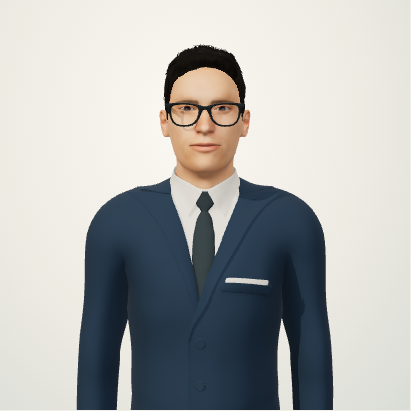
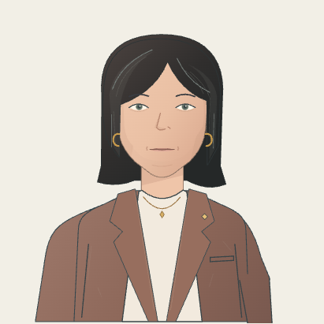
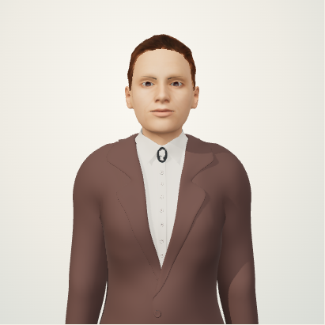

# Avatar styles

Latest revision: [coordinated lips, illustration and 3D surface/gesture review](avatar-refinement-2026-09-19.md). This preserves the [fixed torso, natural arm rest and separate waiting actions](avatar-presence-review-2026-09-19.md) and addresses the subsequent rejection of the lower-lip hinge and artificial appearance.

At `/avatar/test` (**Voce e movimenti / Voice & movement**), choose a style and a male or female appearance. **Avvia animazione / Play animation** runs the same nine-second silent sequence for all three styles: waiting, raising the hand, sample lip movements, lowering the hand and returning to rest. Stop it at any time. It makes no speech-provider calls and consumes no voice credit. **Ascolta la voce / Listen to voice** uses Inworld and takes over from the silent sequence.

| Style | Current treatment | Implementation and visual evidence |
| --- | --- | --- |
| Fumetto editoriale · 2D / Editorial comic · 2D | Refined illustration, filled lip contours, distinct rounded vowels, coordinated upper lip/jaw, arm at the side and discrete waiting actions | [2D details](avatar-editorial-2d.md) |
| Personaggio 3D / 3D character | Skinned male/female meshes, matte surfaces, restrained hair highlights, relaxed articulated fingers and separate glances/shoulder adjustment | [3D details](avatar-rigged-3d.md) |
| Ritratto 2.5D / Portrait 2.5D | Original upper/lower lips and jaw move together, bounded O/U corners, progressive tooth occlusion, transparent arm and fixed seated base | [2.5D details](avatar-portrait-2-5d.md) |

The styles share the existing PCM-driven speech clock and envelope. Mouth transitions use a 22 ms exponential time constant, while silence, stop and closed-lip consonants close the mouth immediately. This is a smoothing constant, not an end-to-end audio latency claim. Ambient motion yields during speech/gestures. Reduced motion removes ambient movement; intentional controls and audio-driven lips remain available.

Changes stay in the shared draft between the identity and movement pages. **Save avatar** applies them to the meeting renderer; **Discard changes** restores the saved choices. Switching style alone changes neither the name nor either language's voice. Existing profiles and clients default to 2D; omitted style fields preserve the saved selection. The animation preview itself never saves.

WebGL renderers load on demand and dispose their loops, geometry, materials and textures when switching away. Missing assets, unavailable WebGL or a lost context produce an explicit notice and the animated 2D fallback without changing the selected style. Assets are local; no image-generation service is called at runtime. The 3D meshes are not reconstructions of the portrait photographs.

## Validation, 19–20 September 2026

The latest [pre-commit check](verification-2026-09-20.md) covered **120 application cases in the changed files**, **36 script tests** and the screenshot workflow. One legacy public-state assertion was corrected; all 12 cases in its file passed on rerun. Lint, TypeScript, the production build and diff checks passed. [Earlier visual review, pixel/motion checks and final recordings](avatar-refinement-2026-09-19.md). Test writes used only temporary MongoDB on port 27018; saved settings and the real database were preserved.

```sh
env MONGODB_URI=mongodb://127.0.0.1:27018 npm run test:e2e -- \
  avatar-animation-preview avatar-illustrated female-avatar-motion editorial-animation \
  avatar-styles avatar-rigged rigged-avatar-motion avatar-portrait portrait- \
  avatar-draft-workflow avatar-workspace avatar-appearance
npm run lint
npm run typecheck
env NEXT_DIST_DIR=.next-build-avatar MONGODB_URI=mongodb://127.0.0.1:27018 \
  MONGODB_DB_NAME=conclavia_e2e_avatar_build MEETING_BOT_PROVIDER=preview \
  MEETING_AI_ENABLED=false npm run build
```

Synthetic PCM and browser captures verify local animation/playback behaviour. They do not validate received Teams audio/video, microphone recognition or client approval of the artwork. No Teams participant is created by these checks.

The final standalone build was exercised on port 3102 with the temporary MongoDB: all six variants rendered, played the silent sequence and closed their mouths on stop, without browser errors or mutation requests. All three styles fitted the 390 × 844 mobile viewport. Four management routes remained blocked through the public-proxy host. The earlier 45-second recordings of every variant establish the fixed torso behavior and contain no saves: [production recordings and before/after comparison](avatar-presence-review-2026-09-19.md). The existing app at `localhost:3000/avatar/test` returned 200 and its tunnel check passed without a restart or configuration change.


## Current visual review

These are actual browser captures of the standalone production build, with temporary default profile data. Both appearances were inspected at rest and while gesturing/articulating, including the 390 × 844 mobile layout. Silent recordings demonstrate the motion; they contain no generated voice.

| Editorial 2D | 3D character | Portrait 2.5D |
| --- | --- | --- |
|  |  |  |
|  |  |  |
| [Male motion](images/avatar-refinement/editorial-business_clay.webm) · [Female motion](images/avatar-refinement/editorial-business_clay_female.webm) | [Male motion](images/avatar-refinement/stylized_3d-business_clay.webm) · [Female motion](images/avatar-refinement/stylized_3d-business_clay_female.webm) | [Male motion](images/avatar-refinement/portrait_2_5d-business_clay.webm) · [Female motion](images/avatar-refinement/portrait_2_5d-business_clay_female.webm) |
| [Mobile](images/avatar-styles/editorial-mobile-it.png) | [Mobile](images/avatar-styles/stylized_3d-mobile-it.png) | [Mobile](images/avatar-styles/portrait_2_5d-mobile-it.png) |

## Separate dependency follow-up

The installation audit on 15 September 2026 reported existing findings in Next.js 16.3.0, sharp 0.35.3 and js-yaml 4.3.1. Those versions were already present before the avatar changes; Three.js and its types were not flagged by that audit. No unrelated framework upgrade is part of this design change.
