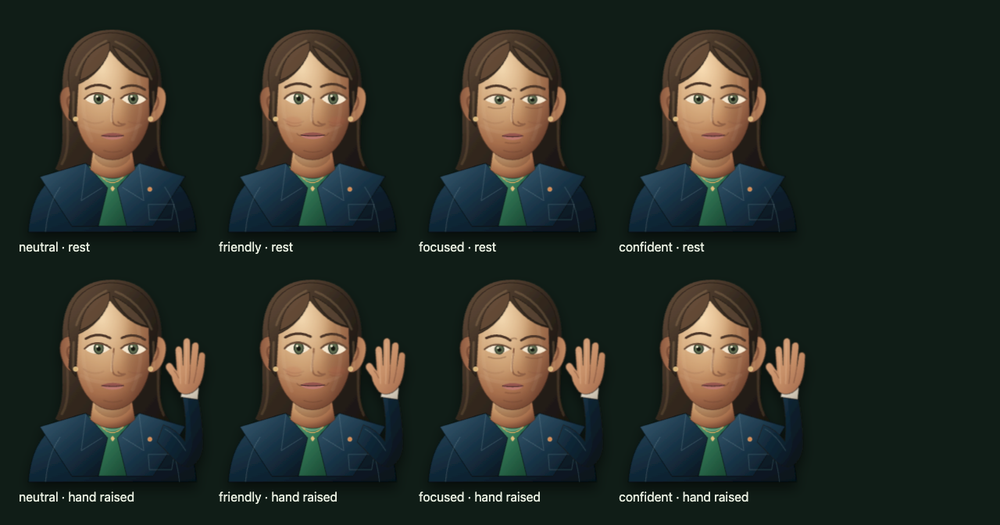

# Female avatar verification — 11 September 2026

## Result and scope

The full automated suite passed **197 tests in 3.1 minutes**. TypeScript and ESLint passed. Female appearance, movement, mouth animation and simulated meeting speech passed; two additional real Inworld previews completed successfully. This is **not a receiving-side Teams lip-sync certification**.

No Teams bot was created or admitted. Automated scenarios used the isolated E2E database. The real preview temporarily selected the female appearance using the profile API and restored `business_clay` in `finally`; saved names and voice choices were not changed. Environment files were preserved.

## Visual and movement checks

- 64 controlled rig combinations: four expressions (neutral, friendly, focused, confident), raised/lowered hand, and eight mouth shapes (rest, MBP, FV, A, E, O, U, consonant).
- Exactly one mouth-shape group visible per combination; female hair and face clipping present.
- Breathing, blink and eye motion sampled from their actual CSS animations; reduced-motion mode disables idle animation while preserving the hand control.
- React controls exercised during audio playback, including expression changes, hand raise/lower, stop and replay.
- Layouts at 390×844, 1280×720 and 1920×1080: hand remains inside the SVG and no horizontal page overflow.
- Eight representative expression/hand poses visually inspected. The pose-board test directly sets rig attributes to enumerate combinations; separate integration tests drive real UI controls and audio.



## Controlled browser lip sync

A deterministic 4.5-second PCM fixture contains seven mouth-shape intervals separated by silence. A browser probe compares rendered shape changes against `AudioContext.getOutputTimestamp()` and the scheduled audio start, rather than wall-clock transcript times.

- Final run: shape onset drift **11.3–45.0 ms**, below the test's 100 ms bound. Earlier runs measured approximately 17–32 ms.
- All seven shapes observed, rest observed between intervals, and stop returned both mouth and jaw to rest.
- Zero buffer underruns and zero inserted gap duration.
- Maximum animation callback interval: approximately 33.5 ms. The test does not establish 60 fps video delivery.

This validates local playback timing against supplied phoneme metadata. It does not prove that arbitrary synthesized phonemes are acoustically perfect or compensate for Teams video encoding/transport latency.

## Real female voice previews

Two short requests used the configured **Inworld TTS-2** model through the running application's normal preview API, with the actual female renderer.

| Voice | Language | First PCM | Browser audio start | Audio chunks | Phonemes | Underruns / inserted gaps |
| --- | --- | ---: | ---: | ---: | ---: | --- |
| Orietta | Italian | 1,005 ms | 1,563 ms | 9 | 70 | 0 / 0 ms |
| Eleanor | English | 627 ms | 915 ms | 10 | 61 | 0 / 0 ms |

Both streams returned HTTP 200, phoneme alignment and a completion frame. Non-silent audio buffers completed playback, and all eight mouth states were observed. Maximum animation intervals were 33.4 and 33.5 ms. These are single samples, not latency percentiles or speech-recognition-to-response measurements. Naturalness and the audio heard by a Teams participant were not evaluated by these automated checks.

## Meeting integration and regressions

Both appearances passed simulated correction → hand raised → permission → speech, followed by two queued responses, with default rendering and GPU disabled. The female cases started prepared correction audio about 839 and 871 ms after permission in the final run; these timings use deterministic audio, not real synthesis.

The full suite also covers dynamic names, greetings and direct questions, proactive triggers, memory, agenda, summaries, echo handling, entry/exit reconciliation, output health and speech errors. External providers are simulated in that suite; it is not 197 real Teams calls.

Two test-harness issues were corrected during verification: infinite animations must be paused rather than finished when capturing the pose board; the legacy output-state assertion must include the new `appearance` field. No additional avatar rendering code was changed during this verification turn.

## Reproduce

```bash
npm run typecheck
npm run lint
npm run test:e2e
# Explicit paid preview; temporarily changes saved appearance and restores it.
# Avoid running concurrently with profile editing or an important live meeting.
node scripts/verify-streaming-voice.mjs --female
```

The real preview does not save the selected preview voices or join Teams. Normal completion and handled errors restore appearance; forced process termination can interrupt cleanup. Remaining live acceptance: receive the female avatar on Teams, assess Italian/English voice quality, and record receiver-side audio/video sync during hand and expression changes.
