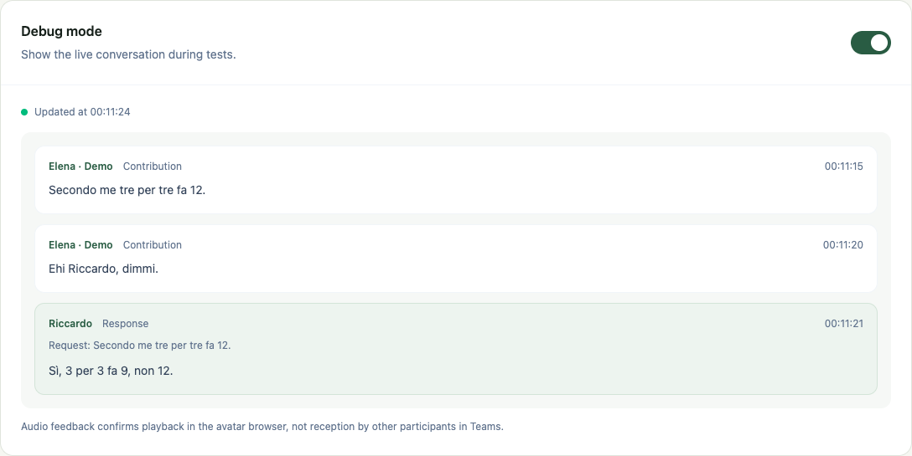
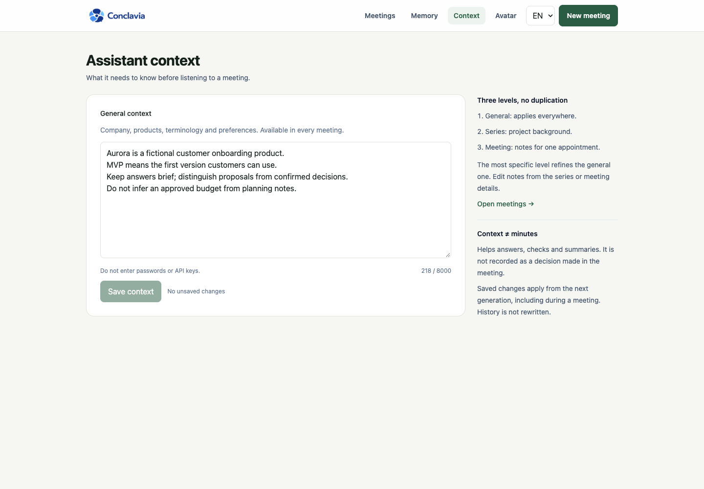
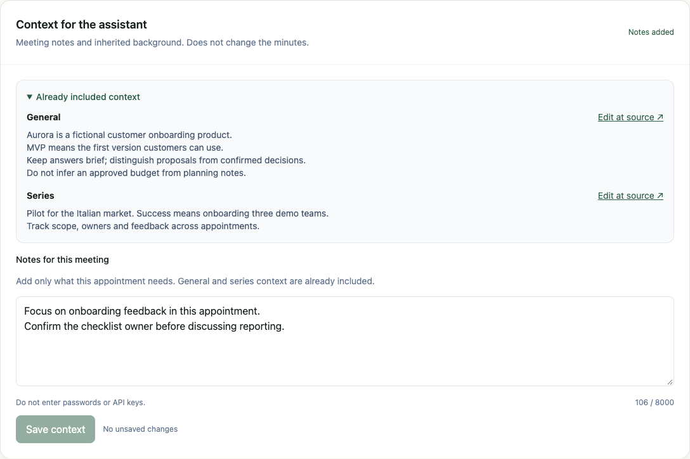
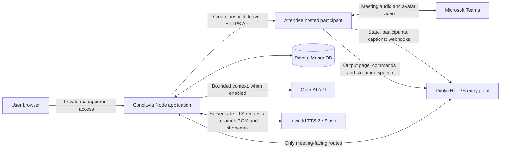
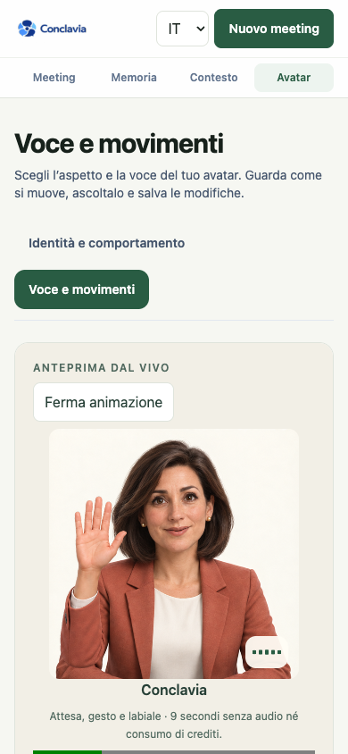

<p align="center">
  
</p>

<p align="center">
  A digital colleague for Microsoft Teams that follows the agenda, answers in the meeting, and carries memory into the next appointment.
</p>

# Conclavia Meeting Assistant — Extended guide

[Back to the short README](../README.md)

**On this page:** [Acceptance](#poc-objectives-and-acceptance) · [Product tour](#product-tour) · [Context](#assistant-context) · [Architecture](#runtime-architecture) · [Voice](#voice-and-response-latency) · [Setup](#local-setup) · [Cloudflare](#cloudflare-for-local-teams-tests) · [Configuration](#environment-variables) · [Tests](#verification) · [Company deployment](#production-deployment)

Conclavia is a focused, single-workspace meeting assistant with four areas:

- **Meetings** for one appointment or a series of Microsoft Teams meetings.
- **Memory** for remembered facts, decisions, actions, questions, and summaries.
- **Context** for background shared by the assistant, refined per series and meeting.
- **Avatar** for the digital colleague's identity, personality, voice, expressions, and hand raise.

The management interface works without a meeting provider. Automatic Teams entry becomes available only after every required integration setting is present. Configuration readiness is not an external connectivity check: the public output page and webhook endpoint must also be reachable.

## Latest avatar update — 20 September 2026

The README is a short entry point; this guide preserves setup, architecture and historical verification detail. The [avatar refinement review](avatar-refinement-2026-09-19.md) covers the current three renderers, both appearances, successive visual corrections, final production recordings and local regression results. **Voice & movement / Voce e movimenti** at `/avatar/test` now has one silent nine-second animation sequence for all styles, separate from provider voice playback. Both lips and the jaw participate in the 2.5D mouth; all styles retain discrete waiting actions and explicit save/discard.

The earlier [14 September application review](final-audit-2026-09-14.md) covers meeting lifecycle, stale-hand/late-echo race fixes and remaining acceptance work. The earlier [playback review](playback-review-2026-09-13.md) records the regional voice fix, browser timing diagnostics and three real Inworld probes. These do not close the live Teams recognition/receiver acceptance gate.

- **Layered context:** the new Context page saves shared background; series and meeting details add their own notes. All AI answer, verification, summary, proactive-intervention and final-memory prompts receive the same three scopes. Existing appointments inherit series edits at the next generation, without leaving/rejoining. Context is not recorded as a meeting decision. See [assistant context](#assistant-context).
- **Named contextual turns:** speech automation requires the configured name, not a generic “hello, can you hear me?”. “Ehi Riccardo, dimmi” releases a valid prepared contribution or retrieves the recent participant statement, even when proactive contributions are off. Punctuation alone cannot become a request. This parser fix does not fix the separate “Ciao Riccardo” → “Charlie cardo” recognition defect.
- **Simpler GUI:** Teams link and language first, an optional collapsed agenda, a more compact avatar studio, question-first assistant controls, and memory search across decisions, actions and open questions. Pending actions prevent repeated submissions in the current view, and failed saves preserve the form. See the [GUI review](gui-review-2026-09-13.md).
- **Avatar workspace:** choose an appearance, select an Italian/English voice, listen, then explicitly save or discard. Optional speaking-rate adjustments, model comparisons and diagnostics are collapsed under Advanced settings.
- **Two appearances:** male and female business avatars share expressions, idle motion, raised-hand animation and audio-clock mouth shapes. Appearance, invocation name and voice remain independent.
- **Streaming-only speech:** Inworld TTS-2 / Flash supplies PCM and phoneme timings. The retired local/browser synthesis path is not an active option or fallback.
- **Repeatable local tunnel setup:** `npm run tunnel` restores or reuses the authorized local app/Cloudflare connection; `npm run tunnel:check` checks it without restarting anything. The launcher preserves unrelated environment values and refuses to expose another project's server. See the [Cloudflare guide](#public-connection-for-a-local-teams-test).
- **Safer meetings:** attempt-scoped entry/exit reconciliation, renderer health checks, caption language setup, conservative echo classification, optional realtime debug and summary-first paginated history.
- **Acceptance status:** application regressions and browser/provider previews are covered; receiver-side Teams latency, voice naturalness and video/lip-sync quality are **not yet signed off**. See the [objective-based audit](objective-audit-2026-09-11.md) and the historical [10 September audit](poc-audit-2026-09-10.md) for evidence and limits.
- **Verification history:** the 13 September run passed 269 application tests and 23 tunnel tests. The [14 September review](final-audit-2026-09-14.md) supersedes those totals. Three earlier real Inworld previews completed with first audio at 0.58–1.08 seconds in the browser and no measured buffer underruns; these are not Teams receiver measurements. Regional accents and audio diagnostics are documented in the [playback review](playback-review-2026-09-13.md); layered-context checks are in the [context verification report](assistant-context-verification-2026-09-13.md).

Start with [voice setup](#streaming-voice-setup), the [Cloudflare local test guide](#public-connection-for-a-local-teams-test), or [company deployment](#production-deployment).

## PoC objectives and acceptance

| Objective | Implemented behavior | Verification / remaining boundary |
| --- | --- | --- |
| Respond when addressed | Dynamic invocation name; greetings, presence checks and specific questions in Italian/English | Parser and caption-ingress tests; actual recognition depends on Teams captions and the configured language |
| Help run the meeting | Required/optional agenda, next item, explicit completion and contextual answers | Automated command, negation and ambiguity checks; real-AI evidence is recorded separately |
| Preserve continuity | Meeting summaries, facts, decisions, actions and open questions shared by linked appointments | Cross-meeting regression coverage; continuity draws from up to five prior completed appointments, not unrestricted global recall |
| Contribute appropriately | Prepare a correction or relevant fact, raise the avatar's hand, wait for named permission, decline or expire safely | Automated permission/queue tests; this is **not native Teams toolbar hand control** |
| Natural and responsive avatar | Two appearances, selectable native-language voices, streamed audio, phoneme-driven mouth and playback timing | Browser tests and real preview samples; received Teams quality and end-of-question-to-audible-answer latency remain open |
| Simple, scalable GUI | Overview, filtered/paginated history, summaries first, optional transcript/debug, separate identity and voice studio | Desktop/mobile tests and 250-meeting history fixture; not a production concurrency/load certification |
| Recover safely | Preflight, bounded admission waits, single attempt claims, provider reconciliation and confirmed departure | Simulated lifecycle/restart/missed-webhook tests; admission policy remains controlled by Teams |
| Company pilot readiness | Documented stable-HTTPS, private management and always-on runtime requirements | Production build verified; SSO/gateway deployment, retention agreement and company approval are not delivered infrastructure |

**Exit gate:** complete a fresh admitted Teams entry → spoken greeting/question → memory/agenda → permitted contribution → received summary → confirmed exit/re-entry run, and record the audio/video from a receiving participant. Measure caption delay, response preparation, synthesis start and received playback separately. A generated answer or browser playback acknowledgement alone does not pass this gate. No end-to-end response-time SLA is claimed.

## Product tour

The desktop figures below were refreshed on **20 September 2026**, using fictional Aurora meetings in an isolated database. Separate avatar production captures and motion recordings document the 19–20 September visual revision. They show the real GUI, not design mockups or recordings of a Teams call. Paid integrations are disabled during capture; the Inworld configuration warning in the voice studio is intentional. See [refreshing the screenshots](#refreshing-the-readme-screenshots).

### Meetings at a glance

The dashboard separates **Overview**, **Upcoming**, **History**, and **Series**. The overview shows a short list of current and upcoming meetings plus recent summaries. A collapsed action bar contains admissions and operational issues; old missed appointments and optional summary reviews do not accumulate there.

History shows the latest five meetings in the overview; **View all** opens text, date and status filters with 20 meetings per page. Compact, fully clickable rows show title, date, series and nonzero decision/action counts. Only exceptional statuses have a visible badge. Summary paragraphs and full transcripts stay in the meeting details, without changing saved data or assistant memory. From those details, missed appointments can be rescheduled from a prefilled form or archived reversibly. Rescheduling creates a new appointment and does not send a participant until explicitly requested. Archiving is blocked while a participant is active or its departure is uncertain.

List queries return only the current page and lightweight fields, not full transcripts, command histories or bot access tokens. Series counts are aggregated in the database. The overview refreshes while there is active work; background tabs do not poll. The screenshot below uses fictional demonstration meetings.

See the [dashboard verification report](dashboard-verification-2026-09-09.md) for pagination, archive safety and desktop/mobile checks.


### Avatar voice and movement

At `/avatar/test`, choose the editorial 2D, 3D character or 2.5D portrait, then male/female appearance. **Play animation / Avvia animazione** runs waiting, a hand gesture, connected mouth shapes and return to rest without audio, credits or saving. **Listen to voice / Ascolta la voce** exercises actual Inworld playback and the audio-driven mouth. Stop closes the mouth immediately. Both pages share the draft; save explicitly to apply it to meetings. Advanced model comparisons affect playback only. This local preview does not require Cloudflare or an Attendee participant.

Start in [Identity & behaviour](images/avatar-settings-en.png) to choose the name and appearance, then move to the studio below. The provider is explicitly labelled **Inworld**, and optional speed/model controls stay under **Advanced settings**.


[Three styles, both appearances and mobile captures](avatar-styles.md) · [Final motion recordings and limits](avatar-refinement-2026-09-19.md).

### One meeting or a series

Every meeting has an objective, a Teams link, a date, and an agenda whose items can be mandatory or optional. A series can contain up to 24 appointments with different Teams links.

For a single meeting, paste the Teams link first, choose the language and decide when the colleague should join. The optional agenda is collapsed until needed; rescheduling an appointment with existing agenda items opens it automatically. Closing the section keeps the items. Entry/contribution preferences remain available separately, and the save action explains whether it starts an entry attempt or only schedules/saves the appointment.


### Shared meeting memory

Completed appointments contribute their summary, remembered facts, decisions, open actions, and questions to the next appointment in the same series.


### Summary-first history

Memory is organized around concise meeting summaries. On a completed meeting's detail page, the summary, decisions and actions come before the agenda and assistant tools. Editing the summary is optional; the full transcript stays collapsed until someone needs to check a passage. The Memory area provides the broader record across meetings.

Memory search includes meeting titles and objectives, summary text, remembered facts, decisions, action descriptions and open questions. Results remain paginated; details stay collapsed until requested.


## Meeting behavior

The participant name configured in **Avatar** is also its wake phrase. If the name is changed to “Nora”, for example, the colleague responds to **“Nora…”** and future Teams participants use that name. Five commands are supported in Italian and English:

- **Remember** stores an explicit fact in the current meeting memory.
- **Summarize** creates a spoken summary and stores it as the meeting overview.
- **Agenda** identifies the next open item and can mark an item as complete.
- **Answer** responds from recent human/assistant dialogue, retrieved older points, configured context and shared series memory.
- **Verify** checks a statement against known meeting facts and decisions.

The meeting's assistant console opens on **Answer**. **Summarize** and **Agenda** are immediate actions; the other commands use the message field. Immediate actions preserve an unfinished question and do not send it accidentally. While a request is pending, controls show progress and reject overlapping submissions in that view. Failed requests preserve the message for retry. Manual agenda changes refresh the page data so the agenda and latest assistant responses stay aligned.

When proactive contributions are enabled, the colleague checks substantive statements for material errors and for reliable stored information that would advance the current objective or agenda. It raises its hand and prepares the contribution, but does not speak yet. A participant must grant the floor using its configured name, for example **“Nora, go ahead”** or **“Nora, vai pure”**. Because the answer is prepared while the hand is raised, playback can begin without a second model request.

The raised hand is drawn by the avatar and reflected in its pending-intervention state. The current integration does not operate the native Teams hand button. Debug shows caption contributions and response text, not a general Teams chat integration.

### Named turns and contextual follow-ups

Voice automation speaks only after a direct call to the meeting's configured name. An unnamed greeting/audio check, a different addressee, a quotation, or a third-person mention does not grant the floor. Generic aliases such as “Assistente” and “Collega digitale” are not substitutes for the configured name. Explicit actions clicked in the management GUI do not require saying the name.

For example, **“Secondo me tre per tre fa 12” → “Ehi Riccardo, dimmi”** produces **“Sì, 3 per 3 fa 9, non 12.”** The incorrect statement alone does not produce speech. With proactive contributions enabled it can prepare a correction and raise the avatar's hand; with them disabled, the named follow-up can still retrieve the statement when answers are enabled.

- “Dimmi”, “dimmi pure” and “vai pure”, addressed to the name, are floor controls, not empty questions. The name can come before or after these controls; Italian and English controls are supported.
- Named acknowledgements such as “Sì, Riccardo” / “Yes, Riccardo” grant a **still-valid prepared contribution**, not an arbitrary old topic. Without a pending contribution they remain silent. The existing hand-raised card also offers **Give the floor**, useful when a detected namesake makes voice addressing ambiguous. Its management-only endpoint consumes the exact intervention ID atomically and rejects expired, replaced, already delivered or stopped turns.
- Debug transcript rows include the routing decision (grant, new request, refusal, deferred permission, ambiguous recipient or unresolved intention) and whether rules or semantic interpretation were used. This is distinct from the subsequent renderer playback acknowledgement. Clear local controls remain the fast path. With `MEETING_AI_ENABLED=true`, unresolved named utterances use a structured OpenAI intent check, capped at **3 seconds per provider request**, with no automatic retry. Uncertainty, timeout or invalid output leaves the avatar silent. A model result cannot override a local refusal, detected namesake, missing name or lifecycle guard. See [implementation and real-model verification](conversation-verification-2026-09-14.md).
- A name followed by arbitrary prose does not default to a question: “Riccardo ci sta ascoltando” stays silent. The semantic fallback distinguishes talking about the colleague from addressing it; Italian and English invitations were tested with the real model, not every language or paraphrase. Answers include original previous assistant responses, not duplicate avatar captions, and request natural wording without routine transcript references. Unknown facts must remain unknown. These changes do not establish successful live recognition or received audio.
- After asynchronous interpretation or answer generation, the processor checks the current meeting/attempt, namesakes, later turns, feature settings and pending contribution again. Late results must not publish after an exit, a replacement contribution or a newer refusal. Prepared contributions are still consumed atomically once. A present request to stop/wait withdraws the current contribution; an explicit future/conditional permission leaves it silent for a later named grant.
- Without a prepared contribution, lookup is restricted to the same meeting's last eight caption segments and 90 seconds. It uses participant content, excludes avatar/known echo segments, and does not revive a refused, already answered or explicitly changed topic. Missing or ambiguous references receive a short clarification, not an invented question.
- Split name/request captions require the same speaker and entry attempt within eight seconds. A statement and named follow-up in a single caption are also supported. A new explicit arithmetic claim can supersede an older prepared correction; incidental text before a named grant must not discard it. A concrete new question takes its own request path.
- A specific question such as “Riccardo, dimmi qual è il budget” remains a question; it does not release an unrelated prepared correction. Refusals remain silent even when no intervention is pending. Conditional permissions such as “Riccardo, vai pure quando te lo dico” or “Riccardo, dimmi pure quando te lo dico” do not authorize speech or become questions. The original point remains available within the same bounded lookup for a later named grant; actual questions such as “dimmi quando consegniamo” still work.
- Elementary, affirmative integer multiplication errors use deterministic arithmetic. Other follow-ups receive the identified statement, transcript, memory and configured context in the AI input. Original captions and speaker names are preserved. Neither contextual retrieval nor a speech command certifies correct microphone recognition or receiver-side playback.

The instruction and the referenced statement are separated following the [official OpenAI prompt guidance](https://developers.openai.com/api/docs/guides/prompt-engineering#message-roles-and-instruction-following). The semantic model proposes an intent; application guards validate and authorize the resulting turn. A prepared contribution or instruction embedded in conversation data is not itself permission. See [named-turn verification](named-turn-verification-2026-09-13.md) and [the authorized semantic extension](conversation-verification-2026-09-14.md).

### Meeting outcomes and debug

At the end of a meeting, the transcript is condensed into an overview, facts, decisions, actions and open questions. Those items become the continuity briefing for later appointments in the same series. The full transcript remains collapsed and can be expanded afterward to verify a specific passage.

Storage/context limits are intentional but relevant to long meetings: the meeting record retains at most **4,000 transcript segments**; the expandable transcript means the retained segments, not an unlimited verbatim archive. Continuity selects up to **five** prior completed linked appointments, with bounded fact/decision/action lists. Contextual answers use at most **14 relevant memory entries / 4,000 characters**. Shared conversation selection considers the latest **36 human turns + 8 original assistant responses**, fitting the selected recent dialogue into **7,000 characters**, plus at most **4 older keyword-matched turns / 4,000 characters**. Long individual turns are explicitly truncated; coverage counts indicate omissions. This is deterministic retrieval, not a progressive summary, complete transcript or exhaustive semantic search. Ordinary answer and spoken-summary output caps are **120 / 180 tokens**. These are section limits, not a total prompt-token guarantee. Long-running archival/compliance requirements need a separate retention design.

This authorized OpenAI input also includes a minimal allowlisted runtime observation and any valid prepared contribution, labelled as not yet spoken. It excludes capability URLs, bot/attempt identifiers and credentials. Generated responses are not independent proof of facts or participant agreement; renderer playback is not proof of reception in Teams. Background remains separate from observed meeting outcomes. The semantic check uses a smaller recent-dialogue selection and bounded general/series/meeting notes; it does not upload the whole stored history. The existing Responses integration and `store: false` remain unchanged.

For testing, enable **Debug mode** on the meeting detail page, below the assistant commands. It is off by default and shows received transcript contributions and assistant response text with names and timestamps, updating roughly every second while the tab is visible. The latest acknowledged response also shows whether the avatar browser started, completed, or failed playback. A text response alone is not proof of audio, and browser playback does not establish what another Teams participant heard. This is a read-only view: it does not enable recording or change memory. Turning it off stops its requests. Only the latest 100 events are displayed; unchanged responses use conditional requests, and updates do not reload the page or pull focus away while reading older messages. Debug is not displayed in the avatar’s Teams video and does not ingest Teams text chat.

When an avatar caption matches a single recent response, the view groups it under **Received transcripts / Trascrizioni ricevute**, collapsed by default, instead of repeating the same answer as another contribution. Original text, speaker and timestamps remain available there and unchanged in the API/database. Substantial matching fragments can share the same response. Human speech, uncertain attribution, ambiguous matches and captions without a matching response remain separate; an association is not proof of a second audio playback. Only this management page needs refreshing for the display change, not the Teams participant.

New completed responses have an expandable **Audio timing · avatar browser** section: voice-request-to-first-audio time, buffer underruns and their total gap, and the longest animation update gap. These observations are saved once per command with a current-attempt check and bounded numeric validation. Old responses and failed/incomplete streams have no fabricated metrics. They exclude speech recognition, answer generation, queue wait and Teams delivery; gaps between separately synthesized very long parts are not buffer underruns. Reload the renderer or use the next clean entry to load this client-side addition; a new meeting record is not required.

The figure illustrates the named contextual follow-up with **seeded demonstration captions and a seeded response**. It documents the display, not microphone recognition, response generation or successful audio playback; those require the separate verification runs.



The assistant personality has two deliberately simple controls: response length and attitude. Those choices are included in the meeting prompt.

## Assistant context

Open **Context** in the navigation to enter company background, terminology and working preferences. In a meeting, open **Context for the assistant** for appointment-specific notes and a read-only preview of inherited context. The series detail has its own **Series context** section. During creation, notes are optional and collapsed; the objective remains the result to achieve, not a second background field.



| Scope | Where to edit | Applies to |
| --- | --- | --- |
| General | `/context` | Every meeting in this installation |
| Series | Series detail → Series context | All appointments linked by `seriesId`, including existing and future ones |
| Meeting | Meeting detail → Context for the assistant | Only that appointment |

The meeting panel shows inherited general and series notes alongside the editable notes for this appointment, so shared background does not have to be copied into each meeting.



The effective background is **general + series + meeting**. Specific details take precedence over broader background, while non-conflicting information remains available. This is prompt guidance, not a guarantee of model reasoning. The common prompt rules keep owner-supplied background separate from transcript evidence: a planned budget in context must not be summarized as a budget approved in the meeting. Stored outcomes and original transcripts are not rewritten. Transcripts remain evidence, never replacement system instructions. This follows the [OpenAI instruction/input separation](https://developers.openai.com/api/docs/guides/prompt-engineering#message-roles-and-instruction-following).

Implementation: `assistant-context-store.ts` resolves the latest general and series records at generation time; `assistant-context.ts` supplies shared rules and an escaped, scoped input block. The block is included in question answering, explicit verification, spoken summaries, proactive correction/relevant-information detection, and final meeting-memory extraction. Deterministic actions (greetings, presence checks, saving an explicit fact, agenda updates, elementary arithmetic and releasing an already prepared intervention) do not invoke AI and are not redefined by custom text. Without AI, question fallback can search the context but cannot reason about conflicting notes.

Each scope accepts up to **8,000 characters**, at most 24,000 additional background characters per prompt. Keep notes focused: longer context increases input usage and may affect latency. No document upload, automatic context generation, vector retrieval or additional voice provider is introduced here.

Changes require **Save context**, take effect on the next generation, and need no new Teams meeting. An in-flight answer or already prepared hand-raise response is not regenerated. Clearing a field removes only that scope. Versioned updates reject a stale edit with HTTP 409; the GUI preserves the draft, lets the user compare the latest saved version, then explicitly save or discard. The dedicated `/api/context?scope=global|series|meeting&id=…` endpoint only updates context fields, never bot state, voice configuration, transcript or summary. The `id` parameter is used only for series/meeting scopes.

Context management routes are blocked on the temporary public Cloudflare hostname, and context is not serialized to the avatar rendering capability. The PoC has a **single shared workspace**: “general” means this installation, not an enterprise tenant. Before a multi-client deployment, enforce authenticated workspace ownership and tenant-scoped queries; do not enter secrets in these notes.

## Runtime architecture

Conclavia has two browser surfaces: the **management interface**, used by people, and the **meeting output**, loaded by the remote participant. They share the same application, but must not have the same public access rules.



The public HTTPS entry point is a **Cloudflare Quick Tunnel during local tests**, or a **stable HTTPS reverse proxy/ingress for deployment**. Cloudflare does not join Teams, transcribe speech, or generate answers. It only lets Attendee reach the app running on your computer; Attendee cannot reach your computer's `localhost` directly.

1. The user selects **Join now** or schedules an appointment. Conclavia persists an entry attempt and calls the Attendee API with the Teams link, avatar name, meeting-output URL, and callback URL.
2. Attendee joins Teams as an anonymous participant. Once admitted and listening, it opens `/meeting-room/[token]?mode=meeting` in its hosted browser. This browser renders the avatar and supplies camera/audio output to Teams. With Inworld configured, **Conclavia requests speech server-side and relays PCM audio and phoneme timings as they arrive**; the hosted browser schedules playback using Web Audio. This path does not use the organizer's Mac for playback during a remote meeting. This webpage-output mechanism requires reachable HTTPS, as described in [Attendee's voice-agent documentation](https://docs.attendee.dev/guides/voiceagents).
3. Attendee sends native Teams caption contributions and lifecycle events to `/api/webhooks/attendee`. Conclavia stores the transcript in MongoDB, routes wake-phrase commands, retrieves relevant memory, and calls OpenAI when enabled. The output page polls for prepared responses and plays them, with lip sync, mood and hand raise. Bot-level callbacks are created with the bot; see [Attendee webhooks](https://docs.attendee.dev/guides/webhooks).
4. The management browser can show the optional live debug panel. Closing that browser does not stop the server-side monitor or the hosted participant. Shutting down the **local app, tunnel, or computer** does interrupt a locally hosted test.

No manually operated Teams browser, virtual microphone/camera, or Teams plugin is required on the organizer's computer. The current local test still depends on that computer serving Conclavia; moving the app to an always-on server removes that dependency.

### Local test versus company deployment

| Component | Local test today | Company pilot / deployment target |
| --- | --- | --- |
| Conclavia UI, API and lifecycle monitor | `npm run dev` on the Mac, port 3000 | Always-on Node container with restart policy and health monitoring |
| Public meeting entry point | Temporary `*.trycloudflare.com` URL forwarded to port 3000 | Stable HTTPS hostname with restricted reverse-proxy routes; a managed tunnel is optional |
| Management access | Local browser at `http://localhost:3000` | Company SSO / authenticated gateway, separate from the bot-facing routes |
| Meeting participant and voice renderer | Hosted by Attendee | Still hosted by Attendee; deploying Conclavia does not self-host or remove the provider |
| Streaming speech synthesis | App calls Inworld; PCM is played by the preview or hosted browser | Same server-side integration; credentials injected into the container at runtime |
| Meeting history and memory | Existing configured MongoDB | Private persistent MongoDB with backups and an agreed retention policy |
| Answers | Server-side OpenAI calls when enabled | Same integration, with centrally managed configuration and credentials |

Cloudflare is **not a mandatory production dependency**. The requirement is a stable HTTPS address that Attendee can reach for output and callbacks. A private-only intranet URL is insufficient for hosted Attendee unless an approved reachable gateway is provided. Company network and Teams policies, external processing approval, access controls and an actual audio/video test must be validated before rollout. The Dockerfile is included; the company's gateway, SSO and infrastructure are not provisioned by this repository.

### Bounded entry and safe recovery

Before creating an Attendee participant, the app verifies the public avatar HTML, state endpoint and all referenced same-origin JavaScript assets. Each request has its own **15-second limit**, including page/state body loading; the entire check is limited to **45 seconds**. A slow first page no longer consumes the JavaScript requests' deadline. Transient network/timeouts and HTTP 408/429/5xx receive at most one retry per resource. Invalid content, blocked assets, TLS failures and voice-not-ready responses remain failures. Only these read-only GET checks are retried, never bot creation. Redirects and external script origins remain blocked.

Failures retain a safe stage/reason code, such as `output_scripts_timeout` or `output_page_http_502`, without private URLs or raw provider content. The GUI distinguishes connectivity checks from lobby admission. If preflight failed without creating a participant, it explicitly says **no bot was sent**: restore the connection and use **Riprova ingresso / Retry entry** (or **Fai entrare ora / Join now**) on the existing meeting. Do not recreate the appointment. Even a cancellation concurrent with a failed preflight releases the attempt instead of waiting for a nonexistent bot to leave. The overall entry deadline below is unchanged.

Verification of this entry-timeout update (13 September): **77 targeted tests passed**, including independent request deadlines, transient/permanent failures, overall cancellation, safe error messages in both languages and retry on the same appointment. TypeScript, ESLint and an isolated production build passed. The existing tunnel's token-free health/isolation check and the local failed-meeting page passed as well. No participant was created and no audio was generated for these checks; they do not prove a successful Teams admission. The earlier failed attempt retained only a generic error, so its exact failed resource cannot be reconstructed retrospectively.

Attendee entry attempts have a persisted two-minute deadline, measured from the requested entry time (or the scheduled start). If Attendee confirms admission before an exit has been requested, the first admission event guarantees at least 60 seconds for listening startup without shortening the original deadline. Repeated polls and callbacks cannot renew that grace period. An admission report alone does not mark the colleague operational. A Node server monitor checks attempts every ten seconds, independently of the management browser. Provider polling reconciles missed callbacks; host and lobby waits are also limited to two minutes in the bot configuration. Network delays can extend the time needed to request and confirm an exit.

Only `joined_recording` confirms that the provider has started the listening pipeline. Being listed as a participant, `joined_not_recording`, or a successful webhook delivery does not establish readiness. The output badge also requires a fresh renderer heartbeat and voice readiness. Configuration readiness alone does not prove provider authentication or audible output. Run the voice preview first.

On timeout, Conclavia requests exit and displays the failure. It does not mark the bot as gone just because the exit request was accepted. A retry remains blocked until that attempt has actually ended, including provider post-processing. Concurrent immediate-entry requests for the same room are protected by a unique database claim. A lost creation response is reconciled by attempt metadata, never by blindly creating another bot; late callbacks cannot revive an interrupted attempt. Failed entries are not presented as completed conversations with an empty summary.

The monitor runs in the long-lived Node process started by `npm run dev`, `npm start`, or the standalone container. Keep that process and MongoDB available; a request-only/serverless deployment that freezes background work needs a separate scheduled worker. Persisted deadlines survive an application restart, but the application cannot force Teams admission or guarantee immediate exit while the external service is unreachable. The [10 September live report](live-meeting-verification-2026-09-10.md) records a successful fourth admission and organizer-confirmed received audio, as well as the remaining microphone-trigger and quality acceptance checks. Earlier exit/re-entry evidence remains in the [9 September report](verification-2026-09-09.md).

Development hot reload must not reuse an older Mongoose model that silently drops lifecycle fields. Conclavia replaces an incompatible cached model definition without touching stored meetings, rejects stale model references before external actions, and verifies the persisted entry claim before sending a bot. Restart long-running development servers after lifecycle updates so background monitors also use the current code. The meeting page shows confirmed exit only after a terminal provider state, not merely an accepted leave request.

### Caption language after admission

**Open recognition defect:** the spoken greeting "Ciao Riccardo" was again received as "Charlie cardo." on 13 September, after the language-setting API acknowledged the Italian request. This is not fixed by parser aliases or tunnel readiness. See the [caption investigation and acceptance requirement](caption-recognition-2026-09-13.md); actual Teams language and microphone-to-transcript recognition still need verification.

For new tracked Attendee entries, Conclavia persists the selected Italian/English language, omits the startup language setting and sends `PATCH /bots/{id}/transcription_settings` after a fresh `joined_recording` confirmation. This is intended to avoid a provider-side same-value no-op: Attendee's published adapter skips a language update when its internal setting already matches, even if startup did not successfully apply it. It does not prove the setting was applied. See the [adapter implementation](https://github.com/attendee-labs/attendee/blob/main/bots/teams_bot_adapter/teams_bot_adapter.py) and [request schema](https://github.com/attendee-labs/attendee/blob/main/bots/serializers.py).

The monitor persists at most three attempts per entry, does not blindly reapply after HTTP acknowledgement, and does not configure a stopped or replaced attempt. The controls distinguish pending, failed, acknowledged-but-unverified and unconfigured sessions; an acknowledgement no longer hides the warning. `captionLanguageRequestedAt` means the API accepted the request, **not** that Teams applied it or that recognition is accurate. Caption language can affect other participants. `auto` and pre-existing active sessions are left unchanged; there is no temporary switch to another language. The 14 September real attempt still failed speech recognition after acknowledgement; do not call the deferred-startup strategy a verified fix. The [native-language investigation](teams-language-verification-2026-09-14.md) includes a read-only provider/local comparison and the provider-side evidence still needed.

## Cost controls

- Inworld speech is billed by the provider for generated text; it is not included in Attendee's meeting charge. Flash is the initial streaming model.
- Teams captions are used for live transcription, so no separate speech-to-text provider is required.
- Teams supports choosing the spoken language, including Italian. Microsoft also documents language-mismatch detection and a prompt to change it; that is not proof of an automatic change or of successful configuration through Attendee. With transcription running, permissions can restrict who changes the language. With Attendee, new entries explicitly request Italian or English after listening starts. An older meeting saved as `auto` keeps the existing Teams setting; Conclavia does not implement automatic bilingual recognition. Changing the new-meeting form does not reconfigure an already running bot. See [Microsoft spoken-language settings](https://support.microsoft.com/en-us/teams/meetings/use-live-captions-in-microsoft-teams-meetings) and [Teams Free guidance](https://support.microsoft.com/en-us/teams/free/meetings/live-captions-in-microsoft-teams-free).
- ChatGPT-backed intelligence is opt-in through `MEETING_AI_ENABLED=true`. Remembering facts and the deterministic memory fallback work without it.
- The default model is `gpt-5.4-mini`; it can be changed with `OPENAI_MEETING_MODEL`.
- Audio is not stored. The live transcript and selected memory are stored in MongoDB.
- No external meeting participant is created while `MEETING_BOT_PROVIDER=preview`.

## Voice and response latency

### Choose the avatar appearance

Choose **Male** or **Female** in either **Identity & behaviour** or **Voice & movement**. Choose the visual style separately: editorial 2D, 3D character or 2.5D portrait. The same unsaved configuration is shared across both pages. Appearance does not rename the colleague.

The current artwork, clothing and motion differ by style; [the style overview](avatar-styles.md) shows both appearances. The hand is an avatar gesture, not the native Teams toolbar hand.



Voices follow the selected appearance in both tabs: **male avatar → male voices only; female avatar → female voices only**, in Italian and English. Switching appearance immediately selects a compatible pair in the preview (Gianni/Dennis for male, Orietta/Eleanor for female), retaining compatible selections and remembering each appearance's last choices during the editing session. The name stays independent: selecting the female avatar does not rename Riccardo. The voice studio uses the current draft; the meeting renderer uses only the saved configuration. An already open meeting renderer picks up saved appearance changes through its existing state polling, without creating another participant.

If an existing profile contains mismatched voices, preview uses compatible defaults and explicitly asks you to save the correction. Merely opening the page never rewrites the saved meeting profile. Custom server voice IDs without curated gender metadata are not offered in this filtered selector; their saved values remain visible under Advanced until explicitly replaced. Discarding other edits cannot restore a mismatched voice into the preview.

The [female avatar verification report](female-avatar-verification-2026-09-11.md) covers 64 pose combinations, movement, hand raise, controlled browser lip sync, Italian/English real voice previews and the full 197-test regression run. Receiver-side Teams sync remains a separate live acceptance check.

### Let the client choose the voice

The avatar workspace has two sections: **Identity & behaviour** for name, appearance and personality, and **Voice & movement** for listening and animation checks. Optional speaking-rate adjustments belong in the studio's collapsed **Advanced settings**, so the main flow stays focused on choosing and hearing a voice.

[Voice and movement studio](images/avatar-studio-en.png) · [Identity & behaviour](images/avatar-settings-en.png). Earlier mobile playback evidence remains in the [female avatar verification report](female-avatar-verification-2026-09-11.md).

Open **Voice & movement**. Only the voices matching the preview's appearance and language are offered:

| Avatar | Italian | English |
| --- | --- | --- |
| Male | Gianni (System); Capitano, Ingegnere, Cuoco (Community) | Dennis, Edward, Alex (US); Alistair (UK) |
| Female | Orietta (System); Voce Sistema (Community) | Olivia, Eleanor (UK) |

**Voice provider: Inworld** is explicit in the GUI. The selector groups **Inworld · System** and **Inworld · Community**, and the selected voice's origin remains visible after closing the dropdown. Community voices are published by community members and served by Inworld; they are not additional providers or promises of the same quality as System voices. Despite its display name, **Voce Sistema is a Community voice**.

The [official Inworld catalog API](https://docs.inworld.ai/api-reference/voiceAPI/voiceservice/list-voices) was queried on **13 September 2026**: the Italian System catalog returned Gianni and Orietta; the separate `community = "true" AND lang_code = "it"` query returned the four additional voices above. All six have Italian as their primary language. Capitano has an explicit male field; the other three community entries omit gender, so their classifications use the published descriptions explicitly stating man or woman, not guesses from names. The six existing English voices were also rechecked on 13 September with their gender and US/UK locale metadata. See the [verification record and exact voice IDs](inworld-voice-catalog-2026-09-13.md).

The catalog describes availability, not a guarantee that a client will prefer the timbre. The **Preview voices** summary shows readable names, not opaque community IDs; saved meeting voices are separate diagnostics under **Advanced**. Community availability can change, and an unavailable voice produces an error instead of silently switching speakers. Existing saved preferences and the default Gianni/Orietta pairing are not changed by adding these options.

1. Select the language and a voice. Compare the same phrase or enter a custom one. If needed, expand **Advanced settings** to adjust **Speaking rate** (0.80×–1.10×), labelled **Ritmo del parlato** in Italian. New profiles start at **1.00×**; existing saved rates are preserved. **Reset · 1.00×** changes only the draft rate, not the chosen voices, and requires an explicit save to affect meetings. The rate is shared by both languages and changes speech pace, not response latency.
2. Click **Listen to voice**. Previewing does not change the saved meeting voice; each synthesis uses Inworld credit. Stop playback before switching voices.
3. Click **Save avatar** in either tab to save all pending changes, including appearance, identity, both language voices and the shared speaking rate. The save panel lists exactly which settings differ. **Discard changes** restores the saved configuration across both tabs (with compatible preview defaults if the saved profile is mismatched). Each language has its own compatible voice choice, persisted in MongoDB, and survives server restarts. Previewing never changes meeting speech.

Hand and expression controls sit below the live avatar preview and affect only the preview. **Advanced settings** is collapsed by default; expand it for the optional speaking-rate control, temporary model comparisons and technical playback metrics. Rate adjustment and reset are disabled during playback and saving. Switching tabs preserves unsaved configuration; save before reloading or closing the page (the browser warns about pending changes). Each language retains its custom test phrase while switching languages in the studio. Identity-only saves do not overwrite voice selections or the rate changed elsewhere. Save failures retain the draft for retry; switching pages stops preview audio.

Workspace regression coverage includes navigation with an unsaved female identity, all four appearance/language voice filters and synthesis payloads, remembered compatible choices, legacy mismatched profiles, both-language saves, global discard, custom test phrases, failed-save recovery, shared rate across languages, stale identity-form preservation, mobile layouts and existing avatar/meeting regressions. Tests use isolated data and deterministic audio, not paid synthesis or a live Teams call.

The Advanced settings simplification passed **38 targeted tests** on 13 September 2026, plus TypeScript and ESLint. Coverage includes collapsed controls, English/Italian labels and number formatting, desktop/mobile layouts, keyboard adjustments, reset without changing voices, preservation of existing saved rates, explicit save/discard, and disabled controls during playback. This targeted run does not replace the separate full-suite result below.

The preceding workspace revision passed **208 regression tests**, including appearance/voice pairing and explicit audio-device closure assertions. The Community expansion adds tests for all four new voices, provider/origin labels, readable names, synthesis payloads, save/reload, and rejection of unknown providers. Automated tests use isolated data and deterministic audio. See the [current verification record](inworld-voice-catalog-2026-09-13.md) for separate real-provider checks. These checks do not certify subjective voice naturalness or receiver-side Teams synchronization.

On mobile and tablet, a small floating avatar remains visible during speech even when the playback controls are below the main preview. Stopping returns it to its normal position; leaving the studio cancels the preview audio.

Subsequent meeting speech requests use the saved preference, falling back to `INWORLD_VOICE_ID_IT` / `INWORLD_VOICE_ID` only when none is saved. No `.env.local` change or meeting restart is required. Speech already being played is not replaced. The model comparison control affects the preview only, not the meeting model.

The management-only `/api/avatar` endpoint saves the shared configuration in one profile update, validates both voices against their language before writing, and rejects cross-site writes. The `/api/avatar/voices` endpoint remains available for scoped voice-only clients. Both routes remain blocked on the public tunnel. No API key reaches the browser. Eight earlier short real synthesis probes completed successfully with PCM audio and phoneme timings; first audio data reached the local test client in 283–574 ms. These are not receiver-side Teams playback measurements or a subjective naturalness rating.

Verification: 30 targeted tests passed, including save/reload, independent language preferences, profile-edit preservation, failed saves, streaming playback and authorization. Two additional real GUI previews (Orietta and Eleanor) completed with no buffer underruns or browser errors; browser audio started in approximately 1.09 s and 0.63 s respectively. The actual public tunnel returned 404 for voice settings and the avatar test page, while health remained reachable. The existing Riccardo bot was confirmed `ended` before these tests; no replacement participant was created and the user's saved voices remained unchanged.

### Future client-specific voice providers

Today **only Inworld is integrated**; customers cannot connect another provider from the GUI yet. Catalog entries now carry a separate `provider` and `source`, and the preview request explicitly identifies Inworld. Unsupported provider requests are rejected, not silently routed to Inworld. This is an extension point, not a completed multi-provider implementation.

For the company version, each customer's voice connection should contain a provider, server-side credential reference, and voice IDs per language. A provider adapter must expose catalog metadata (language, gender, origin) and normalize streamed audio and timing information for the shared avatar player. Each adapter needs availability, latency, cancellation, authorization, and received Teams audio/video tests. Providers without phoneme timing need an explicitly labelled alternative lip-sync strategy, not a claim of equivalent synchronization. The existing Inworld-specific saved fields need a backward-compatible migration when this is implemented.

Credentials must be isolated per customer and never stored in browser state or returned by catalog APIs. The admin interface should offer only integrated, enabled providers, with an audition and explicit save flow. No new provider account, deployment, or credential configuration is required for the current Inworld additions.

### Transcript attribution and echo protection

Teams captions can attribute the avatar's audio to a person (for example, through microphone echo or speaker attribution errors). Conclavia preserves the original caption and speaker; it does not claim to identify the acoustic cause. Debug and expanded history distinguish **Avatar transcript**, **Possible avatar echo**, and participant contributions.

A complete matching fragment of at least four words and 18 normalized characters is marked as a suspected echo only inside an acknowledged playback window, with a five-second tail. Generated but unplayed text is not sufficient. Per-command playback timestamps support delayed captions; epoch timestamps are used when available, otherwise receipt time is used. Unfinished playback evidence expires after 90 seconds. Short replies, additional human content and repetitions outside the window remain eligible for processing.

Avatar captions and suspected echoes are excluded before voice commands, model context and final memory extraction. Raw evidence remains available for inspection; suspected echoes are not relabelled as certainly spoken by the avatar. A stored participant classification is provisional: later playback evidence is checked again when reading debug/history or building new context. This repairs attribution when the acknowledgement arrives after the caption; it cannot undo an action or rewrite a summary already produced before that evidence arrived. An identical human repetition during playback is inherently ambiguous and can be quarantined; this is not acoustic echo cancellation. Async transcript processing uses the original segment's unique ID, not the latest saved speaker. No extra model request or waiting period is introduced by this protection.

Latency-sensitive paths are deliberately short: presence checks, explicit memory and agenda commands run locally; meeting output polls for prepared responses every 650 ms; model requests use no reasoning phase, low verbosity and small output limits. Only the recent transcript window and a bounded set of memory ranked for the question, objective or latest statement are sent, with stable instructions kept separate from changing meeting context to improve prompt caching.

The output retrieves every command after its last cursor and speaks them in order. Inworld audio starts before the entire utterance has been synthesized. Long replies are divided below the provider's 4,000-character streaming limit. The server accepts a command ID and active attempt, not arbitrary text from a meeting capability; it retrieves the authorized response from the database. No paid speech is pre-generated while an intervention awaits permission. Provider failures are reported, without automatically replaying a partially heard answer or silently switching voice engines. Stop/dispose aborts the stream and stops scheduled audio.

### Streaming voice setup

Edit only these entries in the existing `.env.local`; never replace the file or commit credentials:

```dotenv
MEETING_TTS_PROVIDER=inworld
INWORLD_API_KEY=YOUR_BASE64_CREDENTIALS
INWORLD_TTS_MODEL=inworld-tts-2-flash
INWORLD_VOICE_ID=Dennis
INWORLD_VOICE_ID_IT=Gianni
```

Create a **Standard** key in [Inworld Settings > API Keys](https://platform.inworld.ai/), with **Read** permissions for Voices and Router. TTS does not require their Write permissions; a Realtime-only key is for a different API. Copy the **Base64 credentials**, without encoding them again. Italian uses `Gianni` by default, configurable through `INWORLD_VOICE_ID_IT`; English uses `INWORLD_VOICE_ID` (default `Dennis`). Audition the voice before the company pilot. The key stays server-side and is never passed to the avatar page or client bundle. No account, subscription or paid deployment is created by installing this integration.

Restart the server after configuration changes, then open **Avatar > Voice & movement** (`/avatar/test`). Compare Flash and TTS-2 using the same Italian text. The selector changes that preview request only; change `INWORLD_TTS_MODEL` to `inworld-tts-2` to use TTS-2 in meetings. Preview timing measures click-to-audio in that browser, **not end-of-question-to-audio in Teams**. An existing active bot needs its output page reloaded using Restore avatar to pick up a provider change; do not create a second participant.

Inworld streaming is the only supported speech path. Missing credentials, an invalid model or an obsolete provider setting fail closed with an unavailable-voice error. There is no browser synthesis fallback or comparison option. Existing voice preferences and meeting history are preserved. Preflight checks configuration presence, not authentication or audible Teams output; audition through the preview before sending a participant.

The implementation uses [HTTP streaming](https://docs.inworld.ai/tts/synthesize-speech-streaming), raw PCM at 24 kHz, and `WORD` timestamps with `SYNC` delivery. [Phoneme/viseme timings](https://docs.inworld.ai/tts/capabilities/timestamps) drive the existing mouth shapes on the playback clock; PCM silence gates close the mouth. There is no full-response audio Blob or browser model warm-up in this path. The application does not store generated audio, but Inworld processes submitted response text; verify the provider's retention and contractual terms for company use. Current transcription still uses Teams captions; direct streaming STT is a separate, unimplemented change.

Requests are bounded per process (four simultaneous streams; one per meeting; twelve requests per meeting per minute), cancelled on disconnect, and timeout-limited. The preview route remains private behind the existing management access rules. A multi-instance deployment still requires shared tenant quotas and authenticated ingress. No production latency or naturalness target is claimed without a real provider and receiver-side Teams test.

### Measured voice results

On 10 September, the real Inworld integration generated and played the same short Italian greeting in four browser-preview trials:

| Model | Trial | Browser audio start |
| --- | --- | --- |
| TTS-2 Flash | First successful request | 0.95 s |
| TTS-2 Flash | New preview page | 0.71 s |
| TTS-2 Flash | Repeated request on the same page | 0.30 s |
| TTS-2 | Comparison on the same page | 0.60 s |

Every request returned audio and 40 phonemes; all scheduled audio buffers completed, non-silent PCM was measured, and the avatar's mouth shapes changed during playback. These are **click-to-first-non-silent-audio observations in the local browser**, not end-of-question-to-response times in Teams, a statistical model comparison, or a naturalness guarantee. Teams captions, answer generation and remote audio/video delivery still need end-to-end measurement.

See the [streaming voice verification report](streaming-voice-verification-2026-09-10.md) for the test method, first-PCM timings, automated coverage, the legacy CPU timeout and successful rerun, and the remaining live acceptance checklist. Use the [opt-in real voice test](#real-streaming-voice-smoke-test) to reproduce the preview measurements; it incurs provider usage.

## Requirements

- Node.js 22 recommended; Node.js 20.9 or newer is supported.
- MongoDB.
- Google Chrome for the Playwright browser suite.
- For automatic entry as an anonymous guest: an Attendee workspace and a public HTTPS deployment. No Teams account is required.
- The current integration targets meetings that allow anonymous guests. Signed-in Teams identities are not part of this release.
- For generated answers and semantic verification: an OpenAI API project.
- For streaming speech: an Inworld workspace with a valid Standard API key and available usage allowance; see [voice setup](#streaming-voice-setup).

## Local setup

`conclavia-meeting-avatar` is the single working directory for the application. Open this repository in your editor and run all development, test, and build commands here. The former `conclavia-frontend` directory is a historical backup and is no longer synchronized.

For a new installation:

```bash
git clone https://github.com/vgflutter/conclavia-meeting-avatar.git
cd conclavia-meeting-avatar
npm ci
```

For a fresh installation only, create `.env.local` using the [environment-variable reference](#environment-variables), pointing `MONGODB_URI` at the intended database. This checkout does not include `.env.example`. Use `MEETING_BOT_PROVIDER=preview` and `MEETING_AI_ENABLED=false` for local work without external meeting participants or analysis; configure Inworld separately before using voice playback. Then run `npm run dev` and open [http://localhost:3000/meetings](http://localhost:3000/meetings). Preview mode still stores meetings and memory, so it is not a substitute for an isolated test database.

For an existing installation, open `conclavia-meeting-avatar` and run `npm run dev`. Keep the existing `.env.local`: it contains the connection to your saved meetings, memory, and avatar profile, together with the configured integrations. Git updates do not include or replace this file.

## Cloudflare for local Teams tests

Cloudflare is the temporary public doorway to the app on your computer. Attendee's hosted browser must fetch the avatar page, poll commands, receive streamed speech and deliver callbacks; it cannot use your computer's `localhost`. Cloudflare does not run the app or generate speech. **Inworld changes the voice engine, not this reachability requirement.**

For **Avatar > Voice & movement** at `http://localhost:3000`, no tunnel is needed: your browser already reaches the app, which calls Inworld directly. For a **real Teams test with the app hosted locally**, keep both the app and its public tunnel running. For **company deployment**, use an always-on container and stable HTTPS entry point; Cloudflare is optional, as described under [production deployment](#production-deployment).

### Public connection for a local Teams test

#### Recommended: one command

From `conclavia-meeting-avatar`, run:

```bash
npm run tunnel
```

This restores the same local setup without manually copying a Cloudflare hostname:

1. Check the app on port 3000 and the public URL in the existing `.env.local`. If both work and public management routes are blocked, reuse them without a restart.
2. Otherwise start a new Cloudflare Quick Tunnel and update **only** `CONCLAVIA_PUBLIC_URL`, preserving the rest of `.env.local` and its file permissions.
3. Start the app, or restart only the verified Next development server belonging to this directory. It uses `dev:system-ca` and the new public URL. Another project's process on port 3000 is never stopped or exposed.
4. Wait for local/database health, public health and blocked management routes before printing **PRONTO**. While supervising a newly started setup, check connectivity periodically and warn if it drops.

If the command starts the app/tunnel, **keep that terminal open and the Mac awake**. `Ctrl+C` closes only the processes started by that invocation. It does not make an Attendee bot leave Teams: use the GUI and wait for confirmed departure first. If an existing healthy setup is reused, the command exits and leaves its original processes alone. Pre-existing standalone Cloudflare processes are not killed by this launcher.

To check without changing configuration or restarting anything:

```bash
npm run tunnel:check
```

Requirements: macOS/Linux, Node.js 22.19+ or 24.5+, existing `.env.local`, installed npm dependencies and `cloudflared`. The launcher finds Homebrew's standard paths on macOS; it never installs software automatically. A loopback-only lock on port 39091 prevents concurrent launchers and is released automatically on exit/crash. Custom domains are refused rather than overwritten. If recovery fails, only its own configuration change is rolled back; a concurrent user edit is preserved. Its own child processes are closed, so a failed startup may require rerunning the command.

**What this helps with:** Attendee runs the Teams participant remotely; its browser cannot reach the Mac's `localhost`. The tunnel provides a temporary HTTPS address leading to Conclavia on the Mac, so Attendee can load the avatar and exchange meeting events/audio data. It does not generate the voice, admit participants, or fix recognition/lip sync. If the hostname changes, already-created bots still have their old URL; start a fresh attempt only after the previous participant has confirmed departure.

The script checks connectivity and management isolation without sending private meeting links or creating participants. The app's separate avatar-page/state/asset preflight still runs before sending a bot; actual received audio/video must be checked after admission. Launcher regressions run with `npm run test:tunnel`: 23 tests passed, covering isolated recovery/failure simulations, configuration preservation, locking and safety checks. `tunnel:check` also passed against the running local/public setup; this verification did not deliberately interrupt a live setup or spend speech credit.

#### Manual alternative

Use this only for development. [Cloudflare Quick Tunnels](https://developers.cloudflare.com/cloudflare-one/networks/connectors/cloudflare-tunnel/do-more-with-tunnels/trycloudflare/) allocate a temporary random hostname, have no uptime guarantee, and are not a production deployment. Do not save a particular test hostname in this README or reuse it after its tunnel stops working.

Install the connector once. On macOS with Homebrew:

```bash
brew install cloudflared
```

For other platforms, use the [official cloudflared downloads](https://developers.cloudflare.com/cloudflare-one/networks/connectors/cloudflare-tunnel/downloads/). `npm run dev` does not start the tunnel automatically.

1. Start the app from this repository with `npm run dev`. If it is already running on port 3000, use that instance instead of starting a second server. Confirm `http://localhost:3000/api/health` returns `{"status":"ok"}`.
2. With `cloudflared` installed, run this in a second terminal and keep it running:

   ```bash
   cloudflared tunnel --url http://127.0.0.1:3000 --no-autoupdate
   ```

3. Copy the **new HTTPS origin printed by that process** into the existing `.env.local` as `CONCLAVIA_PUBLIC_URL`. Edit only that value; do not replace the file or its other configuration. Restart the app in its terminal so the API and background monitor use the same current origin. Keep both processes running and the computer awake throughout the test.
4. Before sending a participant, check the public URL:

   ```bash
   curl --fail --show-error https://YOUR-NEW-HOST.trycloudflare.com/api/health
   curl --silent --output /dev/null --write-out '%{http_code}\n' https://YOUR-NEW-HOST.trycloudflare.com/meetings
   curl --silent --output /dev/null --write-out '%{http_code}\n' --request POST https://YOUR-NEW-HOST.trycloudflare.com/api/avatar/speech
   ```

   Expect healthy JSON for the first request and **404** for both management checks. The Quick Tunnel route guard intentionally blocks management pages and the standalone speech-preview API. Meeting speech uses the separate attempt-scoped `/api/meeting-room/[token]/speech` route. Use `http://localhost:3000/meetings` to operate the app, not the public tunnel homepage. Do not override the forwarded public hostname with `localhost`, since the guard relies on it.
5. After any previous participant has **confirmed its exit**, use the local GUI to start a fresh attempt. New attempts receive the current output and webhook URLs. Changing `.env.local` does **not** update URLs already sent to an existing Attendee bot; do not create a duplicate to work around a disconnected participant.

Before Attendee creation or scheduling, the app checks the actual public avatar HTML, its state endpoint, and JavaScript assets (with the public origin header). DNS failures, redirects, error pages, missing scripts, and timeouts block participant creation. This is a point-in-time check: it cannot guarantee that a temporary tunnel will stay available until a scheduled meeting.

Once loaded, the meeting renderer sends an attempt-scoped heartbeat every five seconds, including its voice-readiness state. Streaming readiness is not a paid authentication probe. The meeting detail distinguishes missing renderer confirmation, voice preparation, and a loaded avatar with a ready voice. Confirmation expires after 20 seconds without a heartbeat; previews do not count. These checks verify the renderer, not remote playback, Teams captions, or microphone reception. The server continues polling joined participants too, so missing webhooks cannot indefinitely leave a terminated bot shown as live while the server is running.

For a still-active Attendee participant, **Restore avatar** checks the new origin and requests a page reload on the same bot using the provider's [voice-agent API](https://docs.attendee.dev/guides/voiceagents). A successful API acknowledgement is not renderer confirmation. This restores the video-page URL only: existing webhooks are not rewritten by that operation. After a hostname change, a fresh attempt after confirmed exit is needed for the complete callback configuration. A terminated bot cannot be restored.

Keep the laptop powered and awake during local tests. Sleep, lid closure, or low-battery hibernation interrupts the application even if the terminal later still shows its process. For an uninterrupted macOS test run, `env MONGODB_URI=mongodb://127.0.0.1:27018 caffeinate -i npm run test:e2e` prevents idle sleep only for that command; it does not prevent low-battery shutdown or make a laptop a hosted service.

`/api/health` verifies app/database reachability, not the complete avatar, captions, speech or Teams path. Complete the live test after admission and use **Debug mode** to check transcript reception separately from audible responses.

Cloudflare documents a 200-concurrent-request limit and no Server-Sent Events support for [Quick Tunnels](https://developers.cloudflare.com/cloudflare-one/networks/connectors/cloudflare-tunnel/do-more-with-tunnels/trycloudflare/#limitations). The speech route uses streamed NDJSON, not SSE, and debug uses polling. Nevertheless, the local voice-preview timings above do not certify delivery through the tunnel; test actual receiver-side audio and buffering before relying on it.

### Recover after a restart or disconnection

1. Restore the local app and verify its health. Check whether the existing tunnel is still usable before starting a replacement.
2. If the public hostname changed, update only `CONCLAVIA_PUBLIC_URL` and restart the app; confirm healthy public output and blocked management routes again.
3. Check the existing participant's state. **Restore avatar** can reload a still-active bot's page; it does not rewrite that bot's webhooks. For the complete new-origin configuration, request exit, wait for confirmed departure, then start one new attempt.
4. Admit the participant if Teams requires it. Neither Cloudflare nor restarting Conclavia bypasses the lobby. Confirm the avatar, received captions and audible response separately.

If only the voice provider changed and the public hostname stayed the same, reload the existing bot's output using **Restore avatar**; a new meeting is not required solely for that configuration change.

### Managed networks and HTTPS certificates

If Node reports `SELF_SIGNED_CERT_IN_CHAIN` while the system browser can reach Attendee, a company HTTPS-inspection CA may already be trusted by the operating system but absent from Node's active CA list. On such a managed machine, this opt-in launcher adds the **existing system trust store** to Node's normal authorities:

```bash
npm run dev:system-ca
```

The preload requires Node.js 22.19+ or 24.5+, runs before network calls, and propagates to child Node processes. It follows the [Node.js TLS CA API](https://nodejs.org/api/tls.html#tlssetdefaultcacertificatescerts). It does not install certificates, disable verification, change `.env.local`, or trust a certificate downloaded from a remote server. Do not use `NODE_TLS_REJECT_UNAUTHORIZED=0`. In a company container, IT must provision its approved CA trust separately; the Mac's keychain is not part of the image.

Use this command for every restart on the affected managed Mac; plain `npm run dev` does not opt into system authorities. A certificate-verification failure now reports that no bot was sent and releases the entry claim, so a retry is possible after restoring trust. Ambiguous timeouts and connection resets still block duplicate creation until reconciled with the provider.

See the [new Teams attempt report](live-meeting-verification-2026-09-10.md) for TLS recovery, earlier confirmed departures, the subsequently admitted bot with organizer-confirmed audio, and remaining live acceptance checks.

| Symptom | Meaning and next check |
| --- | --- |
| `DNS_PROBE_FINISHED_NXDOMAIN` on the avatar video | The bot's saved hostname no longer resolves. Check the current tunnel hostname; a bot using an old URL needs a fresh attempt after confirmed exit. |
| Cloudflare `502 Bad gateway` | Cloudflare cannot obtain a valid response from the local app. Check that the app is running and healthy on the port forwarded by `cloudflared`. |
| Public `/meetings` returns 404 | Expected isolation of the management interface; use the local GUI. |
| Health works but avatar or speech does not | Inspect the output page, provider readiness and voice preparation separately; HTTP health is not meeting readiness. |
| Local voice preview works, but the Teams avatar does not | The preview does not use the public tunnel. Verify the bot's output URL, the tunnel, renderer confirmation and meeting speech separately. |
| HTTP 403 from local `/api/avatar/speech` | Update to the origin-check fix and reload the preview. Legitimate local browser origins are supported; cross-site or mismatched origins remain blocked. |

The app's outgoing **leave** request goes directly to Attendee's API and does not pass through the tunnel. If the tunnel is unavailable, provider polling can still reconcile exit while the app has outbound access. A broken public URL can therefore explain missing avatar/callbacks, but is not by itself an explanation for a leave command that was never sent.

## Environment variables

| Variable | Required | Purpose |
| --- | --- | --- |
| `MONGODB_URI` | Yes | MongoDB connection string. |
| `MEETING_AI_ENABLED` | No | Set to `true` to use OpenAI for summaries, answers, and verification. |
| `OPENAI_API_KEY` | With meeting AI | Server-side OpenAI API credential. |
| `OPENAI_MEETING_MODEL` | No | Responses API model; defaults to `gpt-5.4-mini`. |
| `MEETING_BOT_PROVIDER` | No | Keep `preview` locally; set `attendee` for automatic Teams entry. |
| `CONCLAVIA_PUBLIC_URL` | With Attendee | Current public HTTPS origin: temporary Quick Tunnel for local tests, stable hostname for deployment. No route or query string. |
| `ATTENDEE_API_BASE_URL` | No | Attendee API origin; defaults to `https://app.attendee.dev/api/v1`. |
| `ATTENDEE_API_KEY` | With Attendee | Server-side Attendee API credential. |
| `ATTENDEE_WEBHOOK_SECRET` | Recommended | Base64 webhook signing secret from Attendee Settings. A private per-meeting callback token is used when it is absent. |
| `TEAMS_ACCESS_MODE` | No | Use `anonymous_guest` for the supported unattended flow. |
| `TEAMS_GUEST_ACCOUNT_EMAIL` | Legacy signed-in mode | Dedicated Microsoft identity used by older provider deployments. |
| `TEAMS_GUEST_DISPLAY_NAME` | No | Fallback participant name; the name saved under Avatar normally takes precedence. |
| `TEAMS_SIGNED_IN_CONFIRMED` | Legacy signed-in mode | Retained for older provider deployments. |
| `MEETING_TTS_PROVIDER` | No | Only `inworld` is supported (also the default). Missing credentials or another provider value disable speech; no fallback. |
| `INWORLD_API_KEY` | With Inworld speech | Server-side Standard API credential, copied in Basic/Base64 form. Never prefix it with `NEXT_PUBLIC_`. |
| `INWORLD_TTS_MODEL` | No | Defaults to `inworld-tts-2-flash`; `inworld-tts-2` enables the comparison model for meetings. |
| `INWORLD_VOICE_ID` | No | English voice, defaults to `Dennis`. Does not override the Italian voice. |
| `INWORLD_VOICE_ID_IT` | No | Italian voice, defaults to native Italian male `Gianni`. Select a different Italian/localized voice here after auditioning it. |

Never commit real credentials. Inject them through the deployment platform's secret store.

## Microsoft Teams setup

For the first test, use a Personal Teams meeting created from Hotmail and keep `TEAMS_ACCESS_MODE=anonymous_guest`. The participant joins with the name configured under Avatar and must be admitted if the meeting uses a lobby.

1. Create an Attendee API key and store it as `ATTENDEE_API_KEY`.
2. Set `CONCLAVIA_PUBLIC_URL` to a reachable HTTPS origin: use the [local test tunnel](#public-connection-for-a-local-teams-test) for development or a stable deployed hostname for the company pilot.
3. Set `MEETING_BOT_PROVIDER=attendee` and `TEAMS_ACCESS_MODE=anonymous_guest`.
4. Recommended before production: copy the signing secret from Attendee **Settings → Webhooks** into `ATTENDEE_WEBHOOK_SECRET`. Conclavia creates the bot-level webhook automatically for each meeting; no project webhook needs to be created manually.
5. Create a meeting with **Entra ora** or schedule a future appointment. Admit the configured digital colleague from the Teams lobby when prompted.

The organizer's Teams policy must allow anonymous guests and captions. If company policy blocks either feature, the meeting detail page reports the failed entry or missing transcription instead of silently pretending the assistant is active.

## Verification

The [20 September pre-commit report](verification-2026-09-20.md) records the current avatar/documentation checks, corrected legacy test assumptions and their exact scope. Earlier full-suite reports retain their original dates.

With a temporary MongoDB running on **127.0.0.1:27018**:

```bash
env NEXT_DIST_DIR=.next-build-verify MONGODB_URI=mongodb://127.0.0.1:27018 \
  MONGODB_DB_NAME=conclavia_e2e_verify MEETING_BOT_PROVIDER=preview \
  MEETING_AI_ENABLED=false INWORLD_API_KEY= npm run verify
```

This runs ESLint, TypeScript, all isolated script tests (tunnel, caption diagnostics and log safety), a production build, and the Playwright regression suite. The command keeps production output separate from the existing app’s `.next` directory. Playwright uses `.next-e2e` and port 3101. Generated type paths in `tsconfig.json` describe those separate outputs. Preserve `.env.local`; never point regression or screenshot commands at the application’s SSH-connected database. Coverage includes:

- general/series/meeting context persistence, inheritance, clearing, concurrent edits, input validation and public-route isolation;
- actual AI task orchestration with intercepted provider calls, checking context injection in answers, checks, summaries, proactive interventions and final memory extraction (not a live-model reasoning certification);
- single-meeting creation, agenda, commands, memory, and cleanup;
- series creation and continuity across two appointments;
- dashboard filtering, search, and large activity queues;
- overdue meeting classification and recovery guidance;
- mobile navigation and horizontal-overflow checks on primary routes;
- avatar navigation, facial mood, and hand raise;
- dynamic Italian and English wake-phrase command parsing;
- deterministic correction detection and explicit permission to speak;
- local command response-time thresholds;
- Recall legacy transcript parsing and Attendee signed-webhook parsing;
- database health and protected meeting-output behavior.
- command delivery between polls and ordered, real browser speech;
- speech preparation while waiting for permission and warm playback latency;
- refusal to grant the floor, consecutive arithmetic checks, and finalization after an intermediate summary;
- language selection and retrieval of relevant facts beyond the first memory entries.
- management-route isolation on the public test tunnel, including spoofed forwarded-host headers.
- persisted entry deadlines, missing listening readiness, duplicate requests, lost creation responses, exit retries, late callbacks, and final exit confirmation;
- inactive output indicators and protection against deleting or completing an unfinished attempt.
- optional live debug, bounded conversation reads, automatic reconnect, disabled/hidden-tab cleanup, and mobile scrolling.
- outdated cached model recovery, fail-closed lifecycle writes, and confirmed-exit feedback.
- clean retry state, including a lost creation response that must not reuse the previous bot's output URL.
- public avatar/script preflight, same-bot page recovery, attempt-scoped renderer confirmation, stale-heartbeat warnings, and joined-bot reconciliation after webhook loss.
- streaming delivery before synthesis completes, PCM/phoneme parsing, audio-clock mouth animation, stop/replay, model selection and truncated responses;
- speech-request authorization, provider-error handling, request limits, local-origin validation and rejection of cross-site or forged-origin requests.
- wrong addressees and quoted wake words, accented/multiword names, recall without memory mutation, safe arithmetic scope, negative/ambiguous agenda completion, human names resembling the bot and disabled voice features.
- bounded human/assistant conversation, older-point retrieval, original caption preservation, structured intent validation and late model-result races against exit, re-entry, namesakes, replacement hands and refusal.

Tests run on an isolated local port and a `conclavia_e2e_…` database with meeting AI and external participants disabled. The Playwright configuration creates a per-run name when no test database name is supplied. **Both** the temporary `MONGODB_URI` and test database name are important: a different database name alone does not move writes off the real MongoDB server. Environment overrides affect only the verification process and preserve `.env.local`. Tests create uniquely named records and remove them after their scenarios, without creating paid external usage or modifying user meeting history.

The regression runner selects streaming with an empty provider credential. Deterministic PCM fixtures test playback, queue ordering, permission gating, errors, stop, and lip sync without paid synthesis. On 11 September 2026, the streaming-only regression run passed **187 tests in 2.0 minutes**, plus ESLint and TypeScript. The running application's old preview URL also opened only the streaming studio, the retired model endpoint returned 404, and no browser errors were observed. No Teams participant or paid synthesis was started for this run. Real provider probes are separate from these regressions; older audit reports describe the implementation at their recorded date.

### Real conversational model probe

After enabling the existing meeting AI configuration, this opt-in check sends only fictional test content to OpenAI. It makes up to **12 paid text requests**, does not open MongoDB, create a bot, or invoke Inworld:

```bash
node --import=./scripts/system-ca.mjs scripts/verify-conversation.mjs --run
```

Without `--run` it only prints usage. Each pass requires an actual successful provider call, so a local fallback cannot masquerade as model success. The existing CA preloader adds only certificates already trusted by the operating system; it does not disable TLS verification. See [results and acceptance limits](conversation-verification-2026-09-14.md). These are text-model checks, not microphone-to-Teams end-to-end acceptance.

### Refreshing the README screenshots

After installing dependencies and starting the temporary MongoDB on port 27018, run from `conclavia-meeting-avatar`:

```bash
env MONGODB_URI=mongodb://127.0.0.1:27018 npm run docs:screenshots
```

This opt-in Playwright workflow regenerates **ten desktop PNGs** under `docs/images/`: meetings, creation, series, memory, identity, male/female voice studios, general context, inherited meeting context and debug. It uses Chrome, an isolated server on **port 3101**, and a dedicated `conclavia_e2e_docs_…` database. It preserves `.env.local`, the normal application's database and the server on port 3000. Do not run it alongside another regression run using port 3101 or `.next-e2e`.

The capture creates fictional demo records, removes its own meeting/series records afterward and restores the isolated profile/context. External meeting participants and AI generation are disabled, the Inworld credential is empty, and browser requests to external hosts or speech endpoints are blocked. No Cloudflare tunnel or paid provider call is needed. The voice configuration warning is retained, and the debug conversation is seeded explicitly; neither screenshot is audio/video acceptance evidence.

The capture checks the selected appearance/voice, inherited context, example response, horizontal overflow and browser errors. Review the generated images visually before committing them. It is separate from `npm run verify`, so regular regression runs do not overwrite documentation images.

### Real streaming voice smoke test

With Inworld configured and the application already running, explicitly run one short paid Italian voice test, or the three-request comparison:

```bash
node scripts/verify-streaming-voice.mjs
node scripts/verify-streaming-voice.mjs --compare
node scripts/verify-streaming-voice.mjs --female
```

The comparison makes two Flash requests and one TTS-2 request. These checks use Chrome and the actual preview API, measure first PCM and browser audio start, check non-silent completed playback and mouth-shape changes, and print diagnostic metrics without credentials. They create no meetings or participants but **do incur Inworld usage**. Use `CONCLAVIA_TEST_ORIGIN` to select another running local origin. Cloudflare is not required for this test.

`--female` tests Orietta in Italian and Eleanor in English with the configured model. It temporarily saves the female appearance and restores the previous appearance on completion or handled error; it does not save the preview voice choices. Avoid concurrent profile edits or running this during an important live meeting. Forced termination can interrupt restoration.

The preview displays the configured voice, buffer underruns, inserted gap duration and maximum animation callback interval. The player now uses a 180 ms initial jitter cushion (up to 500 ms on rebuffering), keeps on-time PCM blocks contiguous, and drives the mouth from the browser output-device timestamp rather than the audio render thread's leading clock. This does not compensate for separate video encoding or Teams transport delay. See [Web Audio output timestamps](https://developer.mozilla.org/en-US/docs/Web/API/AudioContext/getOutputTimestamp).

Italian synthesis uses `Gianni` by default, independently of the English `Dennis` voice. Inworld's live voice catalog identifies their native languages as Italian and English respectively. Passing `it-IT` alone does not guarantee accent-free output from an English voice; see [Inworld language/localization guidance](https://docs.inworld.ai/tts/capabilities/multilingual). Existing `.env.local` credentials are unchanged. Audition the configured voice under **Avatar > Voice & movement** before the next receiving-participant Teams check. The [audio recovery report](audio-recovery-2026-09-10.md) separates reproduced defects, measured browser results and remaining live checks.

### Real answer and memory checks

To explicitly verify answers with the configured AI against an already running local application:

```bash
npm run test:live
```

This creates two temporary linked meetings, validates shared memory and summaries, and removes those records afterward. It never joins Teams; AI calls use the application's configured API and may incur its normal usage charges.

To separately test **real AI proactive proposals**, permission to speak and release of the prepared response:

```bash
node scripts/verify-live-interventions.mjs
```

This creates two temporary `autoJoin: false` records and sends synthetic Attendee callbacks to the local app. It verifies a material correction against stored memory and a relevant contribution, then ends and removes its own fixtures. It does not create or admit Teams participants. It requires the configured AI and the local per-meeting-token webhook verification mode; an installation requiring signed callbacks will reject the unsigned fixtures. It incurs AI usage, including final summaries, and does not measure audible meeting latency.


The [9 September verification report](verification-2026-09-09.md) records two real Teams entry attempts, 190 successful application scenario executions including repetitions, repeated real-AI summary checks, and measured browser audio. It distinguishes confirmed lifecycle behavior from the admitted Teams conversation checks still pending. The [8 September report](verification-2026-09-08.md) retains the earlier findings.

## Participant presence and matching names

The meeting controls show a compact participant-status panel. It distinguishes **no matching name detected in a synchronized list** from **list unverified/stale**. Expand it to see names; identical display names remain separate people internally, keyed by Attendee's meeting-scoped participant ID.

- Initial presence is recovered from paginated participant-event history, including people already present when the bot starts. Join/leave webhooks keep it current; a background reconciliation every 30 seconds repairs missed deliveries and restarts. Opening an already active meeting also triggers a leased refresh, without creating a replacement bot.
- Events merge by participant ID and timestamp. Older joins cannot undo later departures, duplicate events are idempotent, and a stopped/replaced entry cannot receive an old attempt's roster. Historical `participants` and transcripts are retained separately.
- A present participant whose display name matches the configured invocation name (including the parser's accepted spelling variants) makes transcript-driven commands ambiguous. These commands stay silent and do not dismiss pending contributions. Explicit commands in the page's **Assistant** panel remain available. Names and saved voices are not changed automatically.
- A confirmed departure removes that participant's collision. A failed provider call does not erase known collisions or claim the room is clear. An initially empty history remains unverified. **An unknown list does not itself disable voice commands**; the safeguard blocks detected collisions, not every possible ambiguity.
- A stable participant ID, scoped to the entry attempt, prevents a same-name human from being classified as the avatar just because of their name. Identical captions from distinct participant IDs are not deduplicated or combined into a split command. Acoustic-echo quarantine remains separate; the raw caption/name is not rewritten.
- Reads have a shared 12-second budget, at most 20 pages / 5,000 events and a 2,000-identity local limit. Truncated/invalid reads remain unverified or stale. Pagination cannot forward credentials to another origin or bot endpoint. The private status endpoint exposes only names/status, not participant IDs or tokens, and remains blocked through the public Quick Tunnel.

Attendee documents [participant events](https://docs.attendee.dev/guides/participantevents) and [their paginated retrieval](https://docs.attendee.dev/api-reference/tag/bots/get/api/v1/bots/object_id/participant_events); the bot itself is excluded. This is event-based reconstruction, not a guarantee that the provider has reported every attendee. Missing/changed display names, delivery delays and ambiguous addressees remain limits. It does not infer the intended recipient of every sentence or replace the existing invocation parser.

Implementation and evidence: [participant-roster verification](participant-roster-verification-2026-09-13.md). This change does **not** fix Teams misrecognition of “Ciao Riccardo”, nor certify voice quality/lip sync. Broader-prefix named invitations are now assessed by the [contextual turn resolver](conversation-verification-2026-09-14.md), separately from roster ambiguity; a detected namesake still blocks transcript-driven permission.

## Production deployment

The repository includes a multi-stage, non-root Docker image using the Next.js standalone output:

```bash
docker build -t conclavia .
docker run --env-file .env.production -p 3000:3000 conclavia
```

Use `GET /api/health` for readiness checks. Terminate TLS before the application and set `CONCLAVIA_PUBLIC_URL` to the final HTTPS origin.

This release is designed as a private, single-workspace application and does not include end-user authentication. Place the entire management interface and API behind the company's SSO, identity-aware proxy, or equivalent access control before exposing it to the internet. The random meeting-output token acts as a bearer capability and must not be logged or shared.

Do not put the meeting-output page and callbacks behind an interactive SSO login: Attendee cannot complete it. Configure explicit route policies on the public gateway:

- Bot-facing access: `/meeting-room/*`, `/api/meeting-room/*`, the required `/_next/*` assets, `/api/webhooks/attendee`, and the minimal `/api/health` probe. Output/state routes validate the meeting capability; callbacks validate the configured signature or per-meeting callback token.
- User access: management pages and **all** management APIs, including `/api/meetings/*` and debug transcripts, require company authentication. MongoDB is not exposed through this gateway.
- The built-in development guard applies to `*.trycloudflare.com` only. A custom hostname or named tunnel **does not inherit that protection**; enforce these restrictions in the company's gateway before connecting it. Redact capability paths and callback query tokens in access logs.

Keep the Node process running continuously for scheduled entry and exit reconciliation. Initially run one application instance; validate multi-instance job coordination before scaling replicas. Monitor the public output/callback paths as well as `/api/health`, and test restarts, missed callbacks, confirmed exit and end-to-end response timing before company distribution.

For streaming voice, inject the Inworld settings at container runtime and provide outbound HTTPS access to Inworld, alongside the existing provider/AI connections. Keep `/api/avatar/speech` behind user authentication; only the attempt-scoped meeting speech route belongs on the bot-facing entry point. Configure that gateway to forward chunks without full-response buffering, and test the resulting audio from Teams. Replacing Quick Tunnel with stable HTTPS removes the temporary-hostname dependency, not the need to validate audio, transcription, access policy and provider availability.

## Main routes

| Route | Purpose |
| --- | --- |
| `/meetings` | Dashboard for meetings and series. |
| `/meetings/new` | Create one Teams meeting or a multi-appointment series. |
| `/meetings/series/[id]` | Manage appointments, shared agenda, and continuity. |
| `/meetings/[id]` | Follow the agenda, use the assistant, review the summary, and optionally expand the full transcript. |
| `/memory` | Review meeting and series memory. |
| `/context` | Edit general assistant background; specific notes live in meeting and series details. |
| `/avatar` | Manage identity, personality, and voice. |
| `/avatar/test` | Test voice, expressions, lip sync, and gestures without a meeting. |
| `/meeting-room/[token]` | Minimal 16:9 output consumed by the meeting participant. |

## Technology

- Next.js 16.3, React 19, and TypeScript.
- Tailwind CSS 4.
- MongoDB with Mongoose.
- Attendee meeting bots, voice-agent output, and native Teams captions.
- OpenAI Responses API for optional meeting intelligence.
- Inworld TTS-2 Flash / TTS-2 for streaming speech, with PCM playback and phoneme-timed lip sync.
- Playwright for end-to-end verification.
